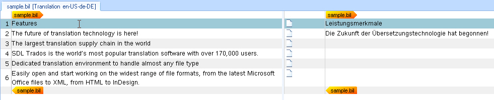

# Outputting Segment Pairs

Extract and expose source and target segments from a BIL input file in the intermediary SDLXliff file for editing in Var:ProductName.

## Extend the Parsing Method

Extend the parsing logic to extract source and target segments and expose them for translation in Var:ProductName's editor. A unit element defines a paragraph unit in the SDLXliff file. Each unit contains one source segment and optionally a target segment. These segments are added to the paragraph unit as segment pairs. A segment pair requires a source segment; the target segment may be empty.

Note: This step does not process inline tags, formatting, or other unit elements (e.g., comments).

Add the following ```foreach``` loop to the [ParseNext](../../api/filetypesupport/Sdl.FileTypeSupport.Framework.BilingualApi.AbstractBilingualParser.yml#Sdl_FileTypeSupport_Framework_BilingualApi_AbstractBilingualParser_ParseNext) method:

# [C#](#tab/tabid-1)
```cs
foreach (XmlNode item in _document.SelectNodes("//unit"))
{
        Output.ProcessParagraphUnit(CreateParagraphUnit(item));
}
```

This loop iterates through all ```unit``` elements in the input BIL file and outputs a paragraph unit in the SDLXliff document by calling the ```CreateParagraphUnit()``` helper function. This function takes the unit node's sub-nodes as parameters: the ```source``` and ```target``` nodes.

## Add a Helper Function for Generating Paragraph Units

Add the helper function to generate a paragraph unit from the current unit node. Create a paragraph unit object through the item factory:

# [C#](#tab/tabid-2)
```cs
IParagraphUnit paragraphUnit = ItemFactory.CreateParagraphUnit(LockTypeFlags.Unlocked);
```

The [LockTypeFlags](../../api/filetypesupport/Sdl.FileTypeSupport.Framework.NativeApi.LockTypeFlags.yml) parameter determines whether a paragraph unit is locked for editing. Normally, paragraph units remain unlocked, allowing translator access and editing.

Create a segment pair object through the item factory:

# [C#](#tab/tabid-3)
```cs
ISegmentPairProperties segmentPairProperties = ItemFactory.CreateSegmentPairProperties();
```

Create source and target segment objects and attach them to the paragraph unit. Below is the complete helper function for generating the paragraph unit object. Actual source and target segment generation occurs in a separate helper function, created in the next step.

# [C#](#tab/tabid-4)
```cs
private IParagraphUnit CreateParagraphUnit(XmlNode xmlUnit)
{
    IParagraphUnit paragraphUnit = ItemFactory.CreateParagraphUnit(LockTypeFlags.Unlocked);

    ISegmentPairProperties segmentPairProperties = ItemFactory.CreateSegmentPairProperties();
    segmentPairProperties.ConfirmationLevel = CreateConfirmationLevel(xmlUnit.Attributes["status"].Value);

    ISegment srcSegment = CreateSegment(xmlUnit.SelectSingleNode("source/seg"), segmentPairProperties);
    paragraphUnit.Source.Add(srcSegment);

    if (xmlUnit.SelectSingleNode("target/seg") != null)
    {
        ISegment trgSegment = CreateSegment(xmlUnit.SelectSingleNode("target/seg"), segmentPairProperties);
        paragraphUnit.Target.Add(trgSegment);
    }

    string id = xmlUnit.SelectSingleNode("./@id").InnerText;
    if (xmlUnit.SelectSingleNode("type/@spec") != null)
    {
        string spec = xmlUnit.SelectSingleNode("type/@spec").InnerText;
        paragraphUnit.Properties.Contexts = CreateContext(spec, id);
    }
    else
    {
        paragraphUnit.Properties.Contexts = CreateContext("Paragraph", id);
    }

    if (xmlUnit.SelectSingleNode("comment") != null)
    {
        paragraphUnit.Properties.Comments = CreateComment(xmlUnit.SelectSingleNode("comment").InnerText);
    }

    return paragraphUnit;
}
```

## Add a Helper Function for Generating Source and Target Segments

The helper function that creates source and target segments requires the segment node and segment pair properties as parameters. Passing segment pair properties ensures source and target segments assign to the correct segment pair. This function uses the properties factory to generate text properties from the segment node's text content, creates the text object through the item factory, adds the text to the segment object, and returns it:

# [C#](#tab/tabid-5)
```cs
private ISegment CreateSegment(XmlNode segNode, ISegmentPairProperties pair)
{
    ISegment segment = ItemFactory.CreateSegment(pair);

    foreach (XmlNode item in segNode.ChildNodes)
    {
        if (item.NodeType == XmlNodeType.Text)
        {
            segment.Add(CreateText(item.InnerText));
        }

        if (item.NodeType == XmlNodeType.Element)
        {
            segment.Add(CreateTagPair(item));
        }
    }
    return segment;
}
```

Your file type plug-in produces the following result when opening the sample file at this stage:



## Update the Progress Count

Implement logic for updating the progress report by adding the following to the [ParseNext](../../api/filetypesupport/Sdl.FileTypeSupport.Framework.BilingualApi.AbstractBilingualParser.yml#Sdl_FileTypeSupport_Framework_BilingualApi_AbstractBilingualParser_ParseNext) method:

# [C#](#tab/tabid-6)
```cs
public bool ParseNext()
{
    int totalUnitCount = _document.SelectNodes("//unit").Count;
    int currentUnitCount = 0;
    foreach (XmlNode item in _document.SelectNodes("//unit"))
    {
        Output.ProcessParagraphUnit(CreateParagraphUnit(item));

        currentUnitCount++;
        OnProgress(Convert.ToByte(Math.Round(100 * ((decimal)currentUnitCount / totalUnitCount), 0)));
    }

    return false;
}
```

## See Also

- [Processing Inline Tags](processing_inline_tags.md)
- [Applying Character Formatting](applying_character_formatting.md)
- [Applying the Segment Pair Confirmation Levels](applying_the_segment_pair_confirmation_levels.md)
- [Adding Context Information](adding_context_information.md)

>[!NOTE]
>
> This content may be out-of-date. To check the latest information on this topic, inspect the libraries using the Visual Studio Object Browser.
