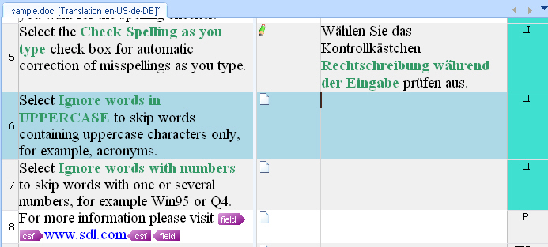

File Type Support
=====
The File Type Support Framework enables translators to process a variety of different document formats (e.g. Microsoft Office, Adobe InDesign, etc.) consistently within the same translation environment.

File Type Support in a Nutshell
----
There are countless document formats that may require localization, e.g. HTML, XML, Adobe FrameMaker, etc. It would be rather inefficient if translators had to do the translation in the respective native editing environment (e.g. Adobe FrameMaker, QuarkXPress, InDesign, etc.) Ideally, translators should not require e.g. Adobe FrameMaker proper for the translation of FrameMaker files. Instead, Translators would rather work in a dedicated editing environment that offers translator-specific features such as lookup functionality in translation memories, termbases, quality assurance features, etc.

The File Type Support Framework can be extended with additional file type plug-ins that extract translatable text from a given document format and generate an intermediary, 'translator-friendly' format from the native document, which is then opened and processed in the translation environment, i.e. Var:ProductName. This step is called extraction. The translation is then done in this intermediary format. Var:ProductName currently uses an XML-based format, which is compliant with the OASIS XLIFF standard and is called SDLXliff. Note that although Var:ProductName uses SDLXliff, the File Type Support Framework was designed to handle alternative intermediary formats. In the future, other options may become available. The intermediary SDLXliff format is bilingual, i.e. it stores both the source and the target content, which allows for easy comparison between source and target segments. This approach has the following advantages:

* All document formats can be processed in the same way, in the same application, and using the same workflows.
* Content is effectively separated from layout. The risk of adversely affecting the layout during localization is thereby minimized.
* Translators do not require the native application (e.g. Adobe FrameMaker) to localize a given document format, nor do they require any associated resources such as specific fonts.
After translation, a target-language version of the original native format is generated from the intermediary (SDLXliff) document, as the recipient of the translation (usually the customer) needs to have the target text in the native document format (e.g. Word, PowerPoint, etc.). This step is called generation (of the native target file). The original native file is often embedded within the intermediary (SDLXliff) document as a dependency file. The original file maybe required for the generation of the target document, as it often contains information other than text, such as pixel graphics, diagrams, etc., which need to be re-inserted into the native target file. (This is not the case for pure text formats, e.g. delimited text, HTML, etc.)

**A DOC file that was opened in Microsoft Word properly:**

**The same DOC file in the side-by-side editor of Var:ProductName. An intermediary SDLXliff file has been generated from the DOC file.**

Upon opening a native file, the File Type Support Framework 'decides' which one of the available file type plug-ins is best suited to process the given file format. Various criteria can be used to make this determination, primarily the file name extension, but also other criteria, e.g. information that is available in the header of the native document.
 Var:ProductName is delivered with a range of file type plug-ins. The File Type Support Framework, however, is flexible and extensible, and can therefore be extended with custom plug-ins for other formats.

The File Type Support Framework was designed to process both native, monolingual documents (e.g. Microsoft Word) and bilingual formats, e.g. TTX (i.e. TradosTag from Trados 2007), ITD (from SDLX 2007), etc.

The file type plug-ins that are delivered with Var:ProductName support a variety of different file formats. A file type plug-in is a collection of components (classes) that support a range of common operations (e.g. detecting the file type, extracting translatable content, generating the target content in the respective native format, etc.). The file type plug-in components are used by the File Type Support Framework to process the data contained in a native file. The File Type Support Framework ships with plug-ins for common document formats such as Word, Excel, PowerPoint, XML, HTML, CSV, etc. The File Type Support Framework is designed to be extensible. This means that you can create additional plug-ins for file formats that are not supported by the standard installation of Var:ProductName.

The File Type Support Framework operates on the concept of a processing chain. In order to process a file a chain of components needs to be set up that will read, process, and then write the translatable content. Some of these steps can be omitted if not required by the file format or your translation workflow. For example, you may not need to generate target file in the native document format if you just intend to read and a document.
