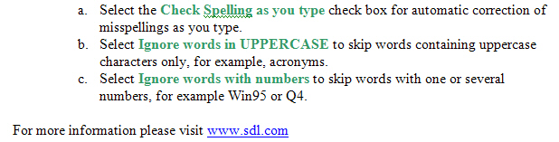
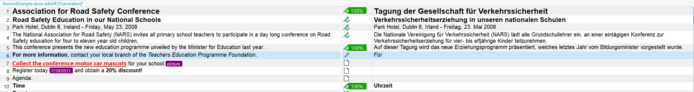

# File Type Support

The File Type Support Framework lets translators process many document formats, such as Microsoft Office and Adobe InDesign, in a consistent translation environment.

## File Type Support in a Nutshell

Many localization workflows involve formats such as HTML, XML, and Adobe FrameMaker. Translating these files in their native authoring tools slows the process and increases the risk of errors. Instead, translators work in a dedicated environment that provides translation memories, termbases, and quality assurance features.

The File Type Support Framework uses file type plug-ins to extract translatable content from a source document and convert it into an intermediary format that Var:ProductName can open and process. This extraction step produces SDLXliff, an XML-based format that follows the OASIS XLIFF standard. The framework also supports alternative intermediary formats.

SDLXliff stores both source and target content, which makes it easy to compare segments. This approach offers several benefits:

* It processes different document formats with the same application and workflow.
* It separates content from layout, which reduces the risk of layout damage during localization.
* It removes the need for the native authoring application and related resources, such as specific fonts.

The following images show the same DOC file in the native application and in the side-by-side editor in Var:ProductName.

After translation, the framework generates the target-language version of the original native format from the intermediary document. This step reuses the original file as a dependency when the target format needs non-text content, such as graphics or diagrams. Pure text formats, such as delimited text and HTML, do not require this dependency.

## How the framework works

When you open a native file, the File Type Support Framework selects the most suitable plug-in for the file format. It uses criteria such as the file name extension and metadata from the file header.

Var:ProductName includes plug-ins for common formats, including Word, Excel, PowerPoint, XML, HTML, and CSV. The framework remains extensible, so you can add custom plug-ins for formats that the standard installation does not support.

The framework also supports native, monolingual documents and bilingual formats, such as TTX and ITD.

Each file type plug-in contains components that handle common tasks, such as:

* detecting the file type
* extracting translatable content
* generating the target content in the native format

The framework runs these components as a processing chain. Depending on the format and your workflow, you can omit steps that you do not need. For example, you might only need to extract content and skip target generation.

## What you can do with the File Type Support SDK

The File Type Support SDK includes sample projects that show how to address common localization requirements.

* Process a file format that Var:ProductName does not support out of the box.
* Enforce a configurable minimum or maximum segment length across all document formats.
* Read XML formats that store length-limit information in tags and validate those limits in a custom file type.
* Keep HTML headings in the source language and verify that users do not translate them.

These samples show how plug-ins can automate repetitive localization work, such as character counting and copying segments.
