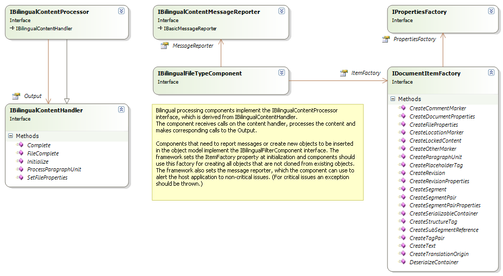
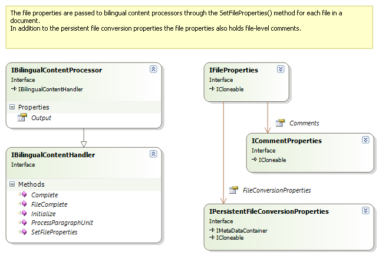
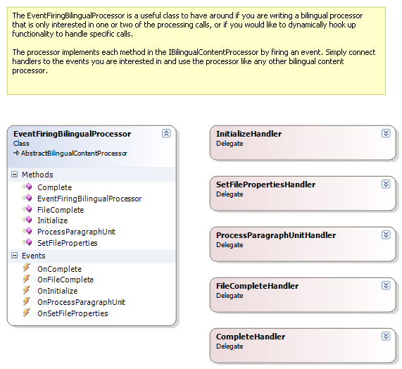
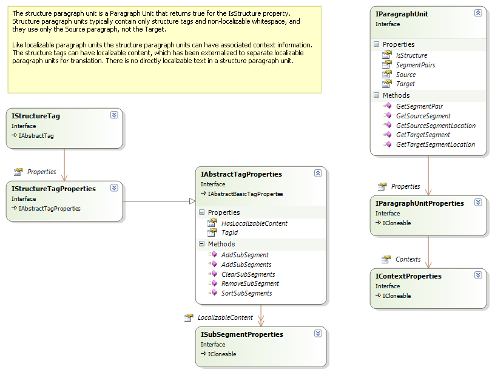
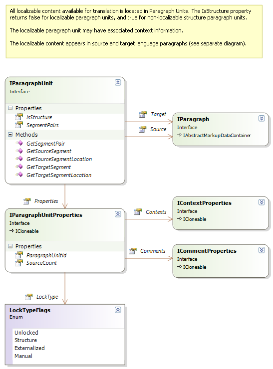
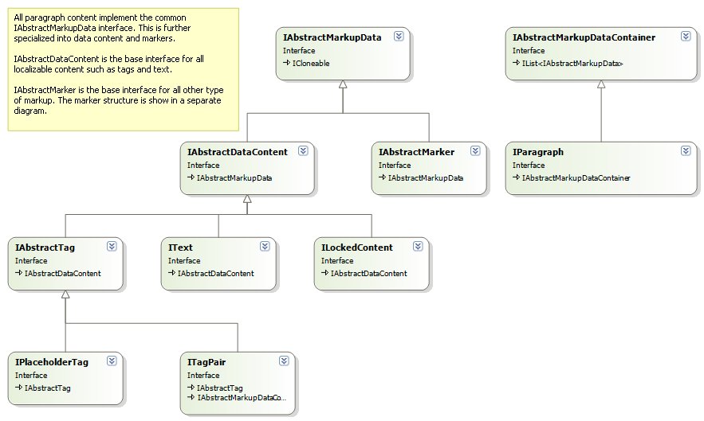
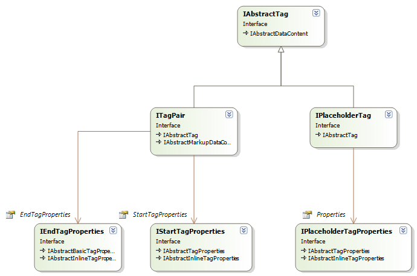
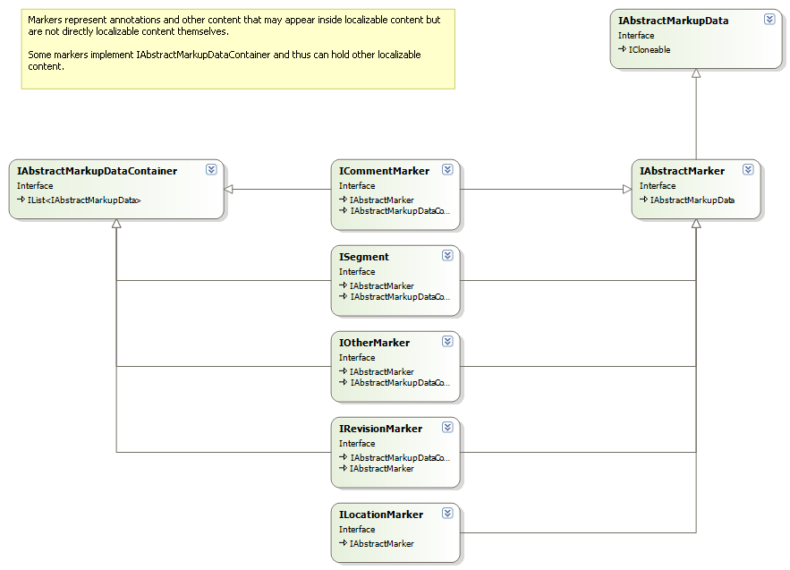
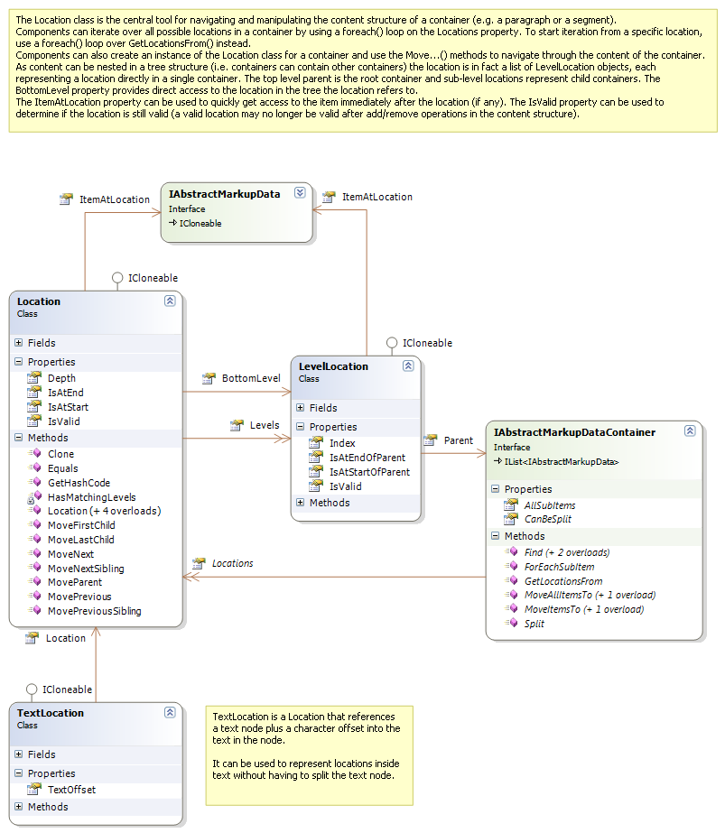
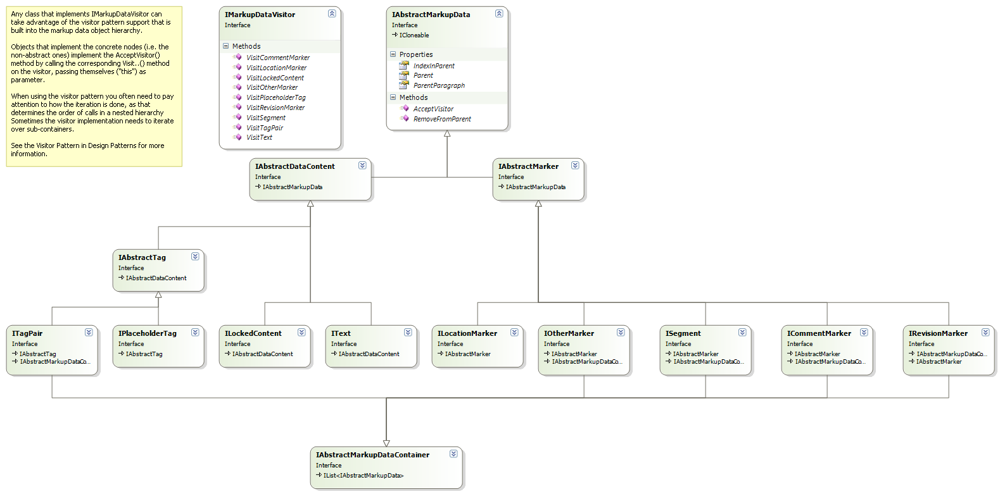

# Overview of the Bilingual API

This section provides a quick overview of the Bilingual API. For detailed documentation on individual interfaces, properties, and methods, see the reference documentation.

Bilingual processor components implement the IBilingualContentProcessor interface. The framework calls this interface to process content in a bilingual object model one paragraph unit at a time.



The framework delivers content to components through calls to [ProcessParagraphUnit](../../api/filetypesupport/Sdl.FileTypeSupport.Framework.BilingualApi.AbstractBilingualContentProcessor.yml#Sdl_FileTypeSupport_Framework_BilingualApi_AbstractBilingualContentProcessor_ProcessParagraphUnit_Sdl_FileTypeSupport_Framework_BilingualApi_IParagraphUnit_). 

The [Initialize](../../api/filetypesupport/Sdl.FileTypeSupport.Framework.BilingualApi.AbstractBilingualContentProcessor.yml#Sdl_FileTypeSupport_Framework_BilingualApi_AbstractBilingualContentProcessor_Initialize_Sdl_FileTypeSupport_Framework_BilingualApi_IDocumentProperties_) method runs before the framework passes any content through the component. It communicates the document properties that are common to all files in the document.

Before processing the content of each native file, the framework calls [SetFileProperties](../../api/filetypesupport/Sdl.FileTypeSupport.Framework.BilingualApi.AbstractBilingualContentProcessor.yml#Sdl_FileTypeSupport_Framework_BilingualApi_AbstractBilingualContentProcessor_SetFileProperties_Sdl_FileTypeSupport_Framework_BilingualApi_IFileProperties_).

After all content in a file has been processed, the framework calls [FileComplete](../../api/filetypesupport/Sdl.FileTypeSupport.Framework.BilingualApi.AbstractBilingualContentProcessor.yml#Sdl_FileTypeSupport_Framework_BilingualApi_AbstractBilingualContentProcessor_FileComplete).

When all files in a document have been processed, the framework calls Complete.

You can use the file properties passed to [SetFileProperties](../../api/filetypesupport/Sdl.FileTypeSupport.Framework.BilingualApi.AbstractBilingualContentProcessor.yml#Sdl_FileTypeSupport_Framework_BilingualApi_AbstractBilingualContentProcessor_SetFileProperties_Sdl_FileTypeSupport_Framework_BilingualApi_IFileProperties_) to retrieve the persistent file conversion settings. Components can store and retrieve settings related to the data being processed.



The `EventFiringBilingualProcessor` implements the [IBilingualContentProcessor](../../api/filetypesupport/Sdl.FileTypeSupport.Framework.BilingualApi.IBilingualContentProcessor.yml) interface and provides a convenient way to use it when you only need to process one or two of these calls. This implementation fires events for each call, and you can subscribe to the event handler for the call you need. This approach is especially useful when writing unit tests.



Paragraph units divide into two types: structure paragraph units and localizable paragraph units.

Structure paragraph units contain only structural data (for example, structure tags). They have no directly localizable content.

Localizable paragraph units contain text and tags that change during translation.

The [ProcessParagraphUnit](../../api/filetypesupport/Sdl.FileTypeSupport.Framework.BilingualApi.AbstractBilingualContentProcessor.yml#Sdl_FileTypeSupport_Framework_BilingualApi_AbstractBilingualContentProcessor_ProcessParagraphUnit_Sdl_FileTypeSupport_Framework_BilingualApi_IParagraphUnit_) call processes both types. Your implementation must check the [IsStructure](../../api/filetypesupport/Sdl.FileTypeSupport.Framework.BilingualApi.IParagraphUnit.yml#Sdl_FileTypeSupport_Framework_BilingualApi_IParagraphUnit_IsStructure) property to determine which type each is.



A localizable paragraph unit can have the following main properties:



The source and target language content in a paragraph comprise objects that implement [IMarkupDataVisitor](../../api/filetypesupport/Sdl.FileTypeSupport.Framework.BilingualApi.IMarkupDataVisitor.yml) derived interfaces:



Here is a diagram with some more details on the inline tags:



Tags and text inside a paragraph support annotation with different types of markup, represented by [IAbstractMarker](../../api/filetypesupport/Sdl.FileTypeSupport.Framework.BilingualApi.IAbstractMarker.yml) as the base interface:



Segments are the most important type of markup. A segment is uniquely identified *within the paragraph unit* through its segment ID.

A segment in a localized paragraph unit always has a source/target language counterpart. The source and target language segments reference the same [ISegmentPair](../../api/filetypesupport/Sdl.FileTypeSupport.Framework.BilingualApi.ISegmentPair.yml) object, and thus implicitly share the same segment ID.

You can easily retrieve the corresponding source or target segment using the [GetSourceSegment](../../api/filetypesupport/Sdl.FileTypeSupport.Framework.BilingualApi.IParagraphUnit.yml#Sdl_FileTypeSupport_Framework_BilingualApi_IParagraphUnit_GetSourceSegment_Sdl_FileTypeSupport_Framework_NativeApi_SegmentId_) and [GetTargetSegment](../../api/filetypesupport/Sdl.FileTypeSupport.Framework.BilingualApi.IParagraphUnit.yml#Sdl_FileTypeSupport_Framework_BilingualApi_IParagraphUnit_GetTargetSegment_Sdl_FileTypeSupport_Framework_NativeApi_SegmentId_) methods. These methods take the segment ID as a parameter and return the corresponding object.

You can navigate and iterate through the bilingual content in a paragraph or other markup data container in several ways.

The most intuitive approach uses the `Parent`, `IndexInParent`, and `Items` properties to directly access related nodes.

Alternatively, iterate over all items in an [IAbstractMarkupDataContainer](../../api/filetypesupport/Sdl.FileTypeSupport.Framework.BilingualApi.IAbstractMarkupDataContainer.yml) directly or through the [AllSubItems](../../api/filetypesupport/Sdl.FileTypeSupport.Framework.BilingualApi.IAbstractMarkupDataContainer.yml#Sdl_FileTypeSupport_Framework_BilingualApi_IAbstractMarkupDataContainer_AllSubItems) property.

You can also call the [ForEachSubItem](../../api/filetypesupport/Sdl.FileTypeSupport.Framework.BilingualApi.IAbstractMarkupDataContainer.yml#Sdl_FileTypeSupport_Framework_BilingualApi_IAbstractMarkupDataContainer_ForEachSubItem_System_Action_Sdl_FileTypeSupport_Framework_BilingualApi_IAbstractMarkupData__) method and pass in an action object.

The [Location](../../api/filetypesupport/Sdl.FileTypeSupport.Framework.BilingualApi.Location.yml) class provides another flexible way of iterating through and working with the localizable content in a paragraph:



You can also process localizable content through the visitor pattern. This approach is especially useful when dealing with collections of objects (for example, in markup data containers). Using a visitor pattern avoids constructing awkward and difficult to maintain ```switch```/```if``` statements to test for different object types.

Call ```AcceptVisitor``` on the object, and the object calls back to the corresponding method on the visitor. For more information about the visitor pattern, see *Design Patterns* by the Gang of Four (Gamma, Helm, Johnson, Vlissides).



>[!NOTE]
>
> This content may be out-of-date. To check the latest information on this topic, inspect the libraries using the Visual Studio Object Browser.