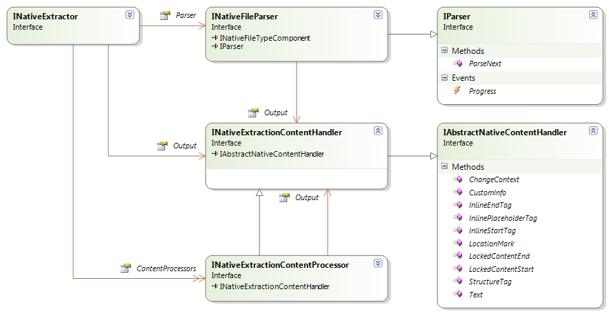
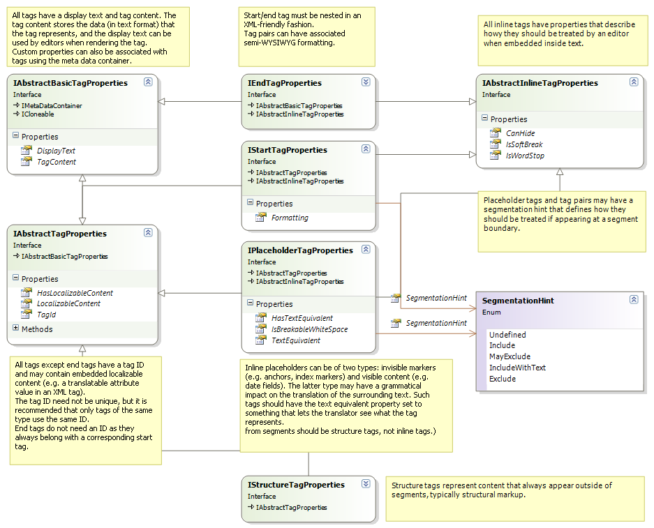
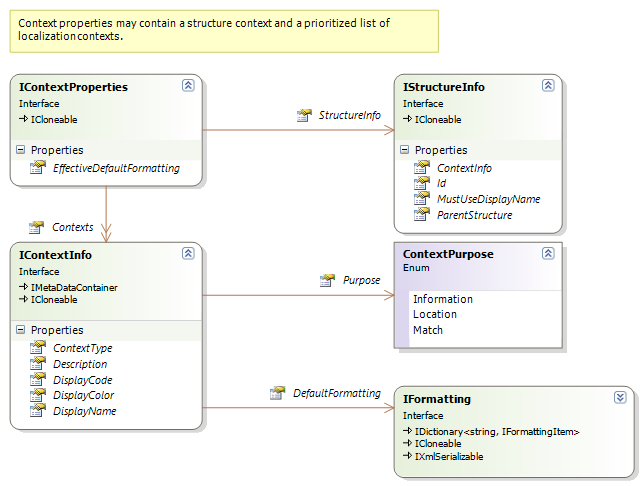
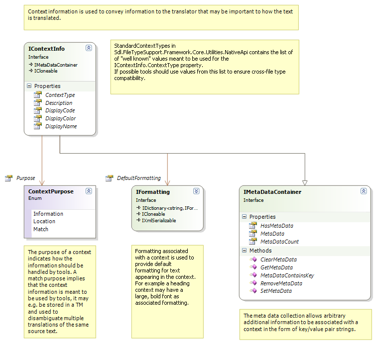
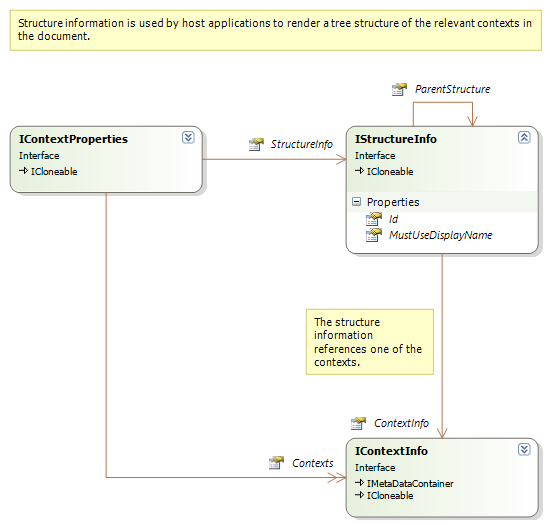
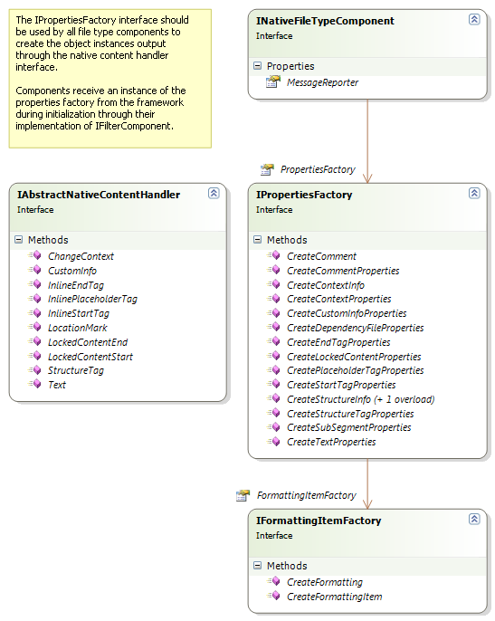
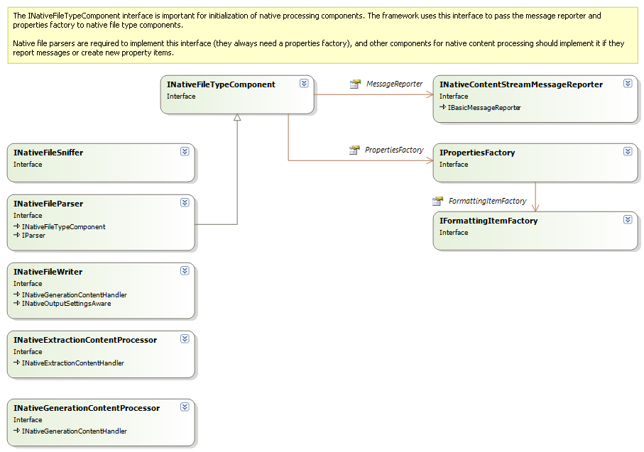
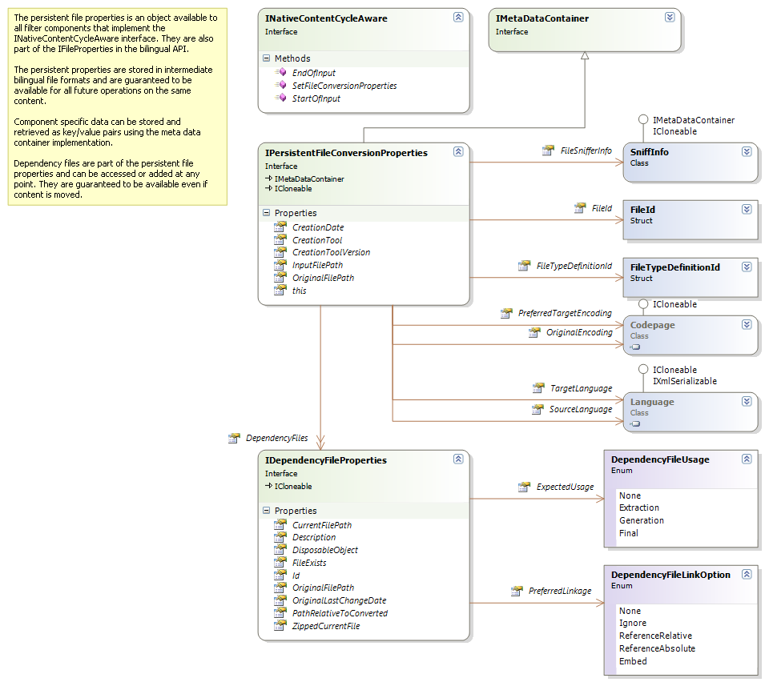
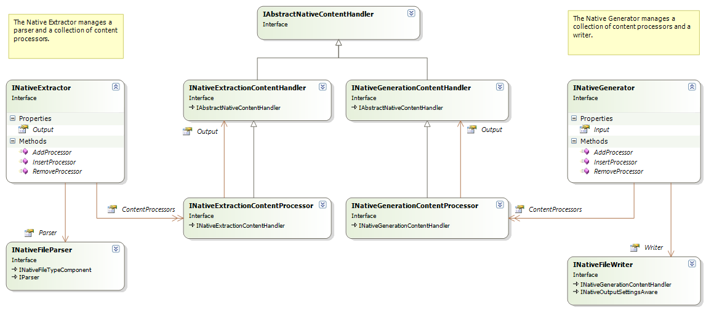
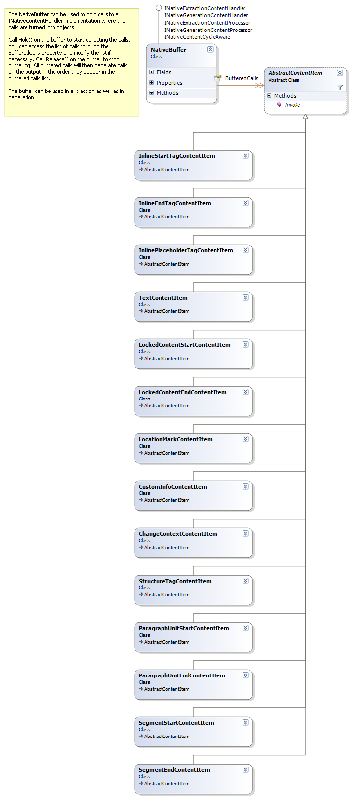

# Overview of the Native API

This section provides a high-level overview of the Native API.

The Native API provides the functionality that you need to build filters and filter components for monolingual content in a native document format, such as Microsoft Word. You can build most file filters and file-processing components in Var:ProductName by using only this API. You only need a different approach when you must explicitly process bilingual content, such as TTX or ITD files.

## Native content handler

The core of the Native API is the [IAbstractNativeContentHandler](../../api/filetypesupport/Sdl.FileTypeSupport.Framework.NativeApi.IAbstractNativeContentHandler.yml) interface. All content processing, whether input, output, or both, passes through this interface. This interface is similar to the `IEvents` interface in File Type Support Framework 1. The following diagram shows the native content handler interface and the components that relate to it:

Parsers use this interface to generate output. Writers use the interface as input: the writer implements the interface and receives calls from other filter components. Native content processors use the interface as both input and output. They receive calls through their implementation and then forward corresponding calls to another content handler.

## Text and tags

Localizable content that is processed in the framework is divided into **text** and **tags**. All localizable text processed by the framework is passed through the [Text](../../api/filetypesupport/Sdl.FileTypeSupport.Framework.NativeApi.IAbstractNativeContentHandler.yml#Sdl_FileTypeSupport_Framework_NativeApi_IAbstractNativeContentHandler_Text_Sdl_FileTypeSupport_Framework_NativeApi_ITextProperties_) method in this interface. Tags are passed as calls to either of the following methods:

* [StructureTag](../../api/filetypesupport/Sdl.FileTypeSupport.Framework.NativeApi.IAbstractNativeContentHandler.yml#Sdl_FileTypeSupport_Framework_NativeApi_IAbstractNativeContentHandler_StructureTag_Sdl_FileTypeSupport_Framework_NativeApi_IStructureTagProperties_): represents structural information in the file. This is the equivalent of external tags in File Type Support Framework 1.
* [InlinePlaceholderTag](../../api/filetypesupport/Sdl.FileTypeSupport.Framework.NativeApi.IAbstractNativeContentHandler.yml#Sdl_FileTypeSupport_Framework_NativeApi_IAbstractNativeContentHandler_InlinePlaceholderTag_Sdl_FileTypeSupport_Framework_NativeApi_IPlaceholderTagProperties_): represents standalone tags that can appear inside localizable text and that translators may need to place or duplicate. This is the equivalent of standalone inline tags in File Type Support Framework 1.
* [InlineStartTag](../../api/filetypesupport/Sdl.FileTypeSupport.Framework.NativeApi.IAbstractNativeContentHandler.yml#Sdl_FileTypeSupport_Framework_NativeApi_IAbstractNativeContentHandler_InlineStartTag_Sdl_FileTypeSupport_Framework_NativeApi_IStartTagProperties_) and `InlineEndTag`: represent paired tags that can appear inside localizable text and that translators usually need to place or duplicate as a pair. The framework requires these calls to follow standard XML nesting rules:
  * Each call to `InlineStartTag()` must be matched by a later call to `InlineEndTag()`. Text content usually appears within a start and end tag and can include other nested tag pairs.
  * A call to `InlineEndTag()` must never occur before the corresponding call to `InlineStartTag()`.
  * A call to `InlineEndTag()` always matches the last unmatched call to `InlineStartTag()`.

If you do not follow these nesting rules, the framework throws an exception. File Type Support Framework 1 did not enforce these rules explicitly, but filters still nested start and end tags in the same way in practice.

Each of the methods in the content handler interface take property objects, which describe the actual data passed through the call. The tag properties have the following relations and content:

All property objects implement the `ICloneable` interface. The framework clones them when it inserts them into bilingual content models or buffers. This behavior prevents implicit changes to the properties.

## Context information

Information on the structure of the file and other relevant context information that may be relevant for the translation can also be communicated through the framework. For this purpose, the method [ChangeContext](../../api/filetypesupport/Sdl.FileTypeSupport.Framework.NativeApi.IAbstractNativeContentHandler.yml#Sdl_FileTypeSupport_Framework_NativeApi_IAbstractNativeContentHandler_ChangeContext_Sdl_FileTypeSupport_Framework_NativeApi_IContextProperties_) is used.

The context properties that you pass to `ChangeContext()` contain both document structure information and localization context information:

Localization context information is a prioritized list of individual contexts. Put the context that matters most for translation first in the list. Each context has the following structure:

If localization tools should use a context to affect recycling or disambiguate multiple translation memory matches, set its [Purpose](../../api/filetypesupport/Sdl.FileTypeSupport.Framework.NativeApi.IContextInfo.yml#Sdl_FileTypeSupport_Framework_NativeApi_IContextInfo_Purpose) property to [Match](../../api/filetypesupport/Sdl.FileTypeSupport.Framework.NativeApi.ContextPurpose.yml#fields). If the context only provides additional information to the translator, set its purpose to [Information](../../api/filetypesupport/Sdl.FileTypeSupport.Framework.NativeApi.ContextPurpose.yml#fields). The [Location](../../api/filetypesupport/Sdl.FileTypeSupport.Framework.NativeApi.ContextPurpose.yml#fields) purpose is used by the framework in the bilingual `content` model to reference the location of the tag for paragraph units that contain localizable tag content.

The [StandardContextTypes](../../api/filetypesupport/Sdl.FileTypeSupport.Framework.Core.Utilities.NativeApi.StandardContextTypes.yml) list defines well-known context types. Use these types whenever possible to ensure the best tool support and cross-file-type compatibility. If none of the well-known types fit, define a custom context.

You can store additional context information in the [IMetaDataContainer](../../api/filetypesupport/Sdl.FileTypeSupport.Framework.NativeApi.IMetaDataContainer.yml) key/value collection. This metadata lets filters and filter components exchange document metadata. The default bilingual file format also serializes this metadata with the context.

A context can also include semi-WYSIWYG formatting. If several contexts include formatting information, use the combined formatting as the base formatting for all paragraph units to which the contexts apply. You can retrieve the combined formatting from the [EffectiveDefaultFormatting](../../api/filetypesupport/Sdl.FileTypeSupport.Framework.NativeApi.IContextProperties.yml#Sdl_FileTypeSupport_Framework_NativeApi_IContextProperties_EffectiveDefaultFormatting) property.

Other context properties control how the context is displayed to the user. Filter components should only set these properties for contexts that are not part of `StandardContextTypes`.

## Document structure

The document structure context can be used to generate an overview of the document content. It contains the following information:

All property objects that pass through the `IAbstractNativeContentHandler` methods are created by a property factory that the framework provides. The [IPropertiesFactory](../../api/filetypesupport/Sdl.FileTypeSupport.Framework.NativeApi.IPropertiesFactory.yml) interface looks like this:

## Native file type components

Filter components can implement [INativeFileTypeComponent](../../api/filetypesupport/Sdl.FileTypeSupport.Framework.NativeApi.INativeFileTypeComponent.yml), as shown in the following diagram:

The framework uses this interface to provide services such as the properties factory and the message reporter to filter components. When you create your own components, you can derive them from [AbstractNativeFileTypeComponent](../../api/filetypesupport/Sdl.FileTypeSupport.Framework.NativeApi.AbstractNativeFileTypeComponent.yml) or one of its derived classes, although this is optional:

* [AbstractNativeFileWriter](../../api/filetypesupport/Sdl.FileTypeSupport.Framework.NativeApi.AbstractNativeFileWriter.yml)
* [AbstractNativeFileParser](../../api/filetypesupport/Sdl.FileTypeSupport.Framework.NativeApi.AbstractNativeFileParser.yml)
* [AbstractNativeGenerationContentProcessor](../../api/filetypesupport/Sdl.FileTypeSupport.Framework.NativeApi.AbstractNativeGenerationContentProcessor.yml)
* [AbstractNativeExtractionGenerationContentProcessor](../../api/filetypesupport/Sdl.FileTypeSupport.Framework.NativeApi.AbstractNativeExtractionContentProcessor.yml)

These classes implement the interface for you. You can then access the properties factory and the message reporter directly through their properties without adding extra implementation code.

Components can also implement the [INativeContentCycleAware](../../api/filetypesupport/Sdl.FileTypeSupport.Framework.NativeApi.INativeContentCycleAware.yml) interface. The framework uses this interface to notify components when parsing starts and ends. It also lets components store and retrieve settings that persist as part of the bilingual format:

## Extractor, generator, and buffering

You can group native filter components together to perform reading and writing operations through the Extractor and Generator converters:

The forward converter manages a file parser and an associated set of content processors that work together to convert content from the native format. The backward converter similarly manages a collection of content processors and a writer that operate as a single unit.

Content processors typically apply specialized tasks to the content stream. Examples include detecting localizable content inside tags, marking up embedded HTML content in strings, and converting XML, SGML, or HTML entities. When you develop content processors, you sometimes need to inspect later content in the stream before you can process earlier content. In that case, the component must buffer the stream until it has enough information to continue. The framework provides a buffer component for this purpose:

>[!NOTE]
>
> This content may be out-of-date. To check the latest information on this topic, inspect the libraries using the Visual Studio Object Browser.
