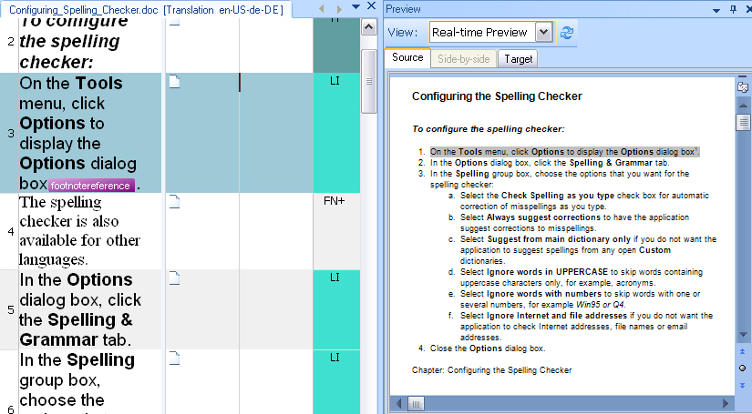

# Previewing files

Var:ProductName presents source and target text in an abstracted view that relies on context information. See [Using context information](using_context_information.md). However, translators and reviewers often need to inspect the actual document layout. For that reason, a file type plug-in should ideally generate the source document, the target document, or both in the native format.

## External previews

Var:ProductName can generate a document preview in an external application for almost any supported document format. For example, when users process an Adobe FrameMaker file in Var:ProductName and choose the external preview, Var:ProductName launches Adobe FrameMaker if it is installed on the machine. If the application is unavailable, Var:ProductName cannot open the external preview and displays an error message.

## Internal previews

Var:ProductName can also host the preview inside the application. In that case, the preview appears in an embedded window. Var:ProductName currently supports embedded previews for Microsoft Word, Microsoft PowerPoint, HTML, and XML.

Internal previews can be static or dynamic. A static preview shows the document, but it does not interact with the side-by-side editor. A dynamic preview stays synchronized with the editor. When users select a segment in the preview, Var:ProductName highlights the corresponding segment in the editor, and vice versa. Internal previews usually rely on a display component instead of the native application. For example, Var:ProductName uses a Word viewer component to preview Word documents even when Microsoft Word is not installed. The HTML preview uses a web browser component.

A file type plug-in can generate previews for the source document, the target document, or both side by side.

## Example

This example shows the internal preview for a Microsoft Word document in Var:ProductName. The preview can show the source language, the target language, or both at the same time. The Microsoft Word file type plug-in does not provide a side-by-side preview because that layout uses too much screen space and can affect performance.

## See also
- [Implementing an External File Preview](implementing_an_external_file_preview.md)
- [Implementing the Preview Writer](implementing_the_preview_writer.md)
- [Enhancing the Preview File Writer](enhancing_the_preview_file_writer.md)
- [Adding a Preview UI Control](adding_a_preview_ui_control.md)
- [Adding a Preview Controller](adding_a_preview_controller.md)
- [Appendix: Real-time Preview for XML Files](appendix_real_time_preview_for_xml_files.md)
