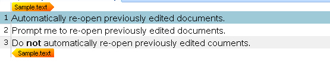
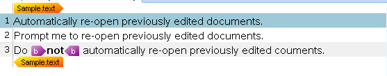
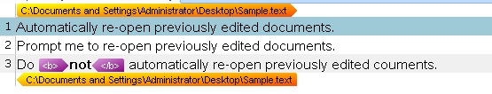

# Processing Inline Formatting

In this chapter you will learn how to enhance your file type plug-in to properly mark up inline tags and apply character formatting.

## Add New Members to the Parser Class

For your parser class to identify inline tags embedded within translatable content and apply character display formatting, add the following items:

First, add the regular expressions namespace to your class because you will use regular expressions to identify tags within translatable strings:

```
System.Text.RegularExpressions
```

Second, add the `Sdl.FileTypeSupport.Framework.Formatting` namespace. This namespace provides the functionality to apply display character formatting in the editor of Var:ProductName.

To keep this project simple, assume the text file contains only the `<b>` tag for applying bold character formatting. Add a new formatting member to the global settings of your class:

# [C#](#tab/tabid-1)
```cs
IPersistentFileConversionProperties _fileConversionProperties;
StreamReader _reader = null;

FormattingGroup _fBold;
```
***

## Add the Functionality Required for Processing Formatting

Modify the `ProcessLine()` helper function to call a new `ProcessFormatting()` function through `WriteText()`. (You will add this helper function in the next step.)

# [C#](#tab/tabid-2)
```cs
// determines whether a given line is
// translatable or not
// if not, a structure tag is output
// otherwise, the translatable text is exposed
private void ProcessLine(string sLine)
{
    if (sLine.StartsWith("[") && sLine.EndsWith("]"))
    {
        WriteStructureTag(sLine);
        WriteContext(sLine);
    }
    else
    {                
        WriteText(ProcessFormatting(sLine));
    }
}
```
***

Now add the function that identifies inline tag content within a translatable line:

# [C#](#tab/tabid-3)
```cs
// this function uses regular expressions to identify
// what is 'normal' translatable content and which strings
// need to be marked up as inline tags, e.g. <b>
private string ProcessFormatting(string sLine)
{
    int LastPosition = 0;
    // search for opening and closing <b> tags
    Regex rx = new Regex(@"\<.*?\>", RegexOptions.Compiled);
    MatchCollection rxMatches = rx.Matches(sLine);

    foreach (Match rxMatch in rxMatches)
    {
        if (LastPosition != rxMatch.Index)
        {
            WriteText(sLine.Substring(LastPosition, rxMatch.Index - LastPosition));
        }

        bool IsOpening = rxMatch.Value.Contains("/") ? false : true;
        WriteInlineTag(rxMatch.Value, IsOpening);  

        LastPosition = rxMatch.Index + rxMatch.Length;
    }
    return sLine.Substring(LastPosition, sLine.Length - LastPosition);
}
```
***

This function calls ```WriteText()``` to output 'normal' text and ```WriteInlineTag()``` to output any inline tags that have been found.
Next, add the function that outputs the inline < b> tags. Note that these inline tags always occur in pairs, i.e. there will be an opening and a closing tag. This is why this function takes a boolean isStart parameter. If this function is called with a True value from ```ProcessFormatting()```, a start tag will be created through the properties factory, which is then output to the bilingual file. Otherwise an end tag will be output.

>[!NOTE]
>
>Start tags and end tags must be well-formed in the XML sense, i.e. all start tags must match an end tag with the same nesting of paired tags. If not, the  File Type Support Framework will throw a fatal exception. When paired tags are processed by the  File Type Support Framework and the framework-based editor, this well-formedness is guaranteed to be preserved. This can simplify other tag processing modules such as the native file writer (see [Implementing the File Writer](implementing_the_file_writer.md)).

**Outputting the start tag of a tag pair**: The properties factory provides a [CreateStartTagProperties](../../api/filetypesupport/Sdl.FileTypeSupport.Framework.NativeApi.IPropertiesFactory.yml#Sdl_FileTypeSupport_Framework_NativeApi_IPropertiesFactory_CreateStartTagProperties_System_String_) method that creates properties for a start tag inside localizable content. The start tag has a corresponding end tag. Pass the tag content to the `Create()` method as a parameter. Output the start tag property to the API using `Output.InlineStartTag()`.

**Outputting the end tag of a tag pair**: The properties factory provides a [CreateEndTagProperties](../../api/filetypesupport/Sdl.FileTypeSupport.Framework.NativeApi.IPropertiesFactory.yml#Sdl_FileTypeSupport_Framework_NativeApi_IPropertiesFactory_CreateEndTagProperties_System_String_) method that creates properties for an end tag matching a previously emitted start tag. Pass the tag content to the `Create()` method as a parameter. Output the end tag property to the API using `OutputInlineEndTag()`.

This function also creates a formatting object to apply bold display formatting in the editor for the translator's convenience. Use the [CanHide](../../api/filetypesupport/Sdl.FileTypeSupport.Framework.NativeApi.IAbstractInlineTagProperties.yml#Sdl_FileTypeSupport_Framework_NativeApi_IAbstractInlineTagProperties_CanHide) property to hide the inline tags by default. Translators see only the formatting, not the actual tags, which is usually more convenient for the translation process.

# [C#](#tab/tabid-4)
```cs
// this function outputs an opening or a closing <b> tag
// and applies bold character formatting to the strings
// that the tags enclose
private void WriteInlineTag(string tagContent, bool isStart)
{
    _fBold = new FormattingGroup();
    _fBold.Add(new Bold(true));

    if (isStart)
    {
        IStartTagProperties startTag = PropertiesFactory.CreateStartTagProperties(tagContent);
        startTag.DisplayText = "b";
        startTag.TagContent = tagContent;
        startTag.Formatting = _fBold;
        startTag.CanHide = true;
        Output.InlineStartTag(startTag);
    }
    else
    {
        IEndTagProperties endTag = PropertiesFactory.CreateEndTagProperties(tagContent);
        endTag.DisplayText = "b";
        endTag.TagContent = tagContent;
        endTag.CanHide = true;
        Output.InlineEndTag(endTag);
    }
}
```
***

Use the [DisplayText](../../api/filetypesupport/Sdl.FileTypeSupport.Framework.NativeApi.IAbstractBasicTagProperties.yml#Sdl_FileTypeSupport_Framework_NativeApi_IAbstractBasicTagProperties_DisplayText) property to define the tag text that users see when they enable partial tag text mode. The [TagContent](../../api/filetypesupport/Sdl.FileTypeSupport.Framework.NativeApi.IAbstractBasicTagProperties.yml#Sdl_FileTypeSupport_Framework_NativeApi_IAbstractBasicTagProperties_TagContent) property determines the tag text that users see when they enable full tag text view.

Below, the text displays with proper character formatting:



This is the editor view when the user enables inline tags (partial tag text):



This is the editor view when the user enables inline tags (full tag text):



## Putting It All Together

The enhanced file parser class should now look as shown below:

# [C#](#tab/tabid-5)
```cs
using System.Drawing;
using System.IO;
using System.Text.RegularExpressions;
using Sdl.FileTypeSupport.Framework.BilingualApi;
using Sdl.FileTypeSupport.Framework.Core.Utilities.Formatting;
using Sdl.FileTypeSupport.Framework.NativeApi;
using Sdl.FileTypeSupport.Framework.Formatting;

namespace Sdk.Snippets.Native
{
    public class SimpleTextParser : AbstractNativeFileParser, INativeContentCycleAware
    {
        IPersistentFileConversionProperties _fileConversionProperties;
        StreamReader _reader = null;

        FormattingGroup _fBold;

        // through the properties object you can retrieve important information
        // on the native input file such as the original file name and path
        public void SetFileProperties(IFileProperties properties)
        {
            _fileConversionProperties = properties.FileConversionProperties;
        }

        public void StartOfInput()
        {

        }


        public void EndOfInput()
        {

        }

        protected override void BeforeParsing()
        {
            // set progress reporter to the beginning
            OnProgress(0);

            // open the native input file for reading
            _reader = new StreamReader(_fileConversionProperties.OriginalFilePath);
        }

        protected override bool DuringParsing()
        {
            // iterate through all lines in the input file
            while (!_reader.EndOfStream)
            {
                ProcessLine(_reader.ReadLine());
            }
            return false;
        }

        protected override void AfterParsing()
        {
            //close original file
            _reader.Close();
            _reader.Dispose();
            _reader = null;
            //set progres report to 100%
            OnProgress(100);
        }

        // determines whether a given line is
        // translatable or not
        // if not, a structure tag is output
        // otherwise, the translatable text is exposed
        private void ProcessLine(string sLine)
        {
            if (sLine.StartsWith("[") && sLine.EndsWith("]"))
            {
                WriteStructureTag(sLine);
                WriteContext(sLine);
            }
            else
            {                
                WriteText(ProcessFormatting(sLine));
            }
        }

        // output translatable text
        private void WriteText(string TextContent)
        {
            ITextProperties textProperties = PropertiesFactory.CreateTextProperties(TextContent);
            Output.Text(textProperties);
        }

        // output non-translatable text as structure tag
        private void WriteStructureTag(string TagContent)
        {
            IStructureTagProperties structureTagProperties = PropertiesFactory.CreateStructureTagProperties(TagContent);
            structureTagProperties.DisplayText = TagContent;
            Output.StructureTag(structureTagProperties);
        }

        // output context information, not required, but useful
        // information for the translator
        private void WriteContext(string ContextContent)
        {
            IContextProperties contextProperties = PropertiesFactory.CreateContextProperties();
            IContextInfo contextInfo = PropertiesFactory.CreateContextInfo(ContextContent);
            contextInfo.DisplayCode = "EL";
            contextInfo.DisplayName = "Element";
            contextInfo.Description = ContextContent;
            contextInfo.DisplayColor = Color.Beige;
            contextProperties.Contexts.Add(contextInfo);
            Output.ChangeContext(contextProperties);
        }

        // this function uses regular expressions to identify
        // what is 'normal' translatable content and which strings
        // need to be marked up as inline tags, e.g. <b>
        private string ProcessFormatting(string sLine)
        {
            int LastPosition = 0;
            // search for opening and closing <b> tags
            Regex rx = new Regex(@"\<.*?\>", RegexOptions.Compiled);
            MatchCollection rxMatches = rx.Matches(sLine);

            foreach (Match rxMatch in rxMatches)
            {
                if (LastPosition != rxMatch.Index)
                {
                    WriteText(sLine.Substring(LastPosition, rxMatch.Index - LastPosition));
                }

                bool IsOpening = rxMatch.Value.Contains("/") ? false : true;
                WriteInlineTag(rxMatch.Value, IsOpening);

                LastPosition = rxMatch.Index + rxMatch.Length;
            }
            return sLine.Substring(LastPosition, sLine.Length - LastPosition);
        }

        // this function outputs an opening or a closing <b> tag
        // and applies bold character formatting to the strings
        // that the tags enclose
        private void WriteInlineTag(string tagContent, bool isStart)
        {
            _fBold = new FormattingGroup();
            _fBold.Add(new Bold(true));

            if (isStart)
            {
                IStartTagProperties startTag = PropertiesFactory.CreateStartTagProperties(tagContent);
                startTag.DisplayText = "b";
                startTag.TagContent = tagContent;
                startTag.Formatting = _fBold;
                startTag.CanHide = true;
                Output.InlineStartTag(startTag);
            }
            else
            {
                IEndTagProperties endTag = PropertiesFactory.CreateEndTagProperties(tagContent);
                endTag.DisplayText = "b";
                endTag.TagContent = tagContent;
                endTag.CanHide = true;
                Output.InlineEndTag(endTag);
            }
        }
    }
}
```
***

## See Also

- [Implementing the File Parser](implementing_the_file_parser.md)
- [Processing Placeholder Tags](processing_placeholder_tags.md)
- [Handling Tags During Segmentation](handling_tags_during_segmentation.md)
- [Tag display modes](tag_display_modes.md)

>[!NOTE]
>
> This content may be out-of-date. To check the latest information on this topic, inspect the libraries using the Visual Studio Object Browser.
