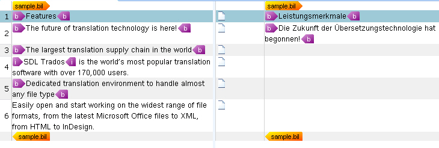

# Processing Inline Tags

In this chapter you will learn how to parse inline tags and how to display character formatting in the side-by-side editing environment of Var:ProductName.

## Enhance the Helper Function for Creating Segments

The segments in our bilingual sample format can contain the following inline tags: *< b>*, *< i>*, and *< u>*. To keep this example simple let us proceed on the assumption that only these three inline tag types can occur in a seg element.

A segment with inline tags may look as follows:

# [HTML](#tab/tabid-1)
```html
Open the <b>dialog box</b>.
```

You need to enhance the `CreateSegment()` helper function to loop through the segment node and create a text object or a tag depending on whether a sub-node is of type **text** or **element**. When you find a text node, call another helper function (`CreateText()`) that adds the text to the segment, or call `CreateTagPair()` to create a tag pair:

# [C#](#tab/tabid-2)
```cs
// helper function for creating segment objects
private ISegment CreateSegment(XmlNode segNode, ISegmentPairProperties pair)
{
    ISegment segment = ItemFactory.CreateSegment(pair);

    foreach (XmlNode item in segNode.ChildNodes)
    {
        if (item.NodeType == XmlNodeType.Text)
        {
            segment.Add(CreateText(item.InnerText));
        }

        if (item.NodeType == XmlNodeType.Element)
        {
            segment.Add(CreateTagPair(item));
        }
    }
    return segment;
}
```

## Add the Helper Function for Generating Text

Create a separate helper function to generate text items for convenience:

# [C#](#tab/tabid-3)
```cs
private IText CreateText(string segText)
{
    ITextProperties textProperties = PropertiesFactory.CreateTextProperties(segText);
    IText textContent = ItemFactory.CreateText(textProperties);

    return textContent;
}
```

## Add the Helper Function for Generating Tag Pairs

Add the function for generating tag pairs. This function works as follows:

The properties factory creates the start and end tag properties. The display text of the tags is what users see when they activate the (default) partial tag text mode of Var:ProductName. Then the item factory generates the actual tag pair object based on the start and end tag properties. Each opening tag requires a closing tag, so the bilingual document must be well-formed in an XML sense. If not, the framework raises a critical error.

Extract the text enclosed in the tag pair by calling the `CreateText()` helper function. This generates the text between the opening and closing tag, which you then append to the tag pair.

# [C#](#tab/tabid-4)
```cs
private ITagPair CreateTagPair(XmlNode item)
{
    // create the start and the end tag
    IStartTagProperties startTag = PropertiesFactory.CreateStartTagProperties(item.Name);
    // apply character formatting to the start tag
    IFormattingGroup formattingGroup = PropertiesFactory.FormattingItemFactory.CreateFormatting();
    startTag.Formatting = new FormattingGroup();
    switch (item.Name)
    {
        case "b":
            formattingGroup.Add(new Bold(true));
            break;
        case "i":
            formattingGroup.Add(new Italic(true));
            break;
        case "u":
            formattingGroup.Add(new Underline(true));
            break;
        default:
            break;
    }
    startTag.Formatting = formattingGroup;

    startTag.DisplayText=item.Name;
    startTag.CanHide = true;
    IEndTagProperties endTag = PropertiesFactory.CreateEndTagProperties(item.Name);
    endTag.DisplayText=item.Name;
    endTag.CanHide = true;

    // create a tag pair out of the start and the end tag
    ITagPair tagPair = ItemFactory.CreateTagPair(startTag, endTag);

    // add text enclosed in the tag pair
    tagPair.Add(CreateText(item.InnerText));

    return tagPair;
}
```
***

After you have enhanced your file type plug-in as described above, the BIL sample file should look as shown below in Var:ProductName:



## See Also

- [Applying Character Formatting](applying_character_formatting.md)

>[!NOTE]
>
> This content may be out-of-date. To check the latest information on this topic, inspect the libraries using the Visual Studio Object Browser.
