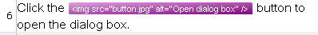

# Processing Placeholder Tags

In one of the previous chapters you learned how to process tag pairs (e.g. <b></b>) during file parsing (see [Processing Inline Formatting](processing_inline_formatting.md)). In this chapter you will learn how to process standalone placeholder tags, such as < img src="button.jpg" />

## Enhance your Parser to Process Standalone Placeholder Tags

Assume your sample text files sometimes contain tags for referencing images, for example:

# [HTML](#tab/tabid-1)
```html

```
***

Below you see an example of a segment that contains a standalone placeholder tag:

# [HTML](#tab/tabid-2)
```html
Click the button  to open 
the dialog box.
```
***

These tags close within themselves and occur as placeholders within the text. To keep this example simple, assume the **IMG** tag is the only placeholder tag that your document will contain.

Start by modifying the `ProcessFormatting()` helper function: if the regular expression pattern finds a match starting with `
private string ProcessFormatting(string sLine)
{
    int LastPosition = 0;
    // search for opening and closing <b> tags
    Regex rx = new Regex(@"\<.*?\>", RegexOptions.Compiled);
    MatchCollection rxMatches = rx.Matches(sLine);

    foreach (Match rxMatch in rxMatches)
    {
        if (LastPosition != rxMatch.Index)
        {
            WriteText(sLine.Substring(LastPosition, rxMatch.Index - LastPosition));
        }
        if (rxMatch.Value.StartsWith("
```
***

The offset in this example is 27 and the length of the localizable text (*Open dialog box*) is 15. Create the sub-segment object as follows:

# [C#](#tab/tabid-7)
```cs
ISubSegmentProperties subSeg = PropertiesFactory.CreateSubSegmentProperties(27, 15);
```
***

Add the sub-segment object to the placeable properties by applying the [AddSubSegment](../../api/filetypesupport/Sdl.FileTypeSupport.Framework.NativeApi.IAbstractTagProperties.yml#Sdl_FileTypeSupport_Framework_NativeApi_IAbstractTagProperties_AddSubSegment_Sdl_FileTypeSupport_Framework_NativeApi_ISubSegmentProperties_) method:

# [C#](#tab/tabid-8)
```cs
placeProperties.AddSubSegment(subSeg);
```
***

Output the placeable as follows:

# [C#](#tab/tabid-9)
```cs
Output.InlinePlaceholderTag(placeProperties);
```
***

The File Type Support Framework API extracts localizable sub-segments into separate translation units displayed to the translator. The output in the editor of Var:ProductName looks as shown below:



Of course, you would implement the functionality to calculate the offset and length so that your `WritePlaceholderTag()` helper function looks as follows:

# [C#](#tab/tabid-10)
```cs
private void WritePlaceholderTag(string tagContent)
{
    IPlaceholderTagProperties placeProperties = PropertiesFactory.CreatePlaceholderTagProperties(tagContent);
    placeProperties.TagContent = tagContent;
    placeProperties.DisplayText = "img";

    // calculate offset and length
    int offset, length;
    offset = tagContent.IndexOf("alt=\"") + 5;
    length = tagContent.Substring(offset, tagContent.Length - offset - 4).Length;

    ISubSegmentProperties subSeg = PropertiesFactory.CreateSubSegmentProperties(offset, length);
    placeProperties.AddSubSegment(subSeg);
    Output.InlinePlaceholderTag(placeProperties);
}
```
***

## See Also

- [Processing Inline Formatting](processing_inline_formatting.md)

- [Handling Tags During Segmentation](handling_tags_during_segmentation.md)

>[!NOTE]
>
> This content may be out-of-date. To check the latest information on this topic, inspect the libraries using the Visual Studio Object Browser.
