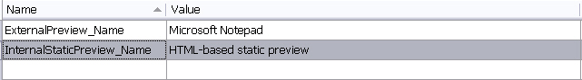
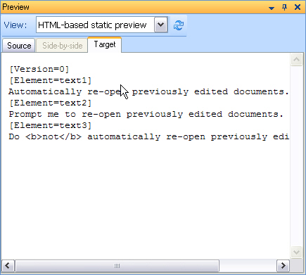

# Modifying the file type component builder

This article shows how to add an internal static document preview.

## Add the static preview name to the resources

Start by defining the preview name in the resources file. Var:ProductName displays this name in the Preview window combo box. The File Type Component Builder references these resource entries later.



## Add the static internal preview set reference

Next, add the following preview set definition to the File Type Component Builder. This code references the preview name that you defined in the resources file.

# [C#](#tab/tabid-1)
```cs
IPreviewSet internalStaticPreviewSet = previewFactory.CreatePreviewSet();
internalStaticPreviewSet.Id = new PreviewSetId("InternalStaticPreview");
internalStaticPreviewSet.Name = new LocalizableString(Resources.InternalStaticPreview_Name);

IControlPreviewType sourceControlPreviewType1 = previewFactory.CreatePreviewType<IControlPreviewType>() as IControlPreviewType;
if (sourceControlPreviewType1 != null)
{
    sourceControlPreviewType1.SourceGeneratorId = new GeneratorId("StaticPreview");
    sourceControlPreviewType1.SingleFilePreviewControlId = new PreviewControlId("InternalNavigablePreview");
    internalStaticPreviewSet.Source = sourceControlPreviewType1;
}

IControlPreviewType targetControlPreviewType1 = previewFactory.CreatePreviewType<IControlPreviewType>() as IControlPreviewType;
if (targetControlPreviewType1 != null)
{
    targetControlPreviewType1.TargetGeneratorId = new GeneratorId("StaticPreview");
    targetControlPreviewType1.SingleFilePreviewControlId = new PreviewControlId("InternalNavigablePreview");
    internalStaticPreviewSet.Target = targetControlPreviewType1;
}
previewFactory.GetPreviewSets(null).Add(internalStaticPreviewSet);
```
## Define the preview control

An internal preview needs a control that can display document content. You can create a custom preview control, and you will do that later for the dynamic real-time preview. See [Adding a Preview UI Control](adding_a_preview_ui_control.md).

For this static preview, use the built-in web browser control in Var:ProductName. Because this sample uses a simple text format, the built-in control can render the preview output without extra setup.

To register the built-in web browser control, add the following method to the File Type Component Builder. Place it below the Notepad preview control that you added for the external preview. See [Implementing an External File Preview](implementing_an_external_file_preview.md).

The object **id** must match the preview set name from the previous step. It must also start with the **PreviewControl_** prefix.

# [C#](#tab/tabid-2)
```cs
/// <summary>
/// Creates a new instance of the preview control with the specified name.
/// </summary>
/// <remarks>
/// <para>
/// Should only be called from the main thread, as controls must always be
/// instantiated on the same thread as the application message pump.
/// </para>
/// </remarks>
/// <param name="name">not used here</param>
/// <returns>not implemented</returns>
public virtual IAbstractPreviewControl BuildPreviewControl(string name)
{
    if (name == "PreviewControl_InternalStaticPreviewControl")
    {
        return new InternalPreviewController();
    }
    else if (name == "PreviewControl_InternalNavigablePreview")
    {
        return new InternalPreviewController();
    }
    else
    {
        return null;
    }
}
```
## Define the preview writer

The preview control also needs a writer that supplies the displayed content. You could reuse the file writer that you already implemented for the file type plug-in and the external preview. See [Implementing an External File Preview](implementing_an_external_file_preview.md).

However, if you reuse that writer, the internal web browser control produces output like this:



This output adds little value. It shows inline tags as plain text. It also applies no character formatting. In addition, it includes all non-translatable strings, which usually do not help in this type of preview.

Instead, implement a second writer that generates formatted HTML for the internal preview. A better preview improves readability and gives end users a clearer sense of the document layout.

Before you implement the new preview writer, add the following method to the File Type Component Builder. Place it below the object for the external preview writer. See [Implementing an External File Preview](implementing_an_external_file_preview.md). The next article explains how to implement the preview file writer class. See [Implementing the Preview Writer](implementing_the_preview_writer.md).

# [C#](#tab/tabid-3)
```cs
/// <summary>
/// Gets a native or bilingual document generator of the type
/// defined for the specified name.
/// </summary>
/// <param name="name">Abstract generator name</param>
/// <returns>not generator for default preview</returns>
public virtual IAbstractGenerator BuildAbstractGenerator(string name)
{
    if (name == "Generator_DefaultPreview")
    {
        return FileTypeManager.BuildFileGenerator(FileTypeManager.BuildNativeGenerator(new SimpleTextWriter()));
    }
    if (name == "Generator_StaticPreview")
    {
        return FileTypeManager.BuildFileGenerator(FileTypeManager.BuildNativeGenerator(new SimpleTextWriter()));
    }
    if (name == "Generator_RealTimePreview")
    {
        return FileTypeManager.BuildFileGenerator(FileTypeManager.BuildNativeGenerator(new InternalPreviewWriter()));
    }

    return null;
}
```
## See also

- [Implementing the Preview Writer](implementing_the_preview_writer.md)
- [Implementing the File Writer](implementing_the_file_writer.md)

>[!NOTE]
>
> This content may be out-of-date. To check the latest information on this topic, inspect the libraries using the Visual Studio Object Browser.
