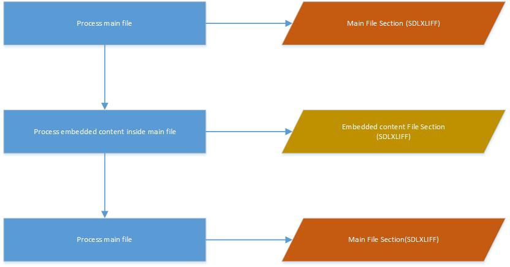
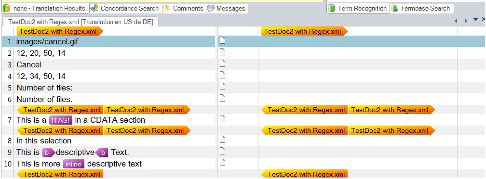

# Sub Content Overview

The File Type Support Framework allows you to create sub-content filters or processors that handle content in a different format from the main content. For example, an XML file may contain a CDATA section with HTML markup. The main XML filter processes the XML until it encounters the CDATA section, then passes the contents to the framework for processing by an appropriate sub-content processor (such as an HTML processor).

## Handling Sub-Content in the File Type Support Framework

The File Type Support Framework handles sub-content in the following manner:

The main parser must identify which content is sub-content and implement the [ISubContentPublisher](../../api/filetypesupport/Sdl.FileTypeSupport.Framework.NativeApi.ISubContentPublisher.yml) interface to send sub-content to the framework. This interface provides the [ProcessSubContent](../../api/filetypesupport/Sdl.FileTypeSupport.Framework.NativeApi.ISubContentPublisher.yml#Sdl_FileTypeSupport_Framework_NativeApi_ISubContentPublisher_ProcessSubContent) event. When the main parser detects sub-content, it populates the [ProcessSubContentEventArgs](../../api/filetypesupport/Sdl.FileTypeSupport.Framework.NativeApi.ProcessSubContentEventArgs.yml) properties and raises the event. The framework uses the sub-content processor ID from the event arguments to initialize and configure the sub-content processor.

The sub-content processor is a regular filter parser implementing the [ISubContentParser](../../api/filetypesupport/Sdl.FileTypeSupport.Framework.NativeApi.ISubContentParser.yml) interface. It must handle streams and document fragments. When the framework calls [InitializeSubContentParser](../../api/filetypesupport/Sdl.FileTypeSupport.Framework.NativeApi.ISubContentParser.yml#Sdl_FileTypeSupport_Framework_NativeApi_ISubContentParser_InitializeSubContentParser_System_IO_Stream_), it passes a stream containing the sub-content. The parser uses this stream to parse the content. The rest of the setup is identical to file-based parsing.

For target regeneration, the framework uses a sub-content writer implementing the [ISubContentWriter](../../api/filetypesupport/Sdl.FileTypeSupport.Framework.NativeApi.ISubContentWriter.yml) interface. The framework calls [InitializeSubContentWriter](../../api/filetypesupport/Sdl.FileTypeSupport.Framework.NativeApi.ISubContentWriter.yml#Sdl_FileTypeSupport_Framework_NativeApi_ISubContentWriter_InitializeSubContentWriter_System_IO_Stream_) to pass the original sub-content. This allows the writer to access the original data when reconstructing content. After all sub-content is built, the framework calls [GetSubContentStream](../../api/filetypesupport/Sdl.FileTypeSupport.Framework.NativeApi.ISubContentWriter.yml#Sdl_FileTypeSupport_Framework_NativeApi_ISubContentWriter_GetSubContentStream) to retrieve the rebuilt sub-content stream.

The main writer must implement [ISubContentAware](../../api/filetypesupport/Sdl.FileTypeSupport.Framework.NativeApi.ISubContentAware.yml) to receive sub-content from the framework. The framework calls [AddSubContent](../../api/filetypesupport/Sdl.FileTypeSupport.Framework.NativeApi.ISubContentAware.yml#Sdl_FileTypeSupport_Framework_NativeApi_ISubContentAware_AddSubContent_System_IO_Stream_) to pass the sub-content to the main writer for insertion into its output stream.

To use a sub-content processor, the framework must know about it through a component builder. The component builder implements two interfaces: [IFileTypeComponentBuilder](../../api/filetypesupport/Sdl.FileTypeSupport.Framework.IntegrationApi.IFileTypeComponentBuilder.yml) and [ISubContentComponentBuilder](../../api/filetypesupport/Sdl.FileTypeSupport.Framework.IntegrationApi.ISubContentComponentBuilder.yml). It must implement these methods:

- [BuildSubContentExtractor](../../api/filetypesupport/Sdl.FileTypeSupport.Framework.IntegrationApi.ISubContentComponentBuilder.yml#Sdl_FileTypeSupport_Framework_IntegrationApi_ISubContentComponentBuilder_BuildSubContentExtractor_System_String_) — Specifies the parser to use
- [BuildSubContentGenerator](../../api/filetypesupport/Sdl.FileTypeSupport.Framework.IntegrationApi.ISubContentComponentBuilder.yml#Sdl_FileTypeSupport_Framework_IntegrationApi_ISubContentComponentBuilder_BuildSubContentGenerator_System_String_) — Specifies the writer to use

These methods differ from the regular [BuildFileExtractor](../../api/filetypesupport/Sdl.FileTypeSupport.Framework.IntegrationApi.IFileTypeComponentBuilder.yml#Sdl_FileTypeSupport_Framework_IntegrationApi_IFileTypeComponentBuilder_BuildFileExtractor_System_String_) and [BuildFileGenerator](../../api/filetypesupport/Sdl.FileTypeSupport.Framework.IntegrationApi.IFileTypeComponentBuilder.yml#Sdl_FileTypeSupport_Framework_IntegrationApi_IFileTypeComponentBuilder_BuildFileGenerator_System_String_) methods because they specify both a parser and writer plus additional processors for sub-content. You must also implement [BuildFileTypeInformation](../../api/filetypesupport/Sdl.FileTypeSupport.Framework.IntegrationApi.IFileTypeComponentBuilder.yml#Sdl_FileTypeSupport_Framework_IntegrationApi_IFileTypeComponentBuilder_BuildFileTypeInformation_System_String_). All other methods can return null. Use a unique File Type Identifier for each processor. Note: File Sniffers are not used by sub-content processors.

You can reuse settings pages from the main filter in sub-content processors when appropriate. Sub-content processors typically use a subset of the main filter's settings pages, though custom settings pages may be required for some processors.

To display sub-content FileTypeConfiguration IDs in your UI, pass the list from the settings page to your UI control. Populate a dropdown with the IDs to let users select which processor handles the sub-content. Access the IDs via [SubContentFileTypeConfigurationIds](../../api/filetypesupport/Sdl.FileTypeSupport.Framework.Core.Settings.IFileTypeConfigurationAware.yml#Sdl_FileTypeSupport_Framework_Core_Settings_IFileTypeConfigurationAware_SubContentFileTypeConfigurationIds). Store the selected ID in a settings object accessible by the main parser. Pass the ID in [ProcessSubContentEventArgs](../../api/filetypesupport/Sdl.FileTypeSupport.Framework.NativeApi.ProcessSubContentEventArgs.yml) when raising the [ProcessSubContent](../../api/filetypesupport/Sdl.FileTypeSupport.Framework.NativeApi.ISubContentPublisher.yml#Sdl_FileTypeSupport_Framework_NativeApi_ISubContentPublisher_ProcessSubContent) event.

The framework processes embedded content (or sub-content) sequentially. The main filter processes its content. When it detects sub-content, it raises an event passing the sub-content to the framework. The sub-content parser consumes all the sub-content. When complete, the framework continues processing the main content. This flow is shown as follows:

This is saved in the SDLXLIFF file as individual file sections. In Var:ProductName, it appears as:

>[!NOTE]
>
>It is currently not possible to extend a sub-content component builder in the same manner as a filter component builder.

>[!NOTE]
>
> This content may be out-of-date. To check the latest information on this topic, inspect the libraries using the Visual Studio Object Browser.
