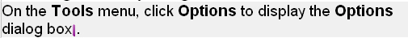
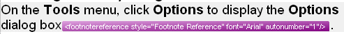
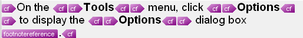

# Tag display modes

Tags that appear inside segments are called inline tags. Inline tags can act as placeholders for elements such as footnote references and index markers. They can also apply character formatting such as bold and underline. In that case, a tag pair (an opening and a closing tag) encloses the formatted text.

`Var:ProductName` provides a clutter-free editing environment. Users should see only a minimal number of inline tags. Design your file type plug-in so that inline tags are hidden by default when possible. For example, you can hide tags that define bold formatting in your document format. When possible, show the actual display formatting instead of tags because this is more user-friendly. If users need to view hidden inline tags, they can show them at runtime, for example by clicking a toolbar button.

As a general rule, hide tags that define character formatting. Show tags that act as placeholders for items such as hyperlinks and footnote references.

## Display states for visible inline tags

When inline tags are visible, users can choose from four display states:

* **No tag text**: only a placeholder symbol is displayed.
* **Partial tag text** (default): the tag name is shown, for example *footnotereference*.
* **Full tag text**: the tag name and attributes are shown, for example *<footnotereference font='Arial'>*.
* **Tag ID**: in an intermediary (SDLXLIFF) file, each tag has a unique ID starting with 1, and the displayed value is the tag ID (from 1 to n).

## Examples

This example shows an inline tag that acts as a placeholder for a footnote reference. The tags that define character formatting are hidden, so only the actual formatting is shown. The **footnotereference** tag is shown in the default partial tag text display mode.

This is what the inline tag looks like when shown with no tag text:

This is what the inline tag looks like when the full tag text (including attributes) is shown:

The tag ID (*ph* stands for placeholder):

The same segment with character formatting tag pairs displayed:

## See also
- [Processing Inline Formatting](processing_inline_formatting.md)
- [Processing Inline Tags](processing_inline_tags.md)
- [Applying Character Formatting](applying_character_formatting.md)
- [Processing Placeholder Tags](processing_placeholder_tags.md)
- [Handling Tags During Segmentation](handling_tags_during_segmentation.md)
