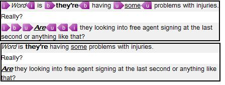

# Text Formatting

Complex documents often contain formatting and styles. For example, most editors support character formats such as **bold**, *italic*, and <u>underline</u>.

Semi-WYSIWYG formatting support allows a framework-based editor to display common character formatting information. During parsing, a native processor converts formatting from an external editor such as Microsoft Word into the framework's semi-WYSIWYG formatting objects. The framework can persist these objects in a bilingual file format, including its XLIFF-based format, and read them back when it opens the document.

To apply character formatting, use the [Sdl.FileTypeSupport.Framework.Formatting](../../api/filetypesupport/Sdl.FileTypeSupport.Framework.Formatting.yml) class. This class provides the basic formatting properties that native and bilingual filters use.

Apply formatting properties to [IStartTagProperties](../../api/filetypesupport/Sdl.FileTypeSupport.Framework.NativeApi.IStartTagProperties.yml). You can assign multiple [IFormattingItem](../../api/filetypesupport/Sdl.FileTypeSupport.Framework.Formatting.IFormattingItem.yml) objects to a single `Formatting` property. The text then receives all formatting defined in the opening tag.

[IStartTagProperties](../../api/filetypesupport/Sdl.FileTypeSupport.Framework.NativeApi.IStartTagProperties.yml) and [IEndTagProperties](../../api/filetypesupport/Sdl.FileTypeSupport.Framework.NativeApi.IEndTagProperties.yml) include a [CanHide](../../api/filetypesupport/Sdl.FileTypeSupport.Framework.NativeApi.IAbstractInlineTagProperties.yml#Sdl_FileTypeSupport_Framework_NativeApi_IAbstractInlineTagProperties_CanHide) property that lets users hide tags. To hide a tag in the editor, set `CanHide` to `true`. The semi-WYSIWYG formatting remains visible. This makes the translator's view simpler and easier to read.

For tags that apply only character formatting, set this property to `true`.

>[!NOTE]
>
> This content may be out-of-date. To check the latest information on this topic, inspect the libraries using the Visual Studio Object Browser.

