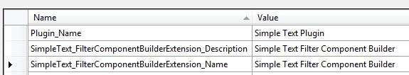

# The resources file

The project template includes a `PluginResources.resx` file. This file stores strings and plug-in UI elements that Var:ProductName displays in the user interface, such as the plug-in name and any problem messages that the plug-in reports.

By default, this resource file includes only the `Plugin_Name` string. For this implementation, add more strings for the plug-in description and any error messages that verification should display. The resources table should look like the following example:

The `Sdl.Sdk.FileTypeSupport.Samples.SimpleText` sample project folder also contains an `icon.ico` file. Add this file to your project resource file to display the icon next to the plug-in name in the **Options** dialog box.

>[!NOTE]
>
> This content may be out-of-date. To check the latest information on this topic, inspect the libraries using the Visual Studio Object Browser.
