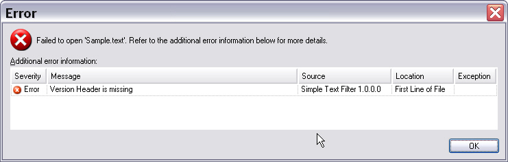

User Communication Through Messaging
==

In this chapter you will learn how to provide users with helpful information on why a given file cannot be supported by the file type plug-in.

Enhance the File Sniffer to Output a Detailed Message
--

When the file sniffer determines that a given file cannot be supported, the framework will generate the following default message:


However, it may be useful to provide users with more information on why a given file is not supported, so that they can edit the file and resolve the problem. Example: <Var:ProductName> cannot process Microsoft Word documents that contains any pending changes. When users try to open such a DOC file, they will receive a message that points out this particular problem. They can then open the source document in Microsoft Word, accept or reject all pending changes, thereby resolving the problem.

Remember that our sample file type plug-in checks for the presence of the string **[Version=n]** in the first line. If this string is not present, the sniffer should throw a more detailed message, which states the cause of the problem.

Let us consolidate the message texts thrown by the sniffer in another resources file. Add an additional resources file (e.g. **StringResources.resx**) to your project. Enter two resource names and values as shown below:


Now enhance the [Sniff](../../api/filetypesupport/Sdl.FileTypeSupport.Framework.NativeApi.INativeFileSniffer.yml#Sdl_FileTypeSupport_Framework_NativeApi_INativeFileSniffer_Sniff_System_String_Sdl_Core_Globalization_Language_Sdl_Core_Globalization_Codepage_Sdl_FileTypeSupport_Framework_NativeApi_INativeTextLocationMessageReporter_Sdl_Core_Settings_ISettingsGroup_) method as outlined below: apply the [ReportMessage](../../api/filetypesupport/Sdl.FileTypeSupport.Framework.NativeApi.IBasicMessageReporter.yml#Sdl_FileTypeSupport_Framework_NativeApi_IBasicMessageReporter_ReportMessage_System_Object_System_String_Sdl_FileTypeSupport_Framework_NativeApi_ErrorLevel_System_String_System_String_) method to the locMsgReporter object, which is returned by the [Sniff](../../api/filetypesupport/Sdl.FileTypeSupport.Framework.NativeApi.INativeFileSniffer.yml#Sdl_FileTypeSupport_Framework_NativeApi_INativeFileSniffer_Sniff_System_String_Sdl_Core_Globalization_Language_Sdl_Core_Globalization_Codepage_Sdl_FileTypeSupport_Framework_NativeApi_INativeTextLocationMessageReporter_Sdl_Core_Settings_ISettingsGroup_) method:

# [C#](#tab/tabid-1)
```cs
locMsgReporter.ReportMessage(this, nativeFilePath,
        ErrorLevel.Error, StringResources.Sniffer_Message, StringResources.Sniffer_Location);
```
***

The [ReportMessage](../../api/filetypesupport/Sdl.FileTypeSupport.Framework.NativeApi.IBasicMessageReporter.yml#Sdl_FileTypeSupport_Framework_NativeApi_IBasicMessageReporter_ReportMessage_System_Object_System_String_Sdl_FileTypeSupport_Framework_NativeApi_ErrorLevel_System_String_System_String_) method takes a number of parameters such as the error level. Since not being able to open a file is, of course, a critical problem, we choose the highest severity level, i.e. Error. From our string resources file, we retrieve the descriptive texts, which provide detailed information to the user.
Instead of just returning the default generic message, the file sniffer will now generate the following output:



>[!NOTE]
>
>Since file type plug-ins can also be used in server-based scenarios, they cannot always present information to users like 'normal', Windows-based applications do, e.g. by using a message box or by directly updating the user interface of the application. Such behavior could cause the server processing to hang, as there is no user to interact with.

Putting it All Together
--

Your enhanced file sniffer class should now look as shown below:

# [C#](#tab/tabid-2)
```cs
using System.IO;
using Sdl.FileTypeSupport.Framework.NativeApi;
using Sdl.Core.Globalization;
using Sdl.Core.Settings;

namespace Sdl.Sdk.FileTypeSupport.Samples.SimpleText
{
    // the file sniffer component determines whether a given file
    // can be processed by the filter or not
    public class SimpleTextSniffer : INativeFileSniffer
    {
        public SniffInfo Sniff(string nativeFilePath, Language suggestedSourceLanguage, Codepage suggestedCodepage, 
            INativeTextLocationMessageReporter messageReporter, ISettingsGroup settingsGroup)
        {
            SniffInfo fileInfo = new SniffInfo();

            using (StreamReader _reader = new StreamReader(nativeFilePath))
            {
                if (_reader.ReadLine().StartsWith("[Version="))
                {
                    fileInfo.IsSupported = true;
                }
                else
                {
                    fileInfo.IsSupported = false;
                    messageReporter.ReportMessage(this, nativeFilePath,
                                                  ErrorLevel.Error, StringResources.Sniffer_Message,
                                                  StringResources.Sniffer_Location);
                }
            }

            return fileInfo;
        }

        #region INativeFileSniffer Members


        #endregion
    }
}
```
***

See Also
--


[Implementing the File Sniffer](implementing_the_file_sniffer.md)


>[!NOTE]
>
> This content may be out-of-date. To check the latest information on this topic, inspect the libraries using the Visual Studio Object Browser.

