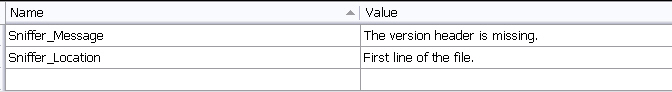
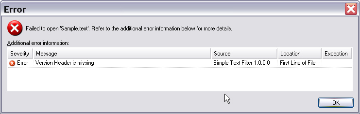

# User Communication Through Messaging

This section explains how to tell users why the file type plug-in does not support a file.

## Enhance the file sniffer to output a detailed message

When the file sniffer determines that it cannot support a file, the framework generates the following default message:


Provide a more specific message when possible so that users can correct the problem. For example, Var:ProductName cannot process Microsoft Word documents that contain pending changes. When users open such a DOC file, the application can explain the problem. Users can then open the source document in Microsoft Word and accept or reject the pending changes.

The sample file type plug-in checks whether the first line contains **[Version=n]**. If the string is missing, the sniffer should report a detailed message that explains the problem.

Store the sniffer messages in a separate resource file. Add another resource file, for example **StringResources.resx**, to your project. Then add two resource names and values, as shown below:



Update the [Sniff](../../api/filetypesupport/Sdl.FileTypeSupport.Framework.NativeApi.INativeFileSniffer.yml#Sdl_FileTypeSupport_Framework_NativeApi_INativeFileSniffer_Sniff_System_String_Sdl_Core_Globalization_Language_Sdl_Core_Globalization_Codepage_Sdl_FileTypeSupport_Framework_NativeApi_INativeTextLocationMessageReporter_Sdl_Core_Settings_ISettingsGroup_) method to call [ReportMessage](../../api/filetypesupport/Sdl.FileTypeSupport.Framework.NativeApi.IBasicMessageReporter.yml#Sdl_FileTypeSupport_Framework_NativeApi_IBasicMessageReporter_ReportMessage_System_Object_System_String_Sdl_FileTypeSupport_Framework_NativeApi_ErrorLevel_System_String_System_String_) on the `messageReporter` object that the method receives:

# [C#](#tab/tabid-1)
```cs
messageReporter.ReportMessage(this, nativeFilePath,
        ErrorLevel.Error, StringResources.Sniffer_Message, StringResources.Sniffer_Location);
```
***

The [ReportMessage](../../api/filetypesupport/Sdl.FileTypeSupport.Framework.NativeApi.IBasicMessageReporter.yml#Sdl_FileTypeSupport_Framework_NativeApi_IBasicMessageReporter_ReportMessage_System_Object_System_String_Sdl_FileTypeSupport_Framework_NativeApi_ErrorLevel_System_String_System_String_) method accepts several parameters, including the error level. Because the plug-in cannot open the file, use the highest severity level: `Error`. The string resource file supplies the descriptive text that explains the problem to the user.

Instead of returning only the generic default message, the file sniffer now generates the following output:



>[!NOTE]
>
> File type plug-ins can also run in server-based scenarios. In those scenarios, the plug-in cannot always present information the way a Windows application does, for example by showing a message box or updating the application UI directly. That behavior can cause server processing to hang because no user is available to respond.

## Put it all together

Your enhanced file sniffer class should now look like this:

# [C#](#tab/tabid-2)
```cs
using System.IO;
using Sdl.FileTypeSupport.Framework.NativeApi;
using Sdl.Core.Globalization;
using Sdl.Core.Settings;

namespace Sdk.FileTypeSupport.Samples.SimpleText
{
    public class SimpleTextSniffer : INativeFileSniffer
    {
        public SniffInfo Sniff(string nativeFilePath, Language suggestedSourceLanguage, Codepage suggestedCodepage, 
            INativeTextLocationMessageReporter messageReporter, ISettingsGroup settingsGroup)
        {
            var fileInfo = new SniffInfo();

            using (var reader = new StreamReader(nativeFilePath))
            {
                if (reader.ReadLine().StartsWith("[Version="))
                {
                    fileInfo.IsSupported = true;
                }
                else
                {
                    fileInfo.IsSupported = false;
                    messageReporter.ReportMessage(this, nativeFilePath,
                                                  ErrorLevel.Error, StringResources.Sniffer_Message,
                                                  StringResources.Sniffer_Location);
                }
            }

            return fileInfo;
        }
    }
}
```
***

## See also

- [Implementing the File Sniffer](implementing_the_file_sniffer.md)

>[!NOTE]
>
> This content may be out-of-date. To check the latest information on this topic, inspect the libraries using the Visual Studio Object Browser.

