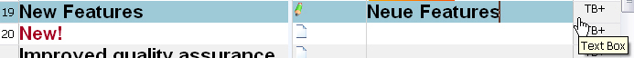
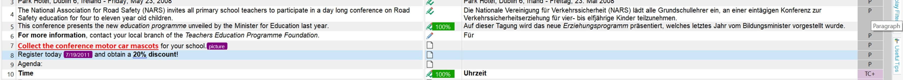
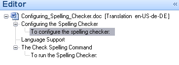

# Using context information

Where applicable, a file type plug-in should extract translatable text and expose context information in the intermediary file. Context information helps translators and editors identify content types such as headlines, table cells, and footnotes without opening the original document layout.

## Why context information matters

File type plug-ins separate translatable content from document layout so users can focus on the text. Context information adds another layer of guidance by showing where a segment came from. For example, users can tell whether a string belongs to a table cell or a footnote.

## How context information appears in the editor

Var:ProductName shows context information in the document structure column of the editor. To save space, the column uses short display codes, such as **H** for headline. Users can hover over the code to see the full description in a tooltip.

Users can also double-click the display code to see additional information, when available.

Example of a context display code for text box content extracted from a PPT document.

Double-clicking the document structure column reveals additional information about the text box content on the PowerPoint slide.

## Use the document structure tree

Var:ProductName can also display a document structure tree in the navigation pane on the left side of the application. The tree lets users navigate quickly to the corresponding sections in the document.

Example of a document structure tree that helps users navigate to the corresponding sections in the editor. In this example, the tree displays level 1 and level 2 headings found in a Microsoft Word document.

## See also

- [Implementing the File Parser](implementing_the_file_parser.md)
- [Adding Context Information](adding_context_information.md)
