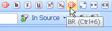
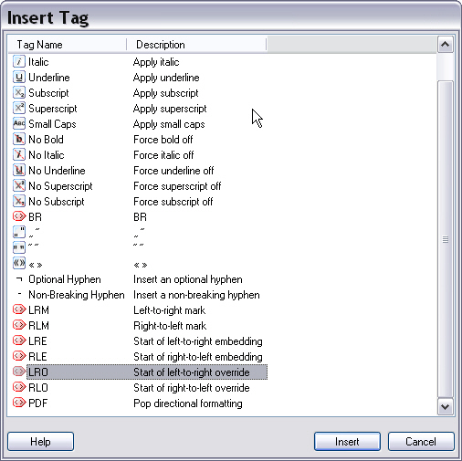

# Using QuickInserts

QuickInserts let users insert placeholder tags, tag pairs, and special characters in target text by using a toolbar button or keyboard shortcut. This gives quick access to characters that are hard to type.

Var:ProductName inserts tags from a source segment into the target segment. In some cases, users must insert tags or text that do not appear in the source segment. For example:

- The source segment has no bold formatting, but the translation needs bold text for emphasis.
- The source segment uses straight quotes, but the target language needs smart quotes.

QuickInserts support these scenarios.

## Choose QuickInserts for Your File Type

When you develop a file type plug-in, identify the tags and special characters users will likely need. Most file formats use common formatting such as bold, italics, and underline. Users also often need characters such as smart quotes or French quotes that are difficult to type on some keyboards.

Define QuickInserts for these common needs.

## Configure QuickInserts

Users can create and customize some QuickInserts in the application GUI. Other QuickInserts must be defined in code in the file type plug-in assembly.

For example, Var:ProductName lets users define QuickInserts for single characters, strings, and string pairs. Only programmatic configuration can define QuickInsert items for tags, such as bold formatting.

## QuickInsert Toolbar

Users can also open the **Insert Tag** window to insert QuickInsert items.

## See also

- [Implementing QuickInsert Functionality](implementing_quickinsert_functionality.md)
