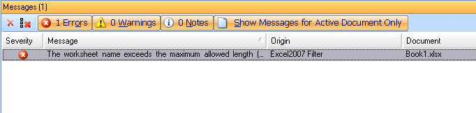

Verifying files
====
Files can be verified for a number of different criteria. The most common example of file verification is the standard tag verification, which checks whether the user failed to insert tags into the translation. You can equip your file type plug-in with verification functionality, for example, by developing an additional verifier plug-in.

Verification example: The interactive verification displays a yellow warning icon next to the target segment as it is missing an inline tag.

One example of a format that requires a particular type of verification is Microsoft Excel. Excel worksheet names must not exceed 31 characters. If a translator enters more than 31 characters for a worksheet name, the corresponding native target file cannot be generated from the intermediary document. This is why the standard file type plug-in for Microsoft Excel files checks for any worksheet names that violate this length limit and generate an error messsage if that is the case.

The interactive verification, which is part of the file type plug-in for MS Excel files displays a red error icon next to the target segment, as the worksheet name translation exceeds the length limit of 31 characters.

The error message is also shown in the **Messages** window of Trados Studio with an error description, the file in which the error was found and the file type plug-in which has thrown the error. By double-clicking the error message in this window the user navigates to the exact segment in the side-by-side editor.

A verification can be triggered interactively when the users confirms a segment. If a problem has been found in that particular segment, a symbol (error = red, warning = yellow, note = white) will be displayed next to the segment in question. For the above example (i.e. Excel worksheet names) the severity level is error (red), as this is a serious problem, which prevents users from generating the target MS Excel file after tranlation.

Users can also run a batch verification on the entire document (through the menu command **Tools** > **Verify**) or they can apply a verfication to several documents by running a **Verify** batch task. The latter will generate a detailed report on any issues found in the documents in question.