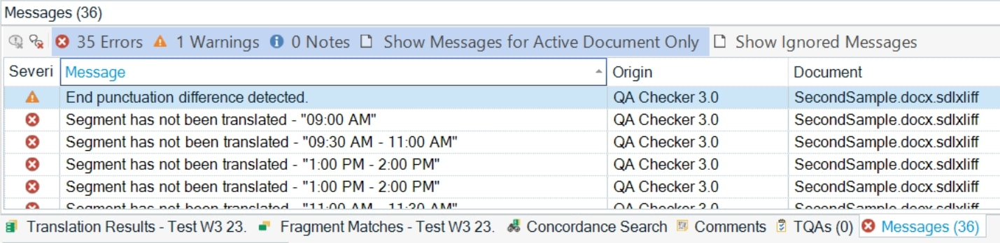

# Verifying files

You can verify files against specific criteria. A common example is tag verification, which detects missing tags in the translation. To add verification to your file type plug-in, develop an additional verifier plug-in.

Interactive verification shows a yellow warning icon next to the target segment when the translation is missing an inline tag.

## Example: Verify Microsoft Excel worksheet names

Microsoft Excel worksheet names cannot exceed 31 characters. If a translator enters a longer worksheet name, Var:ProductName cannot generate the native target file from the intermediary document. The standard Microsoft Excel file type plug-in checks this limit and generates an error message when the translation exceeds it.

The interactive verifier in the Microsoft Excel file type plug-in shows a red error icon next to the target segment when the translated worksheet name exceeds 31 characters.

Var:ProductName also lists the error in the **Messages** window. The message includes the error description, the file that contains the issue, and the file type plug-in that reported it. When the user double-clicks the message, Var:ProductName opens the exact segment in the side-by-side editor.

## Run verification

Verification can run interactively when the user confirms a segment. If the verifier finds a problem, it displays a symbol next to that segment: error (red), warning (yellow), or note (white). In the Excel worksheet example, the verifier reports an error because the issue prevents target file generation.

Users can also run verification for an entire document from **Tools** > **Verify**. To verify multiple documents, run the **Verify** batch task. The batch task generates a detailed report for the selected documents.

## See also

- [What is the Verification Framework?](what_is_the_verification_framework.md)
- [User Communication Through Messaging](user_communication_through_messaging.md)
