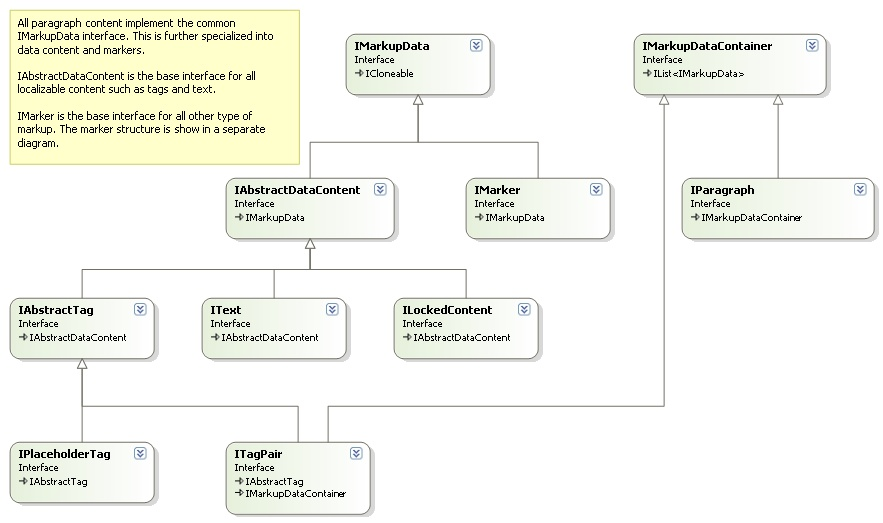
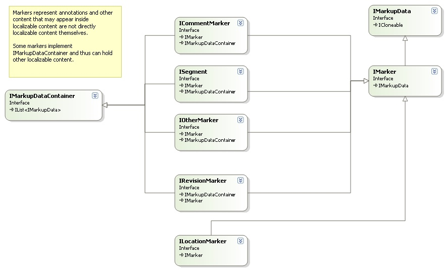
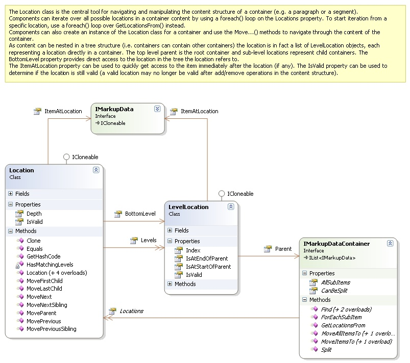

# Bilingual API Overview

This section provides a quick overview of the Bilingual API. For detailed documentation on interfaces, properties, and methods, see the reference documentation.

Bilingual processor components implement the [IBilingualContentProcessor](../../api/filetypesupport/Sdl.FileTypeSupport.Framework.BilingualApi.IBilingualContentProcessor.yml) interface. The framework calls this interface to process content in a bilingual object model, one paragraph unit at a time.

The content flows to components through [ProcessParagraphUnit](../../api/filetypesupport/Sdl.FileTypeSupport.Framework.BilingualApi.IBilingualContentHandler.yml#Sdl_FileTypeSupport_Framework_BilingualApi_IBilingualContentHandler_ProcessParagraphUnit_Sdl_FileTypeSupport_Framework_BilingualApi_IParagraphUnit_) calls. The framework invokes `Initialize` before processing any content to communicate document properties common to all files. For each native file, the framework calls [SetFileProperties](../../api/filetypesupport/Sdl.FileTypeSupport.Framework.BilingualApi.IBilingualContentHandler.yml#Sdl_FileTypeSupport_Framework_BilingualApi_IBilingualContentHandler_SetFileProperties_Sdl_FileTypeSupport_Framework_BilingualApi_IFileProperties_) before processing file content. When file processing completes, the framework calls [FileComplete](../../api/filetypesupport/Sdl.FileTypeSupport.Framework.BilingualApi.IBilingualContentHandler.yml#Sdl_FileTypeSupport_Framework_BilingualApi_IBilingualContentHandler_FileComplete), and after all files finish processing, it calls [Complete](../../api/filetypesupport/Sdl.FileTypeSupport.Framework.BilingualApi.IBilingualContentHandler.yml#Sdl_FileTypeSupport_Framework_BilingualApi_IBilingualContentHandler_Complete).

The file properties from the [SetFileProperties](../../api/filetypesupport/Sdl.FileTypeSupport.Framework.BilingualApi.IBilingualContentHandler.yml#Sdl_FileTypeSupport_Framework_BilingualApi_IBilingualContentHandler_SetFileProperties_Sdl_FileTypeSupport_Framework_BilingualApi_IFileProperties_) call provide access to persistent file conversion settings where components can store and retrieve settings related to the processed data.

The `EventFiringBilingualProcessor` implements [IBilingualContentProcessor](../../api/filetypesupport/Sdl.FileTypeSupport.Framework.BilingualApi.IBilingualContentProcessor.yml) and provides a convenient way to process only specific calls. This implementation fires events for each call, and you can subscribe to the events you need. This approach works especially well for unit tests.

## Paragraph units

Paragraph units fall into two categories: structure paragraph units and localizable paragraph units. Structure paragraph units contain only structural data (structure tags) with no directly localizable content. Localizable paragraph units contain text and tags modified during translation. Your implementation processes both types in [ProcessParagraphUnit](../../api/filetypesupport/Sdl.FileTypeSupport.Framework.BilingualApi.IBilingualContentHandler.yml#Sdl_FileTypeSupport_Framework_BilingualApi_IBilingualContentHandler_ProcessParagraphUnit_Sdl_FileTypeSupport_Framework_BilingualApi_IParagraphUnit_) by checking the [IsStructure](../../api/filetypesupport/Sdl.FileTypeSupport.Framework.BilingualApi.IParagraphUnit.yml#Sdl_FileTypeSupport_Framework_BilingualApi_IParagraphUnit_IsStructure) property to distinguish between them.

A localizable paragraph unit has the following main properties:

## Paragraph content

Paragraph source and target language content consists of objects that implement [IMarkupDataVisitor](../../api/filetypesupport/Sdl.FileTypeSupport.Framework.BilingualApi.IMarkupDataVisitor.yml) derived interfaces:

## Markup

Inline tags provide additional details:

Tags and text within a paragraph can carry different types of markup, represented by [IAbstractMarker](../../api/filetypesupport/Sdl.FileTypeSupport.Framework.BilingualApi.IAbstractMarker.yml) as the base interface:

### Segments

Segments are the most important markup type. Each segment has a unique ID within its paragraph unit. In a localized paragraph unit, every segment has a source/target language counterpart. Both source and target segments reference the same [ISegmentPair](../../api/filetypesupport/Sdl.FileTypeSupport.Framework.BilingualApi.ISegmentPair.yml) object, so they always share the same segment ID. Retrieve the corresponding source or target segment using [GetSourceSegment](../../api/filetypesupport/Sdl.FileTypeSupport.Framework.BilingualApi.IParagraphUnit.yml#Sdl_FileTypeSupport_Framework_BilingualApi_IParagraphUnit_GetSourceSegment_Sdl_FileTypeSupport_Framework_NativeApi_SegmentId_) or [GetTargetSegment](../../api/filetypesupport/Sdl.FileTypeSupport.Framework.BilingualApi.IParagraphUnit.yml#Sdl_FileTypeSupport_Framework_BilingualApi_IParagraphUnit_GetTargetSegment_Sdl_FileTypeSupport_Framework_NativeApi_SegmentId_) with the segment ID as a parameter.

## Navigation and iteration

Navigate and iterate through bilingual content in multiple ways. The most intuitive approach uses the `Parent`, `IndexInParent`, and `Items` properties to directly access related nodes. Alternatively, iterate over all items in an [IAbstractMarkupDataContainer](../../api/filetypesupport/Sdl.FileTypeSupport.Framework.BilingualApi.IAbstractMarkupDataContainer.yml) directly, through the [AllSubItems](../../api/filetypesupport/Sdl.FileTypeSupport.Framework.BilingualApi.IAbstractMarkupDataContainer.yml##Sdl_FileTypeSupport_Framework_BilingualApi_IAbstractMarkupDataContainer_AllSubItems) property, or by calling [ForEachSubItem](../../api/filetypesupport/Sdl.FileTypeSupport.Framework.BilingualApi.IAbstractMarkupDataContainer.yml##Sdl_FileTypeSupport_Framework_BilingualApi_IAbstractMarkupDataContainer_ForEachSubItem_System_Action_Sdl_FileTypeSupport_Framework_BilingualApi_IAbstractMarkupData__) with an action object.

The [Location](../../api/filetypesupport/Sdl.FileTypeSupport.Framework.BilingualApi.Location.yml) class provides another flexible option for iterating through and working with localizable content in a paragraph:

## Visitor pattern

Process localizable content through a visitor pattern, which works especially well for collections of objects (for example, markup data containers). This approach avoids writing complex and hard-to-maintain switch/if statements for different object types. Call `AcceptVisitor` on the object, and it calls back to the corresponding method on your visitor. For more information on the Visitor pattern, see *Design Patterns: Elements of Reusable Object-Oriented Software* by Erich Gamma, Richard Helm, Ralph Johnson, and John Vlissides.

