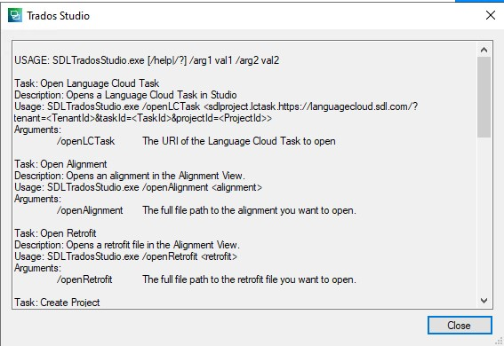

<Var:ProductName> Command line processor 
====
If you need to run <Var:ProductName> from a command line and you what to execute a custom processing based on a command with arguments the Integration API enables you to create your own command line processor. 

Creating a <Var:ProductName> command line argument processor
---

To create a <Var:ProductName> command line processor as a third-party developer :

* implement the [IExternalCommandLineProcessor](../../api/integration/Sdl.Desktop.IntegrationApi.Extensions.CommandLine.IExternalCommandLineProcessor.yml) or [IExternalWindowAwareCommandLineProcessor](../../api/integration/Sdl.Desktop.IntegrationApi.Extensions.CommandLine.IExternalWindowAwareCommandLineProcessor.yml) depending if you want to run the command line processor before or after the main screen is displayed. 

* from `Sdl.Desktop.IntegrationApi.Extensions.CommandLine` namespace and decorate your class with [ExternalCommandLineProcessorAttribute](../../api/integration/Sdl.Desktop.IntegrationApi.Extensions.CommandLine.ExternalCommandLineProcessorAttribute.yml) attribute. 

If you don't implement [IExternalCommandLineProcessor](../../api/integration/Sdl.Desktop.IntegrationApi.Extensions.CommandLine.IExternalCommandLineProcessor.yml) or [IExternalWindowAwareCommandLineProcessor](../../api/integration/Sdl.Desktop.IntegrationApi.Extensions.CommandLine.IExternalWindowAwareCommandLineProcessor.yml),  an exception will be thrown, but if you omit the [ExternalCommandLineProcessorAttribute](../../api/integration/Sdl.Desktop.IntegrationApi.Extensions.CommandLine.ExternalCommandLineProcessorAttribute.yml), your plugin will simply be ignored when <Var:ProductName> starts.

After successfully creating your command line processor you can check the Help generated for it by and running the following command in cmd.exe : <var:InstallationFolder>\SdlTradosStudio.exe ? . Your command will appear, among other commands available, in the following screen :

[Creating a <Var:ProductName> Command line processor Sample]
(trados_studio_command_processor.md)