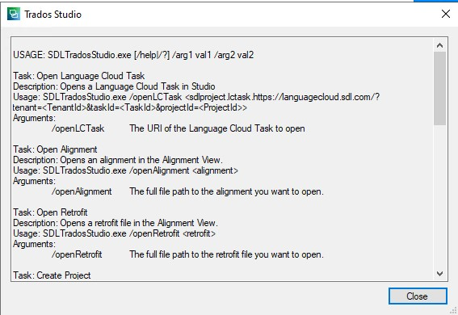

# Var:ProductName Command Line Processor

If you need to run Var:ProductName from a command line and execute custom processing for a specific command with arguments, the Integration API enables you to create your own command line processor.

## Creating a Command Line Argument Processor

To create a Var:ProductName command line processor, follow these steps:

- Implement either [IExternalCommandLineProcessor](../../api/integration/Sdl.Desktop.IntegrationApi.Extensions.CommandLine.IExternalCommandLineProcessor.yml) or [IExternalWindowAwareCommandLineProcessor](../../api/integration/Sdl.Desktop.IntegrationApi.Extensions.CommandLine.IExternalWindowAwareCommandLineProcessor.yml), depending on whether you want the processor to run before or after the main screen displays.

- Decorate your class with the [ExternalCommandLineProcessorAttribute](../../api/integration/Sdl.Desktop.IntegrationApi.Extensions.CommandLine.ExternalCommandLineProcessorAttribute.yml) attribute from the `Sdl.Desktop.IntegrationApi.Extensions.CommandLine` namespace.

## Requirements and Behavior

If you do not implement [IExternalCommandLineProcessor](../../api/integration/Sdl.Desktop.IntegrationApi.Extensions.CommandLine.IExternalCommandLineProcessor.yml) or [IExternalWindowAwareCommandLineProcessor](../../api/integration/Sdl.Desktop.IntegrationApi.Extensions.CommandLine.IExternalWindowAwareCommandLineProcessor.yml), an exception is thrown. If you omit the [ExternalCommandLineProcessorAttribute](../../api/integration/Sdl.Desktop.IntegrationApi.Extensions.CommandLine.ExternalCommandLineProcessorAttribute.yml), your plug-in is ignored when Var:ProductName starts.

## Viewing Your Command in Help

After creating your command line processor, view the generated help by running the following command in cmd.exe:

```
Var:InstallationFolder\SdlTradosStudio.exe ?
```

Your command appears, along with other available commands, in the resulting help screen:



## Example

The following example demonstrates how to implement a custom command line processor.

The plugin implements the required interfaces mentioned above with the following key properties:

- **TaskName** — returns the name of the command processing unit
- **TaskDescription** — describes what that processing will do
- **SupportedArguments** — lists supported arguments

### C#

```cs
using Sdl.Desktop.IntegrationApi.Extensions.CommandLine;
using System.Windows.Forms;
using System.Collections.Generic;

namespace Sdl.CustomPlugin.Packaging.OpenPackageWizard
{
    [ExternalCommandLineProcessor(Id = "OpenPackageCommandLineProcessor_Id", Name = "OpenPackageCommandLineProcessor_Name", Description = "OpenPackageCommandLineProcessor_Description")]
    public class OpenPackageCommandLineProcessor : IExternalWindowAwareCommandLineProcessor
    {
        private readonly IList<ExternalCommandLineArgumentDefinition> _supportedArguments;
        private const string OpenPackageArgument = "openPackage";

        public OpenPackageCommandLineProcessor()
        {
            _supportedArguments = new List<ExternalCommandLineArgumentDefinition>()
            {
                new ExternalCommandLineArgumentDefinition(OpenPackageArgument,
                    StringResources.OpenPackageCommandLineTask_Files)
                {
                    MinValues = 1,
                    MaxValues = 1,
                    SampleValues = new[] { "package" }
                }
            };
        }

        public string TaskName => StringResources.OpenPackageCommandLineTask_Name;

        public string TaskDescription => StringResources.OpenPackageCommandLineTask_Description;

        public IEnumerable<ExternalCommandLineArgumentDefinition> SupportedArguments => _supportedArguments;

        public void ProcessCommandLine(ExternalCommandLineArguments args)
        {
            ExternalCommandLineArgument packagesToOpen = args[OpenPackageArgument];
            if (packagesToOpen == null)
            {
                return;
            }

            var uiPackageOpener = new UIPackageOpener(Form.ActiveForm);
            uiPackageOpener.OpenPackage(packagesToOpen.Values[0]);
        }
    }
}
```
