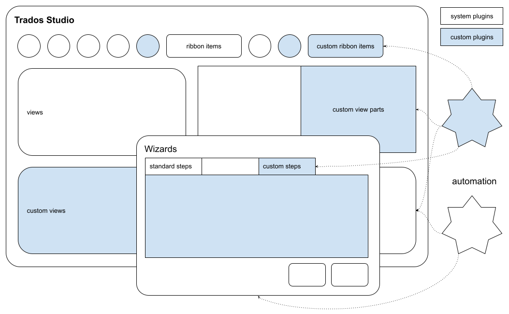
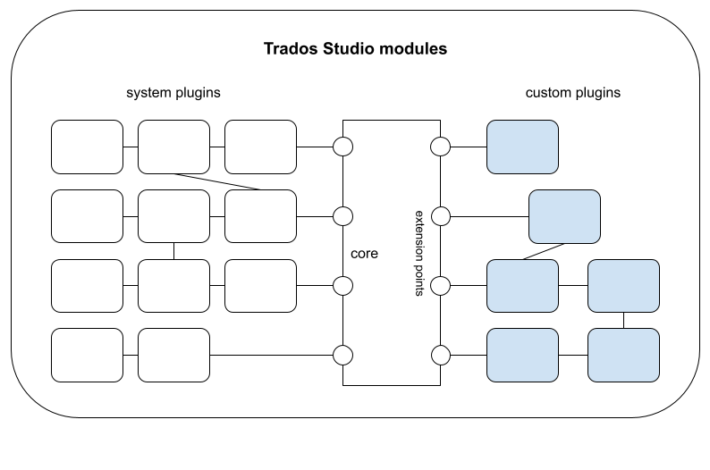

# Var:ProductName Integration API

The Var:ProductName Integration API allows third-party developers to extend or customize Var:ProductName applications. You can create plug-ins to:

* [Extend or customize the user interface for Studio applications.](user_interface_integration.md)
* [Provide custom functionalities for the Var:ProductName application.](studio_automation.md)

## Modular Architecture

Var:ProductName uses a modular architecture based on plug-ins. The system includes built-in plug-ins for core functionality and accepts custom extensions that users install. The following diagram illustrates this architecture:

## Before You Begin

Read the following topics to prepare for using the Var:ProductName Integration API:

* [Setting up a Development Machine](../../articles/gettingstarted/setting_up_a_developer_machine.md) 
* [Studio plug-ins overview](../../articles/gettingstarted/studio_plugin_overview.md)

## Code Examples

The Var:ProductName API documentation includes [examples](https://github.com/RWS/trados-studio-api-samples/tree/master/TranslationStudioAutomation) written in C# of common patterns and best practices for plug-in development.
