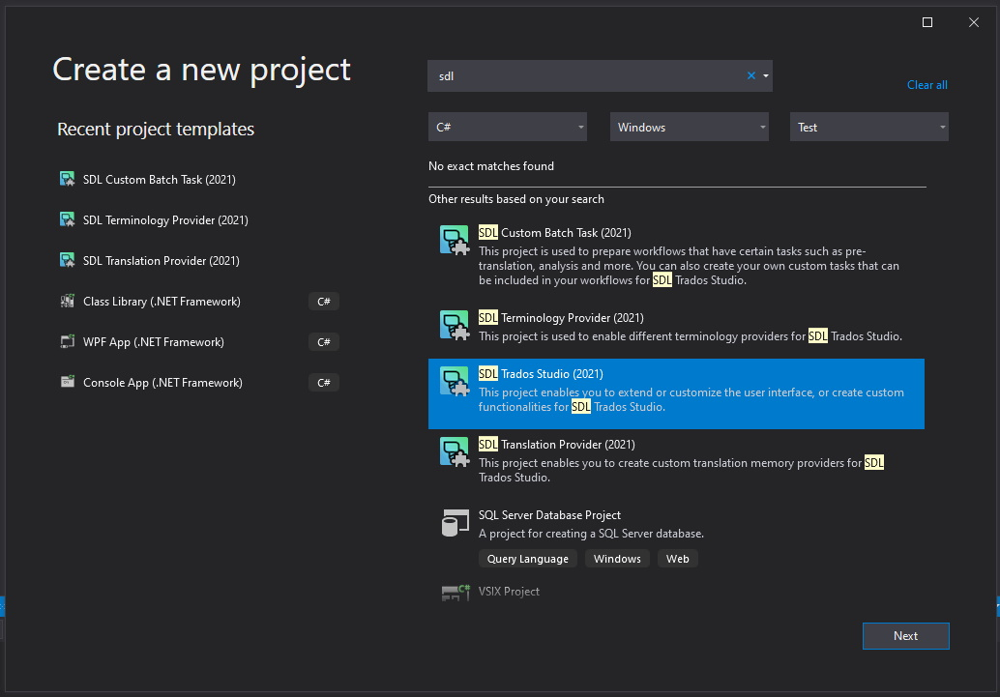

# Setting up the Visual Studio Project

This guide walks you through creating a custom display filter plug-in project. You will generate a plug-in that compiles and implements an empty display filter visible in Var:ProductName. Initially, it contains no application logic and does not perform any real filtering task.

## Create the Visual Studio Project

After installing the Var:ProductName SDK, open Var:VisualStudioEdition. The following templates appear when you create a new project:

These templates help you set up the skeleton of a Var:ProductName plug-in project.

Create a new project using the Var:ProductName (2021) project template and name it, for example, `AdvancedDisplayFilter.Example`.

The Var:ProductName (2021) template automates the initial setup phase for your development project. It:

- Includes all standard references to the studio assemblies your project might require
- Adds the plugin manifest and resource files
- Sets the build output path to the correct location in your system's roaming directory

Your project should look like this after creation:

> [!IMPORTANT]
> 
> The Var:ProductName (2021) template does not automatically add the *Sdl.Core.Globalization* assembly to the project. This project requires this assembly because it references some of the [ISegmentPair](../../api/filetypesupport/Sdl.FileTypeSupport.Framework.BilingualApi.ISegmentPair.yml) enumerators.
>
> To add this assembly, right-click the **References** node in Solution Explorer and select **Add Reference** from the context menu. Then navigate to **Var:InstallationFolder** and select **Sdl.Core.Globalization.dll**.

## Sign the solution

Follow these steps to sign your development solution from the project properties area:

1. In Var:VisualStudioEdition, go to **Project > AdvancedDisplayFilter.Example Properties**.
2. Select the **Signing** tab.
3. Select the **Sign the assembly** checkbox and choose **New…** from the **Choose a strong name key file** combo box.
4. In the **Create Strong Name Key** dialog, provide a name, click **OK**, and save the project.

After saving the project properties, a new file with the `.snk` extension appears in your project. This file holds the Strong Name Key details you provided.

> [!NOTE]
> 
> Signing the project provides authenticity for the assembly, ensuring the assembly originates from the specified author and preventing tampering. You also need to sign assemblies to include them in the Global Assembly Cache (GAC).
