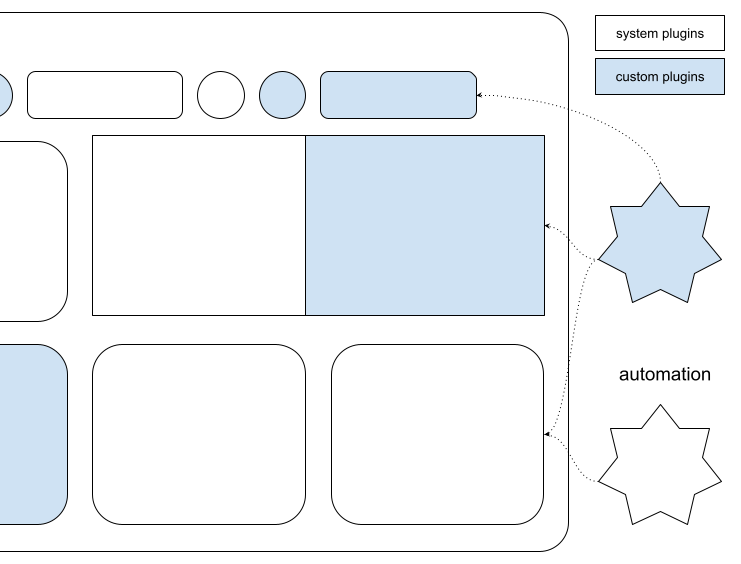

# Studio Automation

The Var:ProductName Integration API enables third-party developers to extend, customize, and integrate custom functionalities into the Var:ProductName application.

## Required Project References

Add the following references to your project. You can find them in the Var:ProductName installation folder:

- Sdl.Desktop.IntegrationApi.dll
- Sdl.Desktop.IntegrationApi.Extensions.dll
- Sdl.TranslationStudioAutomation.IntegrationApi.dll
- Sdl.TranslationStudioAutomation.IntegrationApi.Extensions.dll
- Sdl.FileTypeSupport.Framework.Core
- Sdl.FileTypeSupport.Framework.Implementation
- Sdl.ProjectAutomation.Core
- Sdl.ProjectAutomation.FileBased
- Sdl.ProjectAutomation.Settings

## Important Configuration

> [!IMPORTANT]
> Choose *Var:PluginPackedPath* as the build output path for your implementations.
> 
> Ensure your library references point to the Var:ProductName folder (for example, *Var:InstallationFolder*).
> 
> For detailed information, see [Building a plug-in](building_plugin.md) and [Plug-in deployment](plugin_deployment.md).
> 
> Sign your assemblies with a strong name to enable loading in Var:ProductName. See [How to: Sign an Assembly with a Strong Name](https://docs.microsoft.com/en-us/dotnet/standard/assembly/sign-strong-name).
> 
> Using a different build output path or failing to sign your assembly prevents your plug-in from loading.
