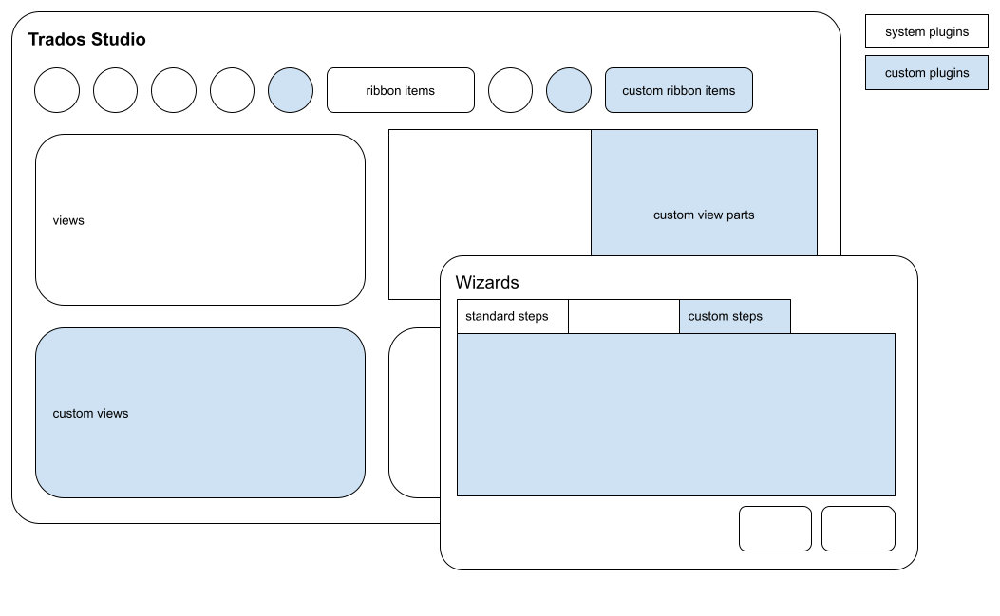

# User Interface Integration

The Var:ProductName Integration API allows third-party developers to extend and integrate custom UI functionalities into the Var:ProductName application.

## Required Assembly References

Add the following assemblies to your project. You can find them in the Var:ProductName installation folder:

* Sdl.Desktop.IntegrationApi.dll
* Sdl.Desktop.IntegrationApi.Extensions.dll
* Sdl.TranslationStudioAutomation.IntegrationApi.dll
* Sdl.TranslationStudioAutomation.IntegrationApi.Extensions.dll

> [!IMPORTANT]
> 
> Follow these guidelines when building and deploying plug-ins:
> 
> * Set your build output path to *Var:PluginPackedPath*
> * Verify that your library references point to the Var:ProductName folder (for example, *Var:InstallationFolder*)
> * Sign your assembly with a strong name—unsigned assemblies will not load in Var:ProductName
> * See [How to: Sign an Assembly with a Strong Name](https://docs.microsoft.com/en-us/dotnet/standard/assembly/sign-strong-name?redirectedfrom=MSDN) for details
> 
> For more information, see [Building a plug-in](building_a_plugin.md) and [Plug-in deployment](plugin_deployment.md).

## API Namespaces

### Sdl.Desktop.IntegrationApi

[Sdl.Desktop.IntegrationApi](../../api/integration/Sdl.Desktop.IntegrationApi.yml) is the main namespace for integrating new UI functionalities into Studio.

### Sdl.TranslationStudioAutomation.IntegrationApi

[Sdl.TranslationStudioAutomation.IntegrationApi](../../api/integration/Sdl.TranslationStudioAutomation.IntegrationApi.yml) is the main namespace for integrating custom functionality into the Var:ProductName application.
