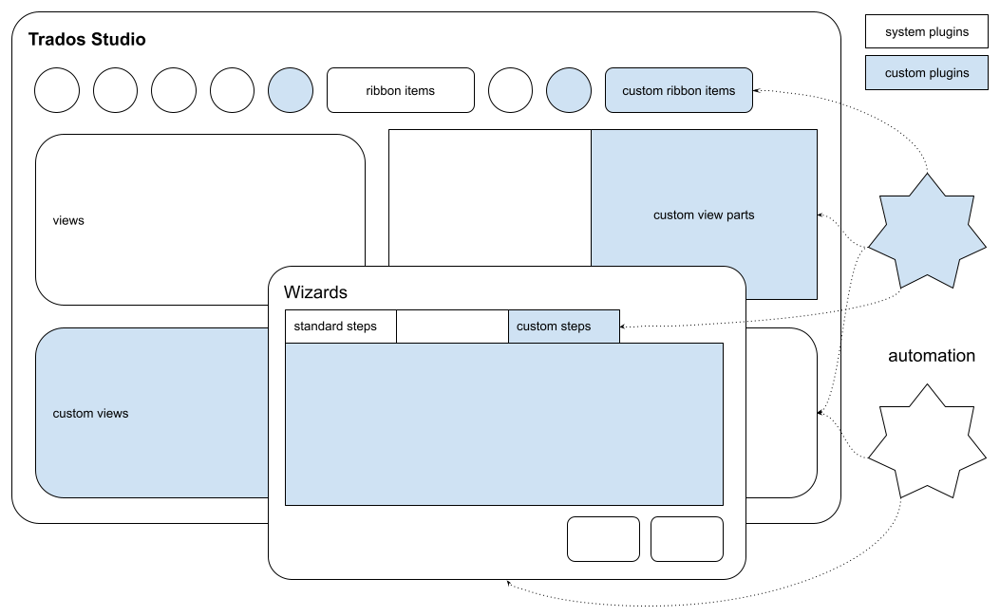

What you can do with the Integration API
=====

This page provides a quick overview of what you can do with the <Var:ProductName> Integration API.

The following diagram exemplifies how the <Var:ProductName> Integration API enables you to create custom plug-ins in order to:

* [Extend or customize the user interface for Studio applications.](user_interface_integration.md)
* [Provide custom functionalities for the <Var:ProductName> application.](studio_automation.md)

<Var:ProductName> API documentation features examples on common and best practices when developing plug-ins using <Var:ProductName> API. All provided examples are written in C#.
