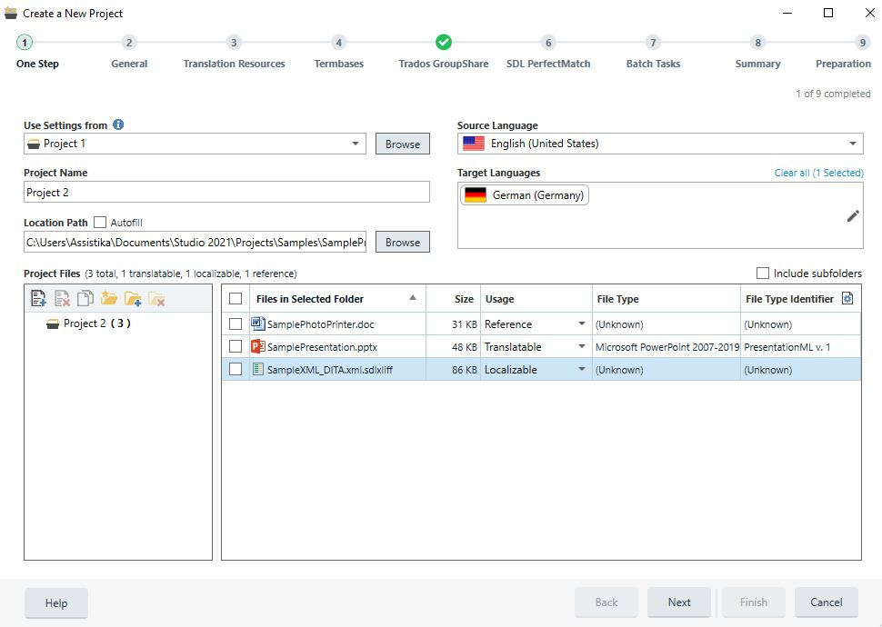

About Project Files
====
This section gives an overview of the types of files that can be part of a localization project and explains how the Trados Studio 2017 models these.

Project Files
----
As mentioned before, the main type of files that play a part in a localizable project are files that should be translated. From now on we will call these files *translatable files*. To be more specific, we define translatable files as files that can be processed and translated using SDL's tools, more specifically files from which the translatable content can be extracted and manipulated through the *File Type Support Framework*. For more information see Translatable Files.

Certain project types may consist of a large quantity of translatable files, which each only contain a small amount of content, for instance a website translation project, or files that were exported from a content management system. To facilitate processing these types of projects, the SDL Trados Studio 2017 offers the ability to merge a number of these files into a single translatable, so that it can be processed and edited as one big unit. Merging files could happen at various stages in the project: upfront as part of project preparation, or on a more ad-hoc basis by a translator who wants to edit multiple files at once. For more information see Merged Translatable Files.

There are files that need to be localized, but for which SDL does not provide a file type definition that can extract translatable content. An example of these are graphics files that contain text. Those files are called localizable files, which indicates that they can be localized as part of the project, but not through the standard workflow with SDL tools, for instance with a graphics editor. For more information see Localizable Files.

Another type of files are *reference files*. These are files that need to be part of the project, but that are not expected to be modified during translation, for instance external graphics that are required to preview an HTML file. For more information see Reference Files.

Sometimes, processing a translatable file, produces additional files that are linked to that translatable file, and that need to travel throughout the remainder of the translation process. We call those files *auxiliary files*. An example of this is a PDF preview file that is generated for a translatable file, and that can be used for commenting. For more information see Auxiliary Files.

File Object Model
---
**IProjectFile** is the base for all files that can be part of a project and provides common properties and functionality such as the ability the download it, etc.

An **ILanguageFile** is a project file that is associated with a specific project language, which could be a source or a target language. Initially, when a file is added to the system, it is typically a source language file. The source language file then goes through some source language specific processing, for instance, conversion into the SDL XLIFF file format and segmentation. At some point, a target language file is created for every target language in the project, after which target language- specific processing takes place, such as translation memory analysis and translation. All types of project files are language files and are therefore associated with a specific project language. Every source language file has the ability to find its related target language files and vice-versa.

All types of project files that can be modified after they have been added to the project are versioned, i.e. a full version history is maintained for these. This includes all files except reference files.

Translatable Files
-----
Translatable files are files that can be processed and translated using SDL's tools, i.e. for which a file type definition exists in the SDL File Type Support Framework. As a result, translatable files can carry some additional information:

* **File Type**: Identifies with which file type definition this particular file will be processed. It also specifies any other file-type specific aspects, such as how to preview this file, how to verify the content of this file, which QuickInsert (=special characters or tags that can be inserted during editing) items are valid for use, etc.
* **Analysis Statistics**: Statistics on how much existing translations can be leveraged from translation memories or previously translated files. These statistics are expressed in terms of characters, words and segments. Statistics are calculated for various categories, such a 100% TM matches, fuzzy TM match categories (50%-74%, 75%-84%, 85%-94%, 95%-99%), repetitions, no match, etc. For more information, see IAnalysisStatistics. Full analysis statistics are only available for target language translatable files. Source language translatable files can only have total character, word and segment count information.
* **Confirmation Statistics**: Statistics on how far the file has progressed throughout the translation process. Every segment in a translatable file is assigned a confirmation level (not translated, draft, translated, translation rejected, translation approved, sign-off rejected, signed off). The confirmation statistics for a translatable file constitute the sums of characters, words or segments for each of these levels. Based on these statistics, a combined confirmation level is also computed: this gives an indication of the status of the entire file. Confirmation statistics are only available for target language translatable files.
* **Auxiliary Files**: A number of files that are associated with the translatable file. These files are typically the result of some automatic task running on the file, but can also be manually attached to the file. For more information see Auxiliary Files.

Translatable files are represented by the **ITranslatableFile** interface in the object model.

Merged Translatable Files
-----
A merged translatable file is a translatable file which is created by merging a number of translation files into one. The SDL Trados Studio 2017 provides capabilities to define which files should be merged into one. Subsequently, the files can actually be merged by creating one consolidated SDL XLIFF file containing the merged content of all the files. After working on the merged file, it can be split into single files again. Apart from the fact that you can merge and split a merged translatable file, it is just a normal translatable file, and can be manipulated as such.

Merged translatable files are represented by the **IMergedTranslatableFile** interface in the object model.

Localizable Files
-----
Localizable files are files that need to be changed as part of the localization process, but that cannot be processed using standard SDL tools (i.e. the File Type Support Framework). As a result of that, localizable files do not have analysis or confirmation statistics. Other than that, localizable files are changeable, versioned files.

Localizable files are represented by the **ILocalizableFile** interface in the object model.

Reference Files
----
Reference files are files that need to be part of the project, for instance for preview reasons, but that can be changed as part of the project. Reference files are language files, which means they are associated with a particular project language.

Reference files are represented by the **IReferenceFile** interface in the object model.

The screenshot above illustrates how project files are selected in Trados Studio 2017.