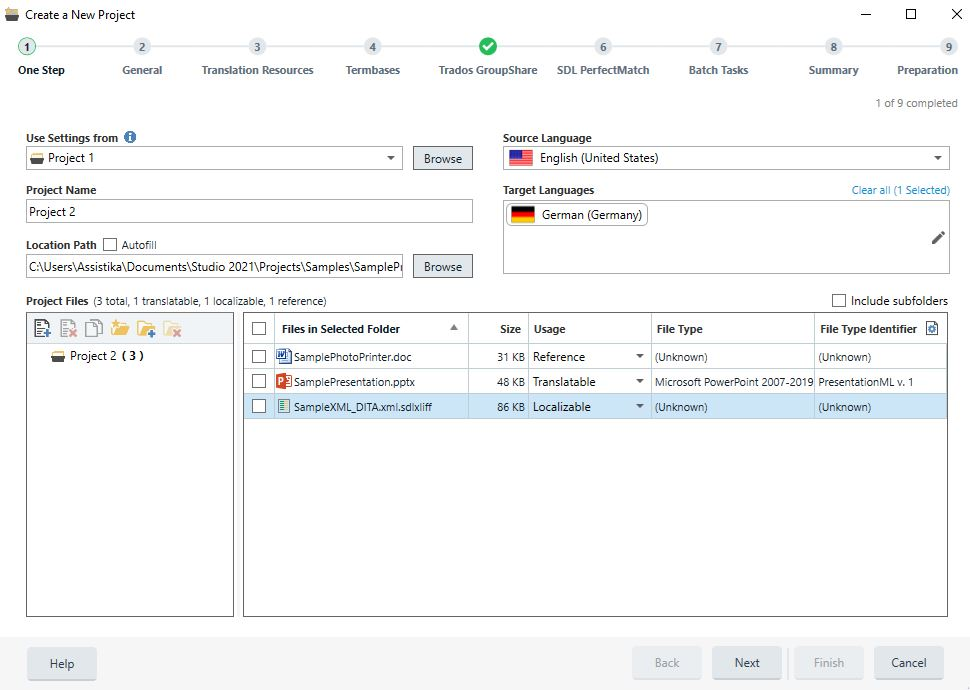

# About Projects
This section provides a high-level overview of projects within the Project Automation API.

A localization project encompasses the data, resources, and processes required to localize source files from one language (the source language) into one or more target languages. The main inputs to a translation project are:

* **The documents to translate**: Files to translate are the main input, although various other file types come into play in real-life project, as explained in the About Project Files section.
* **The source language**: This is the language of the files that need to be translated. At the moment, projects only support one source language. At the same time, files with mixed-language content are not supported either.
* **The target languages**: A single project models the translations of files into one or more target languages. The main reasons for this are the usefulness of being able to manage this translations together and the fact that some processing (manual and automated) on the source language content can be shared between these translations.

Beyond files and language information, project configuration plays a critical role. Configuration covers translation memories and termbases, settings for automated preparation steps, and custom settings for external system integration. For more information, see [Project Configuration](project_configuration.md).

The execution process of a localization project is equally important. The Project Automation API models this through tasks—both automated (file preparation, translation memory analysis) and manual (translation, review). Tasks can run as part of a workflow or on an ad-hoc basis.

Another important aspect of translation projects is their distributed nature. Frequently, the participants in a single localization project are spread across the globe and vary in size from large corporations, who produce content, over language service providers, who provide localization project management to freelance translators and reviewers. This aspect of localization projects is commonly referred to as the localization supply chain. The Project Automation API provides a way to deal with this, through the concept of packages: work (manual tasks) can be sent across the localization supply chain bundled into packages, containing for instance files to translate together with configuration and settings. These packages can be produced and opened by tools like Var:ProductName. For more information, see [About Packages](about_packages.md).

In Var:ProductName, projects are either created by opening a single file or by running the **New Project** wizard as shown in the above screenshot.
