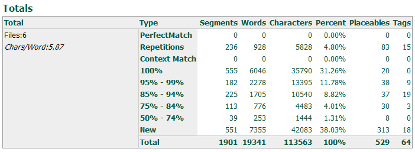
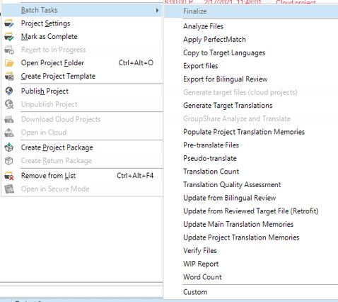

# About Tasks
The API supports two types of tasks:

* **Manual tasks**: For example, translating, editing and proofreading. Manual tasks can only be done by users. They are assigned by the project manager.
* **Automatic tasks**: Are performed by the machine, as they do not require human linguistic skills. Examples of automatic tasks include file analysis, word count, file conversion, etc.
After creating a project, you can run one or more automatic tasks on the project files. One critical task converts native file types into a translatable, bilingual format (SDLXliff). This conversion is a prerequisite for all subsequent tasks—word count, translation, and editing. The file analysis task is one of the most common. It compares source segments against translation units (TUs) in one or more TMs. The task determines match counts (context matches, exact matches, fuzzy matches) and identifies repeated segments. It then generates a report suitable for printing and cost estimation. Below you see an example of a file analyze report:

Automatic tasks can be combined into task sequences. A sequence typically runs immediately after project creation—for example: converting files to SDLXliff, analyzing files, then pre-translating. Below you see an example of a **Prepare** task sequence in Var:ProductName and the single tasks that the sequence contains:

In Var:ProductName, you can also run automatic tasks on one or several selected files by right-clicking the file(s) and selecting the required task from the context menu:

## See Also
[Running Tasks on Project Files](running_tasks_on_project_files.md)

[Automatic Tasks and Tasks Settings](automatic_tasks_and_task_settings.md)

[Creating a Project Package](creating_a_project_package.md)

[Converting the Project Files](converting_the_project_files.md)

[Analyzing the Files](analyzing_the_files.md)

[Configuring the Analyze Task Settings](configuring_the_analyze_task_settings.md)
