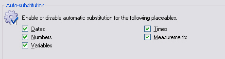
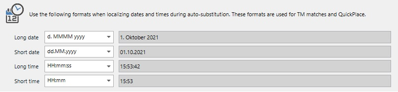

Auto-Substitution Settings
==

<Var:ProductName> offers the ability to automatically substitute and localize certain elements within a segment, e.g. numbers. Example: The segments '*You owe me 100 dollars.*' and '*You owe me 2,000 dollars.*' are regarded as being identical, because the only difference here is a number, which can be automatically substituted. Moreover, <Var:ProductName> can also auto-localize the number format. For example, the number '2,000' in English needs to be localized into '2.000' when the target language is e.g. German.

Through the API you can programmatically set for a project whether elements such as numbers, dates, times, measurements, etc. should be automatically substituted and localized or not. By default, such elements are treated by the system as placeables, which means that they can be automatically substituted by the system. The sample code below highlights some of the properties which you can set to True or False depending on whether you want the auto-substitution and auto-localization to be used in your project:

# [C#](#tab/tabid-1)
```CS
tmSettings.NumbersAutoLocalizationEnabled.Value = true;
tmSettings.DatesAutoLocalizationEnabled.Value = true;
tmSettings.MeasurementsAutoLocalizationEnabled.Value = true;
tmSettings.TimesAutoLocalizationEnabled.Value = true;
```
***

The screenshot below shows the auto-substitution settings that can be enabled/disabled through the user interface of <Var:ProductName>:



Note that if you want to use this feature, however, you would still like to alert translators to the fact that numbers, dates, etc. have been localized automatically in a segment, you can apply a penalty as shown in the code example below:

# [C#](#tab/tabid-2)
```CS
tmSettings.AutoLocalizationPenalty.Value = 1;
```
***

In this case, a penalty of 1% will be applied to each segment in which an auto-localization has taken place (for more information on penalties, please see also [Setting TM Penalties](setting_tm_penalties.md)).

Apart from setting whether elements such as dates, times, etc. should be localized, you can also set the preferred long/short date or time format. For example, you can configure whether the English date format *12-31-2010* should be in German *31.12.2010* or *31.12.10*, etc.

The screenshot below illustrates how you can set your preferred long and short date/time formats for the corresponding target language:



Below you find an example of how to set the preferred short date pattern for your project:

# [C#](#tab/tabid-3)
```CS
tmSettings.ShortDatePattern.Value = "dd.MM.yy";
```
***

See Also
--

[Translation Memory Search Settings](translation_memory_search_settings.md)

[Setting TM Penalties](setting_tm_penalties.md)

[Translation Memory Fields Update](translation_memory_field_update.md)

[Translation Memory Filter Settings](translation_memory_filter_settings.md)