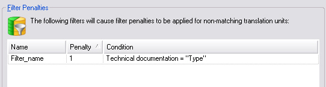

Translation Memory Filter Settings
==

For a project you may also set filters e.g. to 'penalize' translation units if they do not fulfill certain criteria. Example: You want to give preference to translation units that have the TM field value *Type = Technical documentation*. If an exact match is found in the TM, which, however, does not have this field value the match score is reduced by a certain percentage, e.g. from 100% to 99% in order to alert the translator to the fact that it might not fit the current context.

The documentation on the Translation Memory API contains more information on filters. For details please see the following page, which explains how to define filters for TM exports: [Exporting to a TMX File]().

About Filters
--

The following screenshot illustrates how a filter is defined in the user interface of <Var:ProductName>:



>**Note**
>
>In order to leverage filters for configuring the project settings you require the functionality offered by the Translation Memory API (see also Translation Memory Fields Update and Required References and Namespaces).

Note that there are two kinds of filters:

* Filter penalties: Reduces the score of non-matching TUs. For example, a filter has been set to Type = Technical documentation. The filter penalty value has been set to 2%. If the TM yields a translation unit where the Type value is not Technical documentation or where the Technical documentation field is missing, the match score will be reduced e.g. from 96% to 94%.
* Hard filter: If a hard filter is set, then non-matching translation units are not shown in the first place, i.e. it is like those TUs do not exist in the TM.

Note that for filter penalties you can define multiple filters, whereas hard filters can only use one filter expression, which is also outlined in the code examples below.

In this chapter, we will not explain in detail how to use the TM API to create filter expressions. For detailed information, please see [Exporting to a TMX File]().

Defining Filter Penalties
--

When defining filter penalties apply the [Filters]() to the [TranslationMemorySettings]() object and set the value to the penalty filters that should be used in the project, i.e.

```cs
tmSettings.Filters.Value = filterList;
```

The sample code below outlines how to create a single filter expression, i.e.* Type = Technical documentation*. This filter expression (which applies a penalty of 1%) is then set to a filter list, which is then used to configure the filter project settings:


```cs
PicklistItem fieldName = new PicklistItem("Type");
MultiplePicklistFieldValue fieldValue = new MultiplePicklistFieldValue("Technical documentation");
fieldValue.Add(fieldName);

AtomicExpression filter = new AtomicExpression(fieldValue, AtomicExpression.Operator.Equal);
Filter updateFilter = new Filter(filter, "Filter_name", 1);
List<Filter> filterList = new List<Filter>();
filterList.Add(updateFilter);

tmSettings.Filters.Value = filterList;
```

Defining Hard Filters
--

Defining a hard filter for a project is somewhat easier, as you have to set the [HardFilter]() property of your [TranslationMemorySettings]() object to only one filter expression. The example below outlines how to create the same filter expression as above (i.e. *Type = Technical documentation*), but this time use it as a hard filter:

```cs
PicklistItem hardFilterFieldName = new PicklistItem("Type");
MultiplePicklistFieldValue hardFilterFieldValue = new MultiplePicklistFieldValue("Technical documentation");
hardFilterFieldValue.Add(hardFilterFieldName);
AtomicExpression hardFilterExpression = new AtomicExpression(hardFilterFieldValue, AtomicExpression.Operator.Equal);
tmSettings.HardFilter.Value = hardFilterExpression;
```

See Also
--

**Other Resources**

Translation Memory Search Settings

Setting TM Penalties

Translation Memory Fields Update

Auto-Substitution Settings
