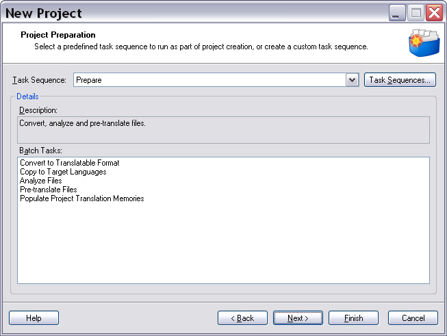

Running Tasks on the Project Files
==

For further processing of the project files a number of so-called automated batch tasks is executed. Batch tasks are used, for example, to convert the native files into the bilingual (SDL XLIFF) format for further processing. Other examples include word count, file analysis, and pre-translation. <Var:ProductName> allows you to put compile single tasks into a task sequence, which can then be run on the entire project. This chapter demonstrates how to programmatically run batch tasks on project files. There are separate chapters deal with tasks in more detail, e.g. provide they further information on the various configuration settings that you can choose before executing a task.

General Information on Tasks
--

The screenshot below shows the standard Prepare compound tasks and the sub-tasks that it contains:



The preparation of the project files involves the following tasks:

* **Convert to Translatable Format**: This task generates bilingual, intermediary (SDL XLIFF) files from the native input files (e.g. DOC, PPT, etc.). These intermediary files are then used further processing. The conversion step is actually the pre-requisite for any other tasks such as analyze files, pre-translation, etc.
* **Copy to Target Languages**: This task creates working copies of the bilingual (original) files per target language. In this step SDL Trados Studio 2017 also creates target language sub-folders in which the copied bilingual files are stored, e.g. de-DE for German, fr-FR for French, etc.
* **Apply Perfect Match**: This task inserts pre-translated segments from previous versions of the files directly into the project files.
* **Analyze Files**: Probably the single most important project management task. During execution of this task the project files are analyzed against any main TM(s) that were added to the project in order to determine the TM leverage, i.e. the number of matches that can be used for a particular set of documents, the segment repetition rate, etc.
* **Pre-translate Files**: Any existing translations found in the main TM(s) are inserted automatically into the project files.
* **Populate Project Translation Memories**: Creates project TMs from the main TMs. A project TM constitutes a subset of the its corresponding main TM. Project TMs only contain the TUs that are relevant for the current project. That way project managers can make sure that they do not have to forward the entire TM content to e.g. freelance translators, but only those TUs that match the project files.

Add the Function for Running the Tasks
--

The aim of this example is to show how to run the tasks that are described above programmatically. Implement a helper function called PrepareFiles. This function is the programmatic equivalent to the **Prepare** task used in <Var:ProductName>. This function takes a [FileBasedProject](../../api/projectautomation/Sdl.ProjectAutomation.FileBased.FileBasedProject.yml) object as parameter. The function can thus be called as follows:

```CS
this.PrepareFiles(newProject);
```
Note that in this chapter we will simply run the tasks without configuring any task options. Configuring the available options for each task will be shown in the subsequent chapters. Note that the first two tasks do the following:
* Generation of bilingual SDL XLIFF files from the native project documents
* Creation of working copies from the previously created bilingual documents for each target language

These two tasks are performed on the source files. Therefore, we will first retrieve the source files by applying the [GetSourceLanguageFiles](../../api/projectautomation/Sdl.ProjectAutomation.FileBased.FileBasedProject.yml#Sdl_ProjectAutomation_FileBased_FileBasedProject_GetSourceLanguageFiles) method to the project object, thereby creating an object (array) based on the [ProjectFile](../../api/projectautomation/Sdl.ProjectAutomation.Core.ProjectFile.yml) class, which holds the source documents:
```CS
ProjectFile[] sourceFiles = project.GetSourceLanguageFiles();
```
In the next step we run the task by applying the [RunAutomaticTask](../../api/projectautomation/Sdl.ProjectAutomation.FileBased.FileBasedProject.yml#Sdl_ProjectAutomation_FileBased_FileBasedProject_RunAutomaticTask_System_Guid___System_String_) method to the project. This method requires the file ids (i.e. the ids of the source files) and the id of the task to run as parameters. You can retrieve the task id easily using the [AutomaticTaskTemplateIds](../../api/projectautomation/Sdl.ProjectAutomation.Core.AutomaticTaskTemplateIds.yml) class as shown in the example below:

```CS
for (int i = 0; i < sourceFiles.Length; i++)
{
    if (sourceFiles[i].Role == FileRole.Translatable)
    {
        Guid[] fileId = { sourceFiles[i].Id };
        AutomaticTask convertTask = project.RunAutomaticTask(
            fileId,
            AutomaticTaskTemplateIds.ConvertToTranslatableFormat);

        AutomaticTask copyTask = project.RunAutomaticTask(
            fileId,
            AutomaticTaskTemplateIds.CopyToTargetLanguages);
    }
}
```

Note that in a 'real-life' implementation you need to make certain not to run the conversion task on any files that are marked as reference, e.g. pixel graphic files that are provided as reference or any documents that you have manually or programmatically set to reference. The conversion task will throw an error when trying to convert such file to a bilingual format. You should therefore make certain to only retrieve the ids of the files that are marked as translatable.
After running the conversion task the source language sub-folder of your project should contain the files that you originally added plus the bilingual SDL XLIFF versions as shown in the screenshot below:


All subsequent tasks such as pre-translate are run on the target file copies of the bilingual (SDL XLIFF) files. As projects can involve multiple target files, we 'outsource' all other tasks to a separate helper function called ```ProcessTargetLanguageFiles```, which also takes a [FileBasedProject](../../api/projectautomation/Sdl.ProjectAutomation.FileBased.FileBasedProject.yml) object and the target language locale string as parameters. For processing the target languages German and French this separate helper function is called as shown below:

```CS
this.ProcessTargetLanguageFiles(project, "de-DE");
this.ProcessTargetLanguageFiles(project, "fr-FR");
```
The helper function gets the project target files for the specified language by applying the [GetTargetLanguageFiles](../../api/projectautomation/Sdl.ProjectAutomation.FileBased.FileBasedProject.yml#Sdl_ProjectAutomation_FileBased_FileBasedProject_GetTargetLanguageFiles) method to the project object providing the required [CultureInfo](https://docs.microsoft.com/en-us/dotnet/api/system.globalization.cultureinfo?redirectedfrom=MSDN&view=net-5.0) as parameter. It then runs the tasks analyze files, pre-translate, and populate project TMs as outlined below:

```CS
public void ProcessTargetLanguageFiles(FileBasedProject project, string locale)
{ 
    #region "PerfectMatchSetupAndTask"
    Language targetLanguage = new Language(CultureInfo.GetCultureInfo(locale));

    ProjectFile[] targetFiles = project.GetTargetLanguageFiles(targetLanguage);

    project.AddBilingualReferenceFiles(GetBilingualFileMappings(new Language[] { targetLanguage }, targetFiles, @"c:\ProjectFiles\PreviousProjectFiles"));

    AutomaticTask perfectMatchTask = project.RunAutomaticTask(
    targetFiles.GetIds(),
    AutomaticTaskTemplateIds.PerfectMatch);
    #endregion

    AutomaticTask analzyeTask = project.RunAutomaticTask(
        targetFiles.GetIds(),
        AutomaticTaskTemplateIds.AnalyzeFiles);

    AutomaticTask translateTask = project.RunAutomaticTask(
        targetFiles.GetIds(),
        AutomaticTaskTemplateIds.PreTranslateFiles);

    AutomaticTask projectTmTask = project.RunAutomaticTask(
        targetFiles.GetIds(),
        AutomaticTaskTemplateIds.PopulateProjectTranslationMemories);
}
```

Check for Task Events
--

Tasks might fail due to particular circumstances. For example, Microsoft Word files that contain unaccepted changes can by default not be processed. Therefore, when you try to convert such a DOC file to SDL XLIFF, the task will fail with an error message. Therefore, it is recommended that you check for the status of the current task and act accordingly, e.g. when the current task has the status [Failed](../../api/projectautomation/Sdl.ProjectAutomation.Core.TaskStatus.yml#fields). You could then, for example, output a message to alert the user and suggest a way of fixing this problem (if applicable). In this step we will implement another helper function called CheckEvents. It uses the [TaskStatus](../../api/projectautomation/Sdl.ProjectAutomation.Core.TaskStatus.yml) class to check the current task status. In this simple implementation we just use a break statement regardless of the current status. In a real-life implementation you would, for example, output an error message when the status is [Failed](../../api/projectautomation/Sdl.ProjectAutomation.Core.TaskStatus.yml#fields). The helper function for checking the task status should look as shown below:

```CS
private void CheckEvents(List<TaskStatusEventArgs> taskStatusEventArgsList, List<MessageEventArgs> messageEventArgsList)
{
    // loop through the available statuses and messages
    foreach (var item in taskStatusEventArgsList)
    {
        switch (item.Status)
        {
            case TaskStatus.Assigned:
                break;
            case TaskStatus.Cancelled:
                break;
            case TaskStatus.Cancelling:
                break;
            case TaskStatus.Completed:
                break;
            case TaskStatus.Created:
                break;
            case TaskStatus.Invalid:
                break;
            case TaskStatus.Rejected:
                break;
            case TaskStatus.Started:
                break;
            case TaskStatus.Failed:
                break;
            default:
                break;
        }
    }

    // at the end clear task statuses and messages
    taskStatusEventArgsList.Clear();
    messageEventArgsList.Clear();
}
```

To trigger the above helper function you need to enhance the ```PrepareFiles``` function by adding the two following lines:

```CS
List<TaskStatusEventArgs> taskStatusEventArgsList = new List<TaskStatusEventArgs>();
List<MessageEventArgs> messageEventArgsList = new List<MessageEventArgs>();
```

Then, each time after applying the [RunAutomaticTasks](../../api/projectautomation/Sdl.ProjectAutomation.FileBased.FileBasedProject.yml#Sdl_ProjectAutomation_FileBased_FileBasedProject_RunAutomaticTask_System_Guid___System_String_) method, you fire the ```CheckEvents``` helper function, e.g.:

```CS
CheckEvents(taskStatusEventArgsList, messageEventArgsList);
```

Putting it All Together
--

Below you see what the above mentioned functions should look like when all is put together:

```CS
public void PrepareFiles(FileBasedProject project)
{
    #region "EventArgs"
    List<TaskStatusEventArgs> taskStatusEventArgsList = new List<TaskStatusEventArgs>();
    List<MessageEventArgs> messageEventArgsList = new List<MessageEventArgs>();
    #endregion

    ProjectFile[] sourceFiles = project.GetSourceLanguageFiles();

    for (int i = 0; i < sourceFiles.Length; i++)
    {
        if (sourceFiles[i].Role == FileRole.Translatable)
        {
            Guid[] fileId = { sourceFiles[i].Id };
            AutomaticTask convertTask = project.RunAutomaticTask(
                fileId,
                AutomaticTaskTemplateIds.ConvertToTranslatableFormat);
            this.CheckEvents(taskStatusEventArgsList, messageEventArgsList);

            AutomaticTask copyTask = project.RunAutomaticTask(
                fileId,
                AutomaticTaskTemplateIds.CopyToTargetLanguages);
            this.CheckEvents(taskStatusEventArgsList, messageEventArgsList);
        }
    }

    this.ProcessTargetLanguageFilesExtended(project, "de-DE");
    this.ProcessTargetLanguageFilesExtended(project, "fr-FR");
}
```
```CS
public void ProcessTargetLanguageFilesExtended(FileBasedProject project, string locale)
{
    List<TaskStatusEventArgs> taskStatusEventArgsList = new List<TaskStatusEventArgs>();
    List<MessageEventArgs> messageEventArgsList = new List<MessageEventArgs>();

    ProjectFile[] targetFiles = project.GetTargetLanguageFiles(new Language(CultureInfo.GetCultureInfo(locale)));

    AutomaticTask analyzeTask = project.RunAutomaticTask(
        targetFiles.GetIds(),
        AutomaticTaskTemplateIds.AnalyzeFiles);
    this.CheckEvents(taskStatusEventArgsList, messageEventArgsList);

    #region "SaveAnalysisReport"
    Guid reportId = analyzeTask.Reports[0].Id;
    project.SaveTaskReportAs(reportId, @"C:\ProjectFiles\Analysis_report.xls", ReportFormat.Excel);
    #endregion

    AutomaticTask translateTask = project.RunAutomaticTask(
        targetFiles.GetIds(),
        AutomaticTaskTemplateIds.PreTranslateFiles);
    this.CheckEvents(taskStatusEventArgsList, messageEventArgsList);

    AutomaticTask projectTmTask = project.RunAutomaticTask(
        targetFiles.GetIds(),
        AutomaticTaskTemplateIds.PopulateProjectTranslationMemories);
    this.CheckEvents(taskStatusEventArgsList, messageEventArgsList);
}
```

```CS
private void CheckEvents(List<TaskStatusEventArgs> taskStatusEventArgsList, List<MessageEventArgs> messageEventArgsList)
{
    // loop through the available statuses and messages
    foreach (var item in taskStatusEventArgsList)
    {
        switch (item.Status)
        {
            case TaskStatus.Assigned:
                break;
            case TaskStatus.Cancelled:
                break;
            case TaskStatus.Cancelling:
                break;
            case TaskStatus.Completed:
                break;
            case TaskStatus.Created:
                break;
            case TaskStatus.Invalid:
                break;
            case TaskStatus.Rejected:
                break;
            case TaskStatus.Started:
                break;
            case TaskStatus.Failed:
                break;
            default:
                break;
        }
    }

    // at the end clear task statuses and messages
    taskStatusEventArgsList.Clear();
    messageEventArgsList.Clear();
}
```

See Also
--
**Other Resources**

[Automatic Tasks and Task Settings](automatic_tasks_and_task_settings.md)

[Analyze Files Settings](analyze_files_settings.md)

[Project TM Creation Settings](project_tm_creation_settings.md)

[Perfect Match](perfect_match.md)

[Update Translation Memory Settings](update_translation_memory_settings.md)

[Generating and Exporting Target Files](generating_and_exporting_target_files.md)

[Translation Count](translation_count.md)

[Converting the Project Files](converting_the_project_files.md)

[Configuring the Analyze Task Settings](configuring_the_analyze_task_settings.md)

[Analyzing the Files](analyzing_the_files.md)

[Generating the Task Report](generating_the_task_report.md)

[Saving Task Reports](saving_task_reports.md)