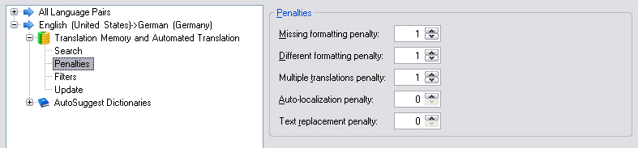

Setting TM Penalties
==

It can happen that a match that was found in a translation memory is linguistically speaking an exact match for the current segment. However, it should not be shown as a 100% match to the user, for example, because of formatting differences. In this case a penalty should be applied to alert the user to the fact that event though an exact match has been retrieved, the suggested translation still requires editing. If the penalty value is e.g. 1%, one percentage point will be deducted from the original score for each formatting difference. Example: If the TM contains a 100% match with two formatting differences, the 100% match will be reduced to a 98% match. Translators are thereby made aware that they should not accept the translation suggestion as is without adapting the formatting in the target segment.

The screenshot below illustrates the various penalties that can be configured through the user interface of <Var:ProductName>:



The sample code below highlights some of the properties that can be used to configure the penalty values for your project. For example, here we set the penalties for missing or different formatting from the default 1 to 0. This can be done e.g. if the project involves files in which formatting is not important. In this case you can get a higher TM leverage by ignoring (i.e. by not penalizing) formatting differences.

At the same time, for example, we increase the [MultipleTranslationsPenalty](../../api/projectautomation/Sdl.ProjectAutomation.Settings.TranslationMemorySettings.yml#Sdl_ProjectAutomation_Settings_TranslationMemorySettings_MultipleTranslationsPenalty) from the default value 1 to 2. This common penalty is applied when more than one exact match is found for a segment. This can happen when the TM contains different translations for the same source segment, which may be necessary as different translations can apply in different contexts. To alert translators to the fact that the TM contains several possible translations and that they need to check which one applies in the current context, a penalty is applied.

Additionally we can set [AutoLocalizationPenalty](../../api/projectautomation/Sdl.ProjectAutomation.Settings.TranslationMemorySettings.yml#Sdl_ProjectAutomation_Settings_TranslationMemorySettings_AutoLocalizationPenalty) when auto localization took place to create a translation proposal, default being 0. TextReplacementPenalty is applied when variable auto-substitutions applied, or text placeholder values copied from the document tag into the translation proposal with default 0. The penalty for character-width difference can be enabled as well (in case of asian-source langauges), it's default value being 1.

# [C#](#tab/tabid-1)
```CS
tmSettings.MissingFormattingPenalty.Value = 0;
tmSettings.DifferentFormattingPenalty.Value = 0;
tmSettings.MultipleTranslationsPenalty.Value = 2;
tmSettings.AutoLocalizationPenalty.Value = 1;
tmSettings.TextReplacementPenalty.Value = 1;
tmSettings.CharacterWidthDifferencePenaltyEnabled.Value = true;
tmSettings.CharacterWidthDifferencePenalty.Value = 2;
```
***

See Also
--
[Translation Memory Search Settings](translation_memory_search_settings.md)

[Translation Memory Fields Update](translation_memory_field_update.md)

[Translation Memory Filter Settings](translation_memory_filter_settings.md)

[Auto-Substitution Settings](auto_substitution_settings.md)