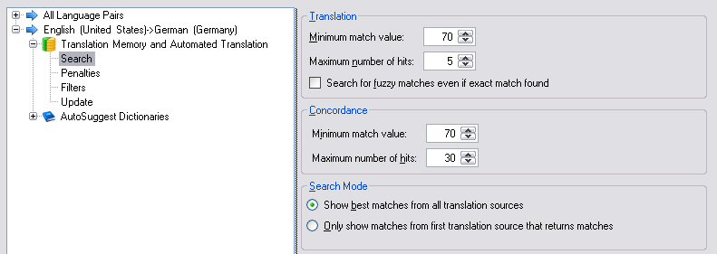

Translation Memory Search Settings
==

The most common TM settings are probably the search settings, which you can use to fine-tune TM segment lookup operations as well as concordance searches.

The screenshot below shows the various search settings that can be configured through the user interface of <Var:ProductName>:



The sample code below demonstrates the properties that you can set for fine-tuning the segment lookup in the TMs:

* Through the minimum match value you can set how high a fuzzy match needs to be at minimum to be offered by a search in the first place. If this value is set to e.g. 90, only fuzzy matches in a high range will be offered. Any TM matches below that threshold will be ignored, i.e. those segments will be treated as no matches. The default is 70.
* Moreover, you can configure how many matches from the TM should be retrieved at maximum. If, for example, the TM would offer 10 possible matches, but you have set the maximum search result limit to 3, only the first three matches (i.e. the first highest matches) will be offered. The default value is 5.
* By settings the [TranslationFullSearch](../../api/projectautomation/Sdl.ProjectAutomation.Settings.TranslationMemorySettings.yml#Sdl_ProjectAutomation_Settings_TranslationMemorySettings_TranslationFullSearch) property to True you can make sure that fuzzy matches are also retrieved even if an exact or a context match has been found.

```CS
tmSettings.TranslationMinimumMatchValue.Value = 80;
tmSettings.TranslationMaximumResults.Value = 10;
tmSettings.TranslationFullSearch.Value = true;
```

Note that all of the above properties can have an impact on the search performance. The more matches the search has to retrieve, and the lower the fuzzy match threshold, the longer a search can take.

Similar options are available for the concordance search, i.e. the type of search that does not retrieve whole segments, but rather parts of segments such as single words or multi-word expressions. As the code below outlines you can configure a minimum match value threshold for the concordance search (default: 70) and a maximum limit for the number of results (default: 30). In the example below we use the lowest possible minimum match value and a search result limit above the default of 30. Note that both settings can have an impact on search performance, i.e. the deeper the concordance search needs to go into the TM, the more time the search might take.

```CS
tmSettings.ConcordanceMinimumMatchValue.Value = 30;
tmSettings.ConcordanceMaximumResults.Value = 50;
```

See Also
--

**Other Resources** 

[Setting TM Penalties](setting_tm_penalties.md)

[Translation Memory Fields Update](translation_memory_field_update.md)

[Translation Memory Filter Settings](translation_memory_filter_settings.md)

[Auto-Substitution Settings](auto_substitution_settings.md)