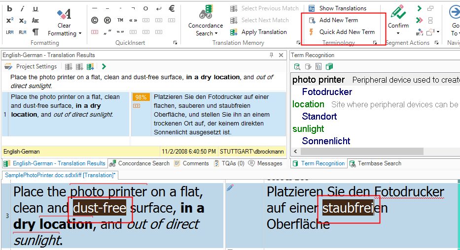
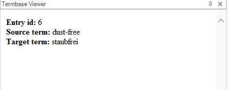
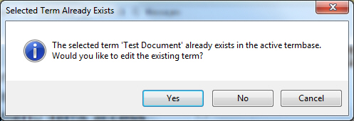
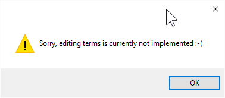

# Adding Terms
Configure your custom terminology provider to support adding and editing terminology entries. This article explains simplified functionality for adding source and target terms to a delimited text list.

In **Var:ProductName**, you can add source and target terms on the fly by marking them in the Editor and then clicking either **Add New Term** or **Quick Add New Term**.

In the standard, MultiTerm-based implementation of **Var:ProductName**:

* **Add New Term** opens an editor control in the **Termbase Viewer** window so you can modify terms before saving.
* **Quick Add New Term** adds the term pair directly to the terminology source and displays the newly created entry in the **Termbase Viewer** window.

In this simplified implementation, no editing function is provided, so both buttons perform the same action.

To implement this behavior:

1. Open the **MyTerminologyProviderViewerWinFormsUI.cs** class and go to the **AddTerm()** function.
2. **Var:ProductName** passes the selected source and target terms through the **source** and **target** string parameters.
3. Implement the following steps:
   * Open the glossary text file.
   * Loop to the end of the text file while counting lines to determine the next entry ID.
   * Insert the new source and target terms (with an empty definition).
   * Display the newly created entry in the Internet Explorer control of the **Termbase Viewer** window.

# [Adding Terms Functionality](#tab/tabid-1)
[!code-csharp[MyTerminologyProvider](code_samples/MyTerminologyProviderViewerWinFormsUI.cs#L66-L102)]
***

When a new source/target term pair is added, the following appears in the **Termbase Viewer** window:

You can also implement your terminology provider to support editing. However, this simplified example does not add editing functionality. Supporting editing would require an editing control in the **Termbase Viewer** window. For now, the **AddAndEditTerm()** function in the **MyTerminologyProviderViewerWinFormsUI.cs** class outputs a message:

# [Adding and Editing Terms](#tab/tabid-2)
[!code-csharp[MyTerminologyProviderViewerWinFormsUI](code_samples/MyTerminologyProviderViewerWinFormsUI.cs#L59-L64)]
***

If you try to add a term that already exists, **Var:ProductName** displays a message that prompts you to:

* Edit the entry by clicking **Yes**.
* Add the term again, risking a duplicate entry, by clicking **No**.
* Cancel the entire add operation by clicking **Cancel**.

If you click **Yes** to edit the entry, the following message box is displayed in this implementation and the **Termbase Viewer** window remains empty. In a real implementation, the entry content is shown in an edit control where you can still modify it.

