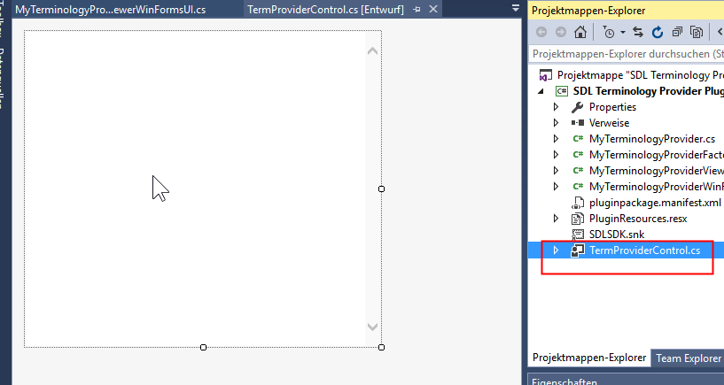

# Displaying Entry Content

Display the full content of an entry in the **Termbase Viewer** window. This guide explains how to show the content of a glossary file line in **Var:ProductName**.

Right-click a term in the **Term Recognition** or **Termbase Search** window and select **View term details** to display the full entry content in the **Termbase Viewer** window.

1. Add an Internet Explorer control to display entry content in HTML format:
   - Create a user control in your project named **TermProviderControl.cs**.
   - Add an Internet Explorer control to the user control.

2. Open the **MyTerminologyProviderViewerWinFormsUI.cs** class.
3. Declare the following term controller object:
# [The Term Controller Object](#tab/tabid-1)
[!code-csharp[MyTerminologyProvider](code_samples/MyTerminologyProvider.cs#L18-L19)]
***

4. Modify the **TermProviderControl** property (implemented by the **ITerminologyProviderViewerWinFormsUI** interface) as shown below to create and return the control element:

# [Returning the Controller Element](#tab/tabid-2)
[!code-csharp[MyTerminologyProvider](code_samples/MyTerminologyProvider.cs#L21-L30)]
***

5. When you right-click a term and select **View term details**, the corresponding entry content should appear in the newly created control.

6. Modify the **JumpToTerm()** method as shown below. **Var:ProductName** passes the ID of the selected entry, which you can use to:

* Retrieve the corresponding line from the glossary text file.
* Parse the line and generate HTML output for the Internet Explorer control.

# [Jumping to a Term](#tab/tabid-3)
[!code-csharp[MyTerminologyProvider](code_samples/MyTerminologyProviderViewerWinFormsUI.cs#L123-L161)]
***
