# Terminology Overview

This section provides an overview of terminology providers in Var:ProductName and their usage.

## What is a Terminology Provider?

A terminology provider plug-in allows Var:ProductName to integrate terminology sources, such as termbases and glossaries. These sources can be used to:

* look up terminology by searching for a specific string that the user enters, similar to an electronic dictionary lookup
* search a sentence for any known terminology
* add term entries to the terminology source
* edit terminology in the terminology source

## Selecting the Terminology Provider
When you implement a custom terminology provider, you need to consider a number of features that such plug-ins typically have. First, you select the terminology provider in Var:ProductName. By default, Var:ProductName features two standard terminology providers for connecting to MultiTerm termbase files or MultiTerm server termbases:

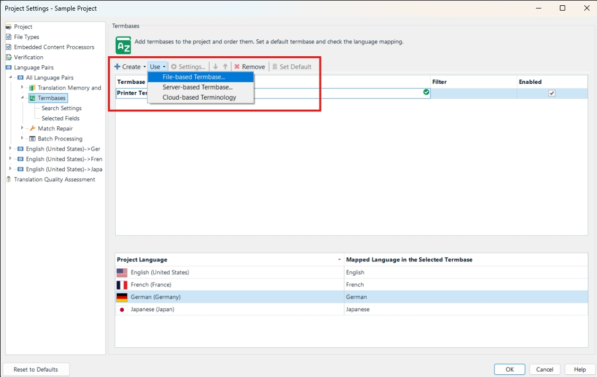

Your plug-in name must appear in the list of terminology providers. The implementation should display a user interface where the terminology source (e.g. a glossary text file) can be selected. For file-based resources, this would typically be an **Open File** dialogue box, e.g.:

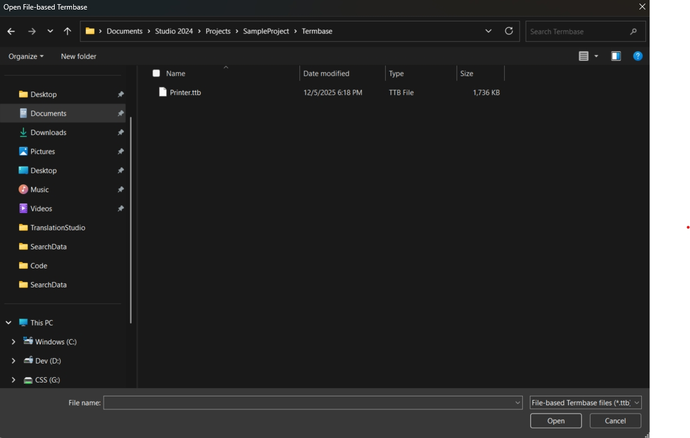

## Selecting the Terminology Resource Languages
A terminology resource typically has terms in several languages. These languages can be named in various ways. For example, the language &apos;English&apos; might be called &apos;ENG&apos;, &apos;Anglais&apos;, &apos;Englisch&apos;, &apos;Inglés&apos;, etc. When selecting a terminology resource, Var:ProductName assigns the languages of the terminology resource to the corresponding project language in Var:ProductName. This is done in the background using locales, e.g. &apos;en-US&apos; for US English, as the language labels used in the terminology resource cannot always be predicted. If Var:ProductName fails to assign the correct languages, you can manually assign the correct language using a dropdown list in Var:ProductName, which shows all the languages offered by the terminology resource, e.g.:

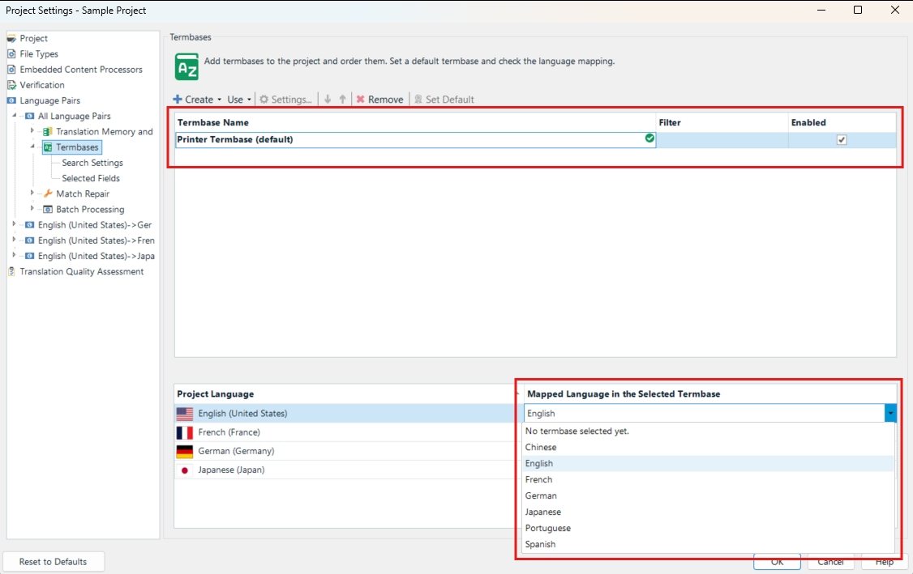

After selecting a terminology resource, Var:ProductName prompts you to confirm that the correct languages have been picked, i.e.:

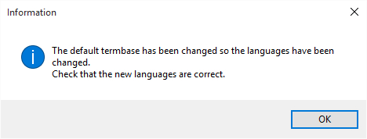

## Active Terminology Recognition
When the terminology provider is selected, it will search search the segments in Var:ProductName for any
known terminology. It will mark the recognized term (e.g. *photo printer*) with a red line, and display the term and its translation in the **Term Recognition** window, e.g.:

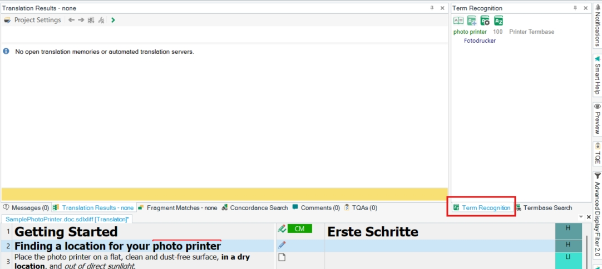

You can insert the target term into the target segment by typing the first letter, e.g.:

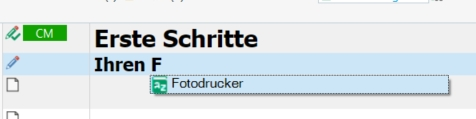

By default, terms in the source segment should only be recognized when there is a target equivalent, as a source term without a translation is normally of no use during translation.

## Search Settings
Users can switch to the **Termbase Search** window and enter search terms manually. The window will then display any hits with source and target terms.

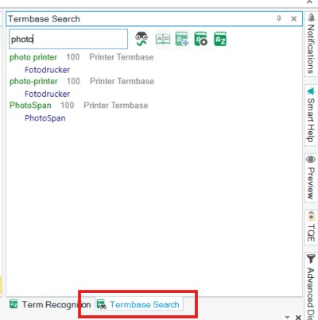

You can also activate the **Fuzzy Search** option to make the search tolerant, so that misspelled or transposed forms of the search string are found, e.g.:

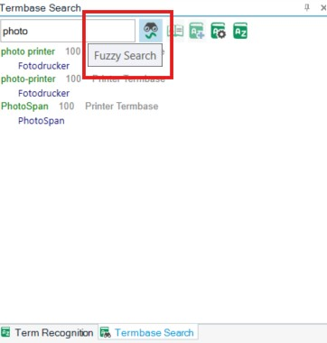

## The Termbase Viewer
A terminology entry can have more than just the source and the target term. It can have additional information, such as definitions, notes, remarks, etc. As the **Term Recognition** and **Termbase Search** window by default only show the source and target terms, you can view any further information in the **Termbase Viewer** window, which you can call up through the **View term details** command:

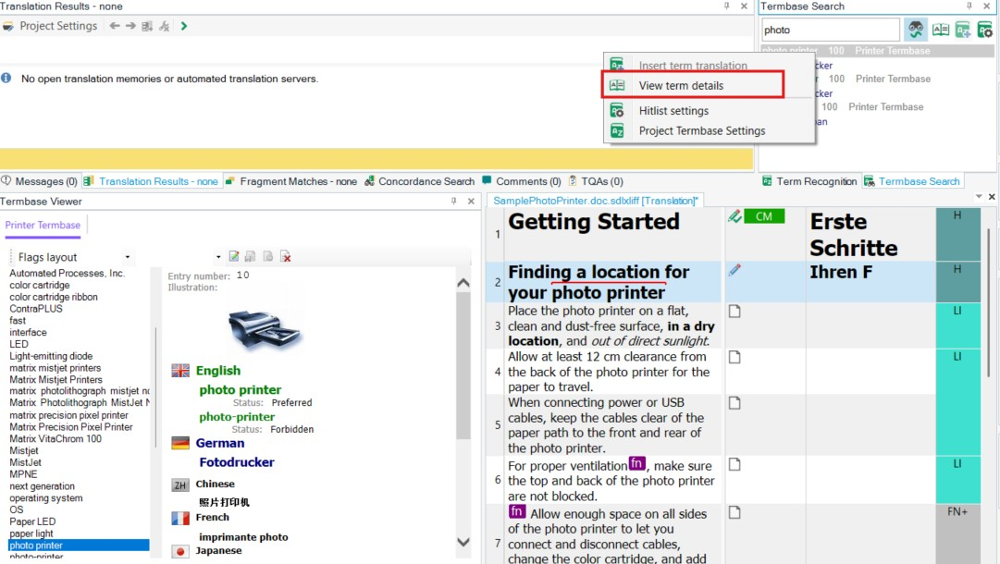

Depending on the nature and content of the terminology resources supported by your custom implementation, this window can show different things. For a MultiTerm termbase, it shows a MultiTerm entry (see screenshot above), for an MS Excel glossary, it can show, for example, the terminology in a tabular format. The display control used here will be part of your custom implementation. In this window, you can also implement editing functionality, so that users can modify the content of the terminology resource. Your custom plug-in can feature editing functionality or not.

## Adding Terminology
The implementation can also be made to support adding term pairs. In this case, you select the source and target term, and use the corresponding command in Var:ProductName to add the term pair to the terminology resource. You can programmatically retrieve the source and target string, and then add term pair to the terminology resource.

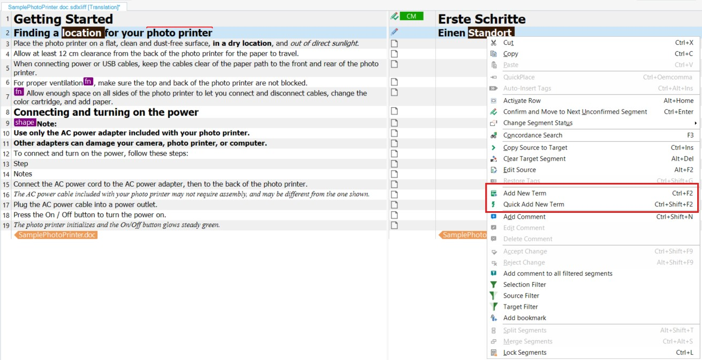

## Term Search Settings
Var:ProductName features a page through which you can configure various search settings. For example, you can decide whether or not source terms without any target term will be shown to the users. These settings are passed through the terminology provider interface and can be used in your custom term provider implementation.

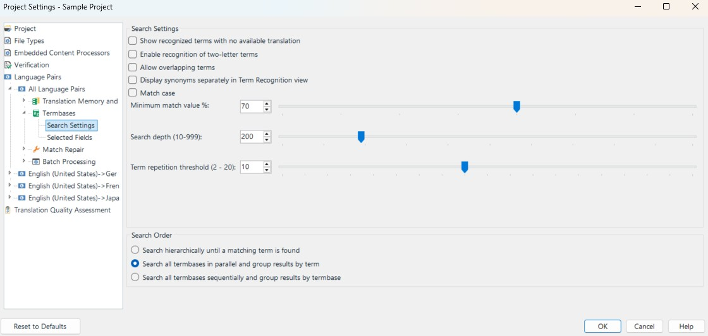
