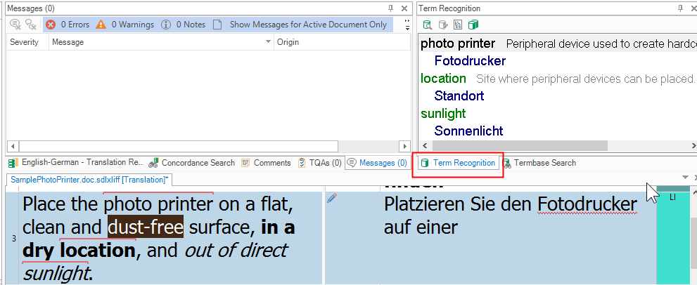
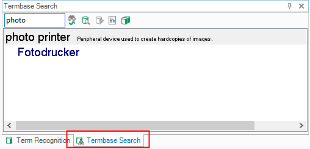

# Searching Terms
Searching the terminology source is a critical part of your term provider implementation. Editing can be optional, but term look-up and recognition are essential.

## Searching and recognizing terms

1. Click inside a segment in **Var:ProductName**. The segment is scanned for terminology from the term resource. Recognized terms are highlighted with a red line and shown in the **Term Recognition** window:

2. You can also manually look up terms in the **Termbase Search** window:

## Implementing the search functionality
Open the **MyTerminologyProvider.cs** class and go to the **Search()** function (implemented by the **AbstractTerminologyProvider** interface). This function is called when you click inside a segment or launch a search in the **Termbase Search** window. **Var:ProductName** passes several useful parameters:

* **text**: the search string. When the user selects a segment in **Var:ProductName**, this is the source segment text. When you launch a manual search, this is the search string entered by the user.
* **maxResultsCount**: the maximum number of hits to show (search depth).
* **mode**: the search mode, either fuzzy or normal. When selecting a segment in **Var:ProductName**, the default mode is `fuzzy`. For manual lookup, the default mode is `normal` unless the **Fuzzy Search** button is selected in **Termbase Search**.
* **targetRequired**: a Boolean parameter that determines whether source terms without a target term should be shown. This parameter is controlled through the **Var:ProductName** UI.

Below is the **Var:ProductName** UI page where users can determine search depth and whether to display entries without a target term:

The **Search()** function returns a list of results to display in **Var:ProductName**. In this simplified implementation, we loop through a glossary text file and look for matching source terms:

* In `normal` mode, check for source terms that start with the search string.
* In `fuzzy` mode, check for source terms contained in the search string (for example, in the segment text).

A production implementation can use more advanced fuzzy search logic than **StartsWith()** or **Contains()**. For each search result object, set the following properties:

* **Text**: the source term. This is also the term highlighted with a red line in **Var:ProductName**.
* **Score**: the fuzzy score. In this simplified implementation, set it to 100%. With custom fuzzy logic, you can assign other values.
* **Id**: the ID of the entry associated with the search result. In **Var:ProductName**, you do not output the search result list directly; instead, you output entries constructed in a separate function (see below). Search result objects are linked to entries through this unique ID. This is why each glossary line in this sample is preceded by a unique number.
  
The **Search()** function in our implementation would look like this:

# [The Search Function](#tab/tabid-1)
[!code-csharp[MyTerminologyProvider](code_samples/MyTerminologyProvider.cs#L142-L197)]
***

As noted above, the results list needs to be associated with the corresponding entry, which you construct in the following helper function:

# [Constructing the Entry Content](#tab/tabid-2)
[!code-csharp[MyTerminologyProvider](code_samples/MyTerminologyProvider.cs#L201-L237)]
***

Add the following entry list object to the terminology provider class:

# [The Entry List Object](#tab/tabid-3)
[!code-csharp[MyTerminologyProvider](code_samples/MyTerminologyProvider.cs#L13-L15)]
***

Besides the **Search()** method, the term provider interface also calls the **GetEntry()** method, which outputs the corresponding entry based on the ID parameter:

# [Getting the Entries](#tab/tabid-4)
[!code-csharp[MyTerminologyProvider](code_samples/MyTerminologyProvider.cs#L90-L95)]
***
