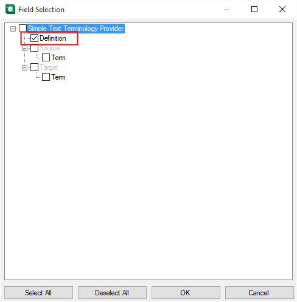
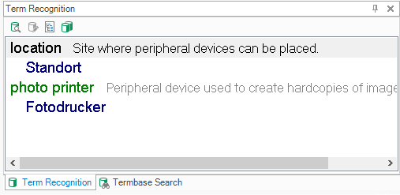

# Setting the Glossary Fields
In addition to source and target terms, a terminology source can include additional information such as definitions, notes, or examples. This additional information is referred to as **descriptive fields**.

## Declaring the Definition Field
The glossary text file includes a definition in the fourth column:

*1;photo printer;Fotodrucker;Peripheral device for creating hardcopies of pictures.*

This information can also be shown when looking up terminology in **Var:ProductName**. When the descriptive field is declared, it can be selected in the **Var:ProductName** UI:

If you select the field for display, the content (for example, the definition) is shown alongside the search results:

1. Go to the **MyTerminologyProvider.cs** class.
2. Add the following member. It creates a descriptive field labeled 'Definition' that can contain a text string. The example field has the field level 'Entry', meaning it is not specific to a particular term or language and instead applies to the whole entry.

# [Setting the Glossary Descriptive Field](#tab/tabid-1)
[!code-csharp[MyTerminologyProvider](code_samples/MyTerminologyProvider.cs#L43-L59)]
***

3. Call this function from the following property, which also calls the **GetLanguages()** method to create the full terminology source definition. The terminology source definition is then exposed in the **Var:ProductName** UI, where you can select which fields to display (see screenshot above).

# [Retrieving the Glossary Languages](#tab/tabid-2)
[!code-csharp[MyTerminologyProvider](code_samples/MyTerminologyProvider.cs#L31-L39)]
***
