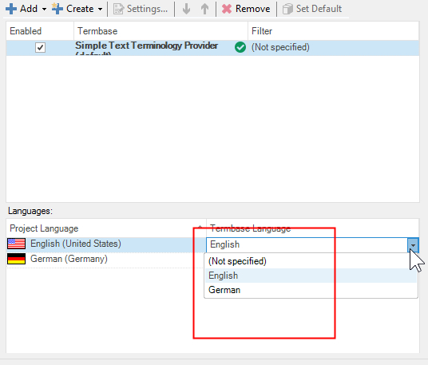

# Setting the Source and Target Language

Learn how to retrieve and set the source and target languages for the terminology provider.

## Reading the Source and Target Language from the Glossary File Header

1. Open the **MyTerminologyProvider.cs** class.
2. Go to the **GetLanguages()** function. This implementation assumes that the first line in the text file contains the source and target language name and locale in the following format: `1;English,en-US;German,de-DE`.

> [!NOTE]
> The source and target languages are separated by a semicolon, and the language name and locale are comma-separated.

3. Modify the **GetLanguages()** function as shown below. This function parses the first line of the text file to retrieve the language label (for example, 'English') and locale (for example, 'en-US'). Based on the locale, **Var:ProductName** assigns the glossary languages to the corresponding project language. After parsing the first line, the method creates two language objects and adds them to the results list that the method returns.

# [Getting the Term Provider Languages](#tab/tabid-1)
[!code-csharp[MyTerminologyProvider](code_samples/MyTerminologyProvider.cs#L106-L137)]
***

> [!TIP]
> You can add more than two languages. If **Var:ProductName** cannot automatically assign the glossary languages to the project languages, select the correct glossary language manually from the dropdown list.

