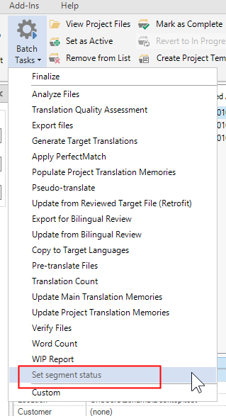

Setting up the Visual Studio project
====================================
To start setting up your batch task plug-in project, you need to generate a plug-in that can compile and that implements an empty batch task which can be seen and selected in Trados Studio. For the moment, it will not contain any application logic, that is it will not actually perform a real task.

How to create the Visual Studio Project
----------------------------------
Assuming that you already installed the Trados Studio SDK, open Microsoft Visual Studio. You will see the following options when you create a new project:

With the above templates you can set up the skeleton of an Trados Studio plug-in project. Select **SDL Custom Batch Task Plug-in 2019**

The Plug-in Skeleton
-------------------------------------
The plug-in template will add the required references to your project:

It will also add the following skeleton classes to your project:

The Plug-in Declaration: ID, Name, Description</title>
--------------------------------
Open the **MyCustomBatchTask.cs** class. This class contains the plug-in declaration - the plug-in name and description that will be visible in Trados Studio:
# [Plug-in Declaration](#tab/tabid-1)
[!code-csharp[MyCustomBatchTask](code_samples/MyCustomBatchTask.cs#L16-L20)]
***
Give the batch task plug-in a new name, ID and description. Instead of doing it directly inside this class, enter the strings into the **PluginResources.resx** file:

> [!NOTE]
> You also declare what kind of files the batch task works on here. Most batch tasks are used to process bilingual SDL XLIFF files, not native files such as DOCX or PPTX. This also applies to our sample implementation.

In this class, you also reference the settings page that allows the user to configure the batch tasks settings via the plug-in UI:
# [Plug-in Declaration](#tab/tabid-1)
[!code-csharp[MyCustomBatchTask](code_samples/MyCustomBatchTask.cs#L24-L26)]
***

The Plug-in Build Folder
---------------------------------------------
Make sure that you sign your assembly. Then build the assembly. The project is automatically configured to build the plug-in file into the folder: <em>%AppData%\Roaming\SDL\SDL Trados Studio\12\Plugins\Packages\ </em>. After you have built the plug-in, you should find the file *SDL Custom Batch Task Plug-in 2015.sdlplugin*. Now start Trados Studio. Because the plug-in is not yet officially signed by SDL, you will see the following message after you start the application:

For the moment, ignore this message. Click **Yes** to make sure that Trados Studio extracts the plug-in file. Once Studio is started, you should find the sub-folder *SDL Custom Batch Task Plug-in 2015* under <em>%AppData%\Roaming\SDL\SDL Trados Studio\12\Plugins\Unpacked\ </em>. This sub-folder contains the unpacked plug-in assemblies.

In the batch tasks list of Trados Studio, you will see the name of your newly compiled plug-in:

When you select your sample batch task you will see the following window with the plug-in description:

At this point your batch task is not actually doing anything, but as a first step you have managed to integrate your plug-in into Trados Studio. In the following pages, we will enhance this basic plug-in with some added functionality. Close Trados Studio and go back to your Microsoft Visual Studio project.
