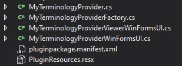
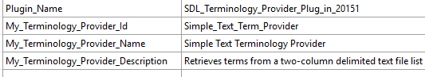
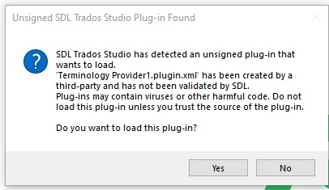
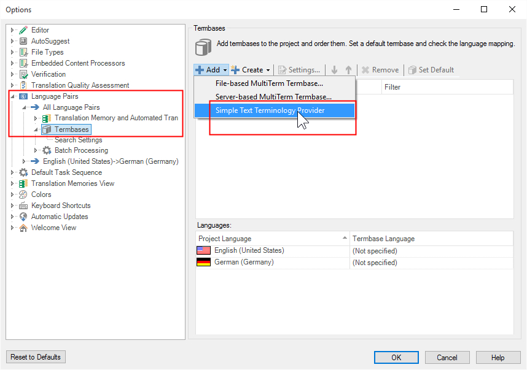

# Setting Up the Visual Studio Project
To set up your batch task plug-in project, generate a plug-in that compiles and implements an empty batch task that is visible and selectable in Var:ProductName. Initially, it will not include any application logic and will not perform a real task.

## Creating the Visual Studio Project
Assuming that you already installed the Var:ProductName SDK, open Var:VisualStudioEdition. You will see the following options when you create a new project:

With these templates, you can set up the skeleton of a Var:ProductName plug-in project. Select **Terminology Provider (2021)**.

## Plug-in Skeleton
The plug-in template adds the required references to your project:

It also adds the following skeleton classes to your project:

## Plug-in Declaration: ID, Name, Description
Open the **MyTerminologyProviderFactory.cs** class. This class contains the plug-in declaration, including the plug-in name and description visible in Var:ProductName:
# [Creating the Term Provider](#tab/tabid-1)
[!code-csharp[MyTerminologyProviderFactory](code_samples/MyTerminologyProviderFactory.cs#L10-L15)]
***

Give the terminology provider plug-in a new name, ID, and description. Instead of defining these directly in this class, enter the strings into the **PluginResources.resx** file:

Make sure the resource file access modifier is set to *public* and that you treat it as an *embedded* resource.

Open the **MyTerminologyProviderWinFormsUI.cs** class. This class controls how the plug-in appears in the Var:ProductName UI. Change the **TypeName** and **TypeDescription** members as shown below.

## Building and Loading the Plug-in in Var:ProductName
Build the assembly. The project is automatically configured to build the plug-in file into the *Var:PluginPackedPath* folder. After building the plug-in, you should find the `Terminology Provider1.sdlplugin` file in that folder. Start Var:ProductName. As the plug-in is not yet officially signed by RWS, you will see the following message when starting the application:

For now, ignore this message and click **Yes** so that Var:ProductName extracts the plug-in file. Once Var:ProductName is started, you should find the sub-folder *Terminology Provider1* under <em> Var:PluginUnpackedPath </em>. This sub-folder contains the unpacked plug-in assemblies.

> [!NOTE]
> To officially sign the plugin, send the sdlplugin file to Var:AppSigningEmail.

Open Var:ProductName and go to **File -> Options -> Language Pairs -> All Language Pairs -> Termbases** as illustrated below. When you click Add, the name of your newly-created terminology provider should be listed:

Your terminology provider is now available in Var:ProductName. The plug-in does not perform any function yet. In the following pages, you will add functionality to the plug-in.
