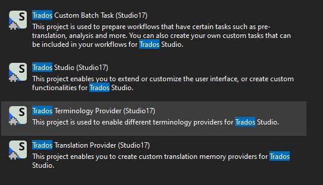

Setting up the Visual Studio project
====================================
To start setting up your batch task plug-in project, you need to generate a plug-in that can compile and that implements an empty batch task which can be seen and selected in <Var:ProductName>. For the moment, it will not contain any application logic, that is it will not actually perform a real task.

How to create the Visual Studio Project
----------------------------------
Assuming that you already installed the <Var:ProductName> SDK, open <var:VisualStudioEdition>. You will see the following options when you create a new project:

With the above templates you can set up the skeleton of a <Var:ProductName> plug-in project. Select ** Terminology Provider (2021)**.

The Plug-in Skeleton
-------------------------------------
The plug-in template will add the required references to your project:

It will also add the following skeleton classes to your project:

The Plug-in Declaration: ID, Name, Description</title>
--------------------------------
Open the **MyTerminologyProviderFactory.cs** class. This class contains the plug-in declaration - the plug-in name and description that will be visible in <Var:ProductName>:
# [Creating the Term Provider](#tab/tabid-1)
[!code-csharp[MyTerminologyProviderFactory](code_samples/MyTerminologyProviderFactory.cs#L10-L15)]
***

Give the terminology provider plug-in a new name, ID and description. Instead of doing it directly inside this class, enter the strings into the **PluginResources.resx** file:

Make sure the resource file access modifier is set to *public* and that you treat it as an *embedded* resource.

Open the **MyTerminologyProviderWinFormsUI.cs** class. This class controls how the plug-in manifests in the <Var:ProductName> UI. Change the **TypeName** and **TypeDescription** members as shown below.

How to build and load the plugin in <Var:ProductName>
---------------------------------------------
Build the assembly. The project is automatically configured to build the plug-in file into the *<var:PluginPackedPath>* folder. After you have built the plug-in, you should find the Terminology Provider1.sdlplugin file in the folder. Start <Var:ProductName>. As the plug-in is not yet officially signed by RWS, you will see the following message when starting the application:

For the moment, ignore this message and click **Yes** to make sure that <Var:ProductName> extracts the plug-in file. Once <Var:ProductName> is started, you should find the sub-folder *Terminology Provider1* under <em> <var:PluginUnpackedPath> </em>. This sub-folder contains the unpacked plug-in assemblies.

> [!NOTE]
> To officially sign the plugin, send the sdlplugin file to <Var:AppSigningEmail>.

Open <Var:ProductName> and go to **File -> Options -> Language Pairs -> All Language Pairs -> Termbases** as illustrated below. When you click Add, the name of your newly-created terminology provider should be listed:

You have now managed to make your terminology provider available in <Var:ProductName>. The plug-in does not perform any function yet. In the following pages we will provide functionality to the plug-in.
