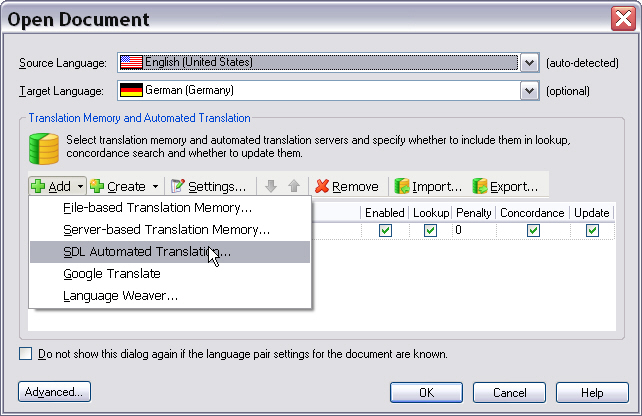

# About the Sample Translation Service Provider Plug-in

This section provides a step-by-step guide for creating a simple translation provider plug-in. You can use the plug-in in Var:ProductName for interactive translation and for batch tasks such as **Analyze Files** and **Pre-translate Files**.

## About Translation Provider Plug-ins

Var:ProductName lets you add one or more translation providers to a localization project. The primary providers are file-based and server-based translation memories. Var:ProductName also includes translation provider plug-ins that connect to web-based machine translation systems such as Google Translate and Language Weaver.

When you open a document for translation or set up a localization project, you can add multiple translation providers and use them in sequence. For example, if you select a TM as your primary provider and an automated translation system as your secondary provider, Var:ProductName suggests an automated translation when the TM does not return a match.

The screenshot below shows the translation providers that are available by default when you open a document for translation in Var:ProductName. Through the API, you can create additional plug-ins to use other translation sources. Var:ProductName then lists those providers alongside the default providers.



## About the Delimited List Provider Sample Plug-in

For this sample plug-in, assume that you want to use simple, delimited text files as translation sources. The text files contain source and target segments separated by a delimiter such as a semicolon (`;`). The plug-in should meet the following requirements:

- The user can select the list text file at runtime.
- The user can select the delimiter character from a drop-down list.
- The plug-in supports standard segment lookups and concordance searches in the source and target segments.
- Each row in a text file contains exactly one source segment and one target segment, separated by the chosen delimiter.
- The same source segment may appear several times in different rows. The corresponding target segments can differ, which means the same source segment can have several translations. In that case, show the translation options to the user so they can choose the best one for the current context.
- The language direction must appear in the first row of the text file, for example `en-US_de-DE`.

To keep the sample plug-in as simple as possible, assume that the following limitations apply:

- The plug-in supports exact matches only, with no fuzzy searches.
- The list files contain plain text only, with no tags, RTF codes, or similar content.
- The delimiter character must be unique within a row and must not appear in the source or target segments, so the application can clearly identify the source and target segments.
- The delimited text file must be in Unicode format.

The following sample list file shows one possible format. You can use it to test the plug-in functionality.

```
en-US;de-DE
Getting Started;Erste Schritte
Finding a location for your photo printer;Einen Aufstellungsort für Ihren Fotodrucker finden
Allow enough space on all sides of the photo printer to let you connect and disconnect cables, change the color cartridge, and add paper.;Achten Sie darauf, dass zu allen Seiten des Fotodruckers genügend Platz vorhanden ist, damit Sie Kabel verbinden und lösen, die Farbpatrone wechseln und Papier einfügen können.
Allow at least 12 cm clearance from the back of the photo printer for the paper to travel.;Lassen Sie mindestens 21 cm Abstand von der Rückseite des Fotodruckers, damit das Papier herausfahren kann.
Step;Schritt
Notes;Anmerkungen
Getting Started;Einstieg
Section:;Abschnitt
The photo printer initializes and the On/Off button glows steady green.;Der Fotodrucker wird initialisiert und die Ein/Aus-Taste leuchtet stetig grün.
Press the On / Off button to turn the power on.;Betätigen Sie zum Einschalten die Ein/Aus-Taste.
```
