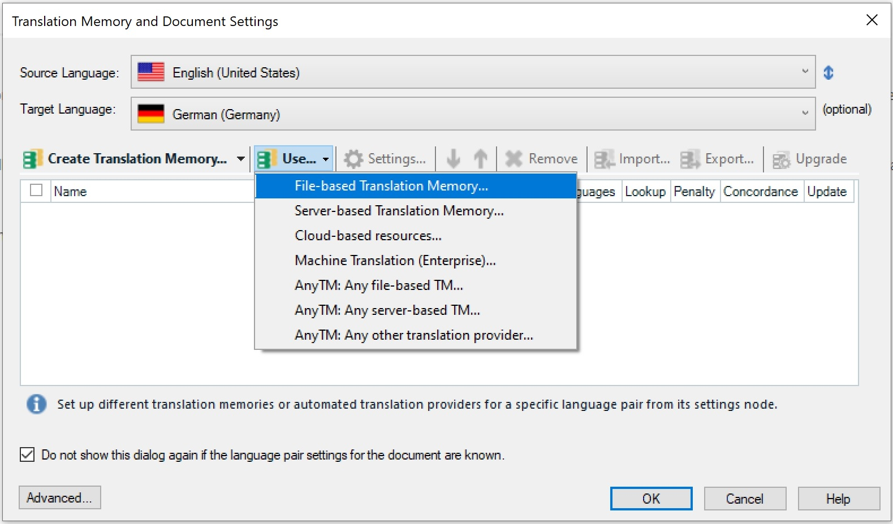

About the Sample Translation Service Provider Plug-in
====
This part of the SDK provides a step-by-step guide of how to create a simple translation provider plug-in, which can be used in Var:ProductName for interactive translation as well as processing through a batch task, e.g. **Analyze Files** and **Pre-translate Files**.

About Translation Provider Plug-ins
------
Var:ProductName allows you to add one or several translation providers to a localization project. The providers that are used primarily are file and server translation memory. By default, Var:ProductName also features translation provider plugs-ins that connect to Web-based machine translation systems such as Google Translate and Language Weaver.

When opening a document for translation or when setting up a localization project you can add several translation providers, in which sequences lookup operations can be performed. For example, when you select a TM as your primary provider and an automated translation system as your secondary provider, an automated translation (AT) will be suggested whenever no match has been found in the TM.

The screenshot below illustrates which translation providers are currently available by default when opening a document for translation in Var:ProductName. Through the API you can create additional plug-ins to leverage other translation sources. These additional providers would then be listed alongside the default providers.




About the Delimited List Provider Sample Plug-in
-----

For our sample plug-in let us assume that you want to use simple, delimited text files as translation sources. The text files contain source and target segments, which are delimited by e.g. semicolon (;) characters. The plug-in should fulfil the following requirements:

* The user should be able to select the list text file at runtime.
* The user should be able to select the delimiter character from a dropdown list.
* The plug-in should support 'normal' segment lookups as well as concordance searches in source and target segments.
* Each row in a text files contains exactly one source and one target segment, which are delimited by a specified character.
* The same source segment may occur several times in different rows. The corresponding target segments can then be different (i.e. several translations for the same source segment). If this is the case, the translation solutions should be shown to the user, who can then choose which one fits the current context best.
* The language direction needs to be indicated in the first row of the text file (e.g. *en-US_de-DE*)

To keep development of the sample plug-in as simple as possible let us proceed on the assumption that the following limitations and conditions apply:

* The plug-in should support only exact matches, i.e. no fuzzy searches.
* The list files contain only plain text information, i.e. no tags, RTF codes, etc.
* The delimiter character must be unique within a row, i.e. it must not occur within the source or target segments to allow for a clear source/target segment identification.
* The delimited text file needs to be available in Unicode format.
  
Below you see what a sample list text file may look like. You can use this as an example for testing the plug-in functionality.

```
en-US;de-DE
Getting Started;Erste Schritte
Finding a location for your photo printer;Einen Aufstellungsort für Ihren Fotodrucker finden
Allow enough space on all sides of the photo printer to let you connect and disconnect cables, change the color cartridge, and add paper.;Achten Sie darauf, dass zu allen Seiten des Fotodruckers genügend Platz vorhanden ist, damit Sie Kabel verbinden und lösen, die Farbpatrone wechseln und Papier einfügen können.
Allow at least 12 cm clearance from the back of the photo printer for the paper to travel.;Lassen Sie mindestens 21 cm Abstand von der Rückseite des Fotodruckers, damit das Papier herausfahren kann.
Step;Schritt
Notes;Anmerkungen
Getting Started;Einstieg
Section:;Abschnitt
The photo printer initializes and the On/Off button glows steady green.;Der Fotodrucker wird initialisiert und die Ein/Aus-Taste leuchtet stetig grün.
Press the On / Off button to turn the power on.;Betätigen Sie zum Einschalten die Ein/Aus-Taste.
```
