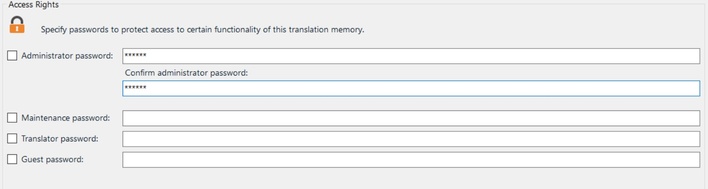

Accessing Translation Memories
=====
TMs can be accessed in two ways: either by opening a TM file stored on a hard disk or by connecting to a TM Server.

File-based TMs
----
When accessing a file-based TM users open an *.sdltm file, which is based on SQLite database technology. By default, file-based TMs are not password-protected. However, users may assign passwords for a number of access levels. Users with guest access, for example, can only read a TM. Users with the administrator access can perform any operation on a TM, e.g. maintenance, export, import, etc.

Server-based TMs
----
Server TMs are physically stored in a database system such as Microsoft SQL Server. 
A user who wants to access a server TM, requires access to a Trados GroupShare server, the server address, the port, and the login credentials.

See Also
-----
[Setting Translation Memory Access Rights](setting_translation_memory_access_rights.md)

[Connecting to TM Server](connecting_to_tm_server.md)