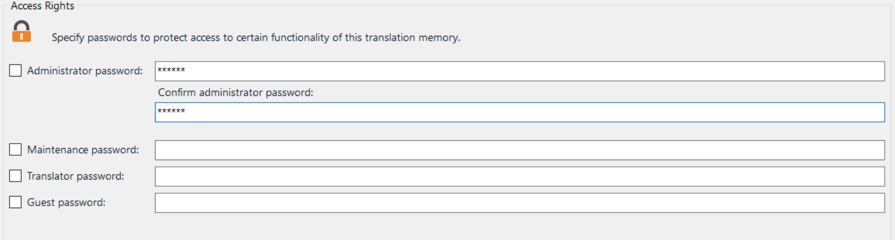

## Accessing Translation Memories
You can access TMs in two ways: open a TM file stored on a hard disk, or connect to a TM Server over LAN or WAN.

### File-based TMs
To access a file-based TM, open an *.sdltm file based on SQLite database technology. By default, file-based TMs are not password-protected. However, users can assign passwords for multiple access levels. For example, users with guest access can only read a TM, while users with administrator access can perform operations such as maintenance, export, and import.

### Server-based TMs
Server TMs are stored in database systems such as Microsoft SQL Server.
The TM Server middleware manages access between the client application and server-based TMs. You can install TM Server software on the same machine as the database system or on a separate server computer. Server-based TMs can be accessed in a LAN through TCP or on the web through HTTP or HTTPS.

To access a server TM, users need the server address, port, and valid TM Server credentials.

## See Also
[Setting Translation Memory Access Rights](setting_translation_memory_access_rights.md)
