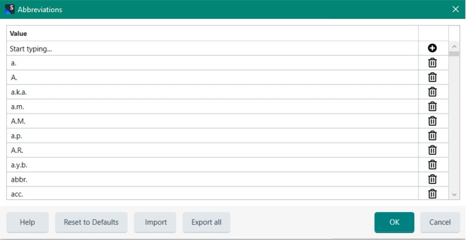
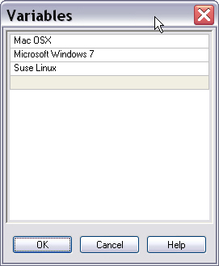

# Adding Language Resources

This chapter explains how to add language resources, such as custom abbreviations and variables, to a translation memory. For background on language resources, see [Configuring Translation Memories](configuring_translation_memories.md).

## Add a New Class

Add a new class named `TmLanguageResource` to your project. This example adds variables and custom abbreviations to the TM. Variables mark strings such as product names as placeables. Custom abbreviations prevent the system from interpreting the dot after an abbreviation as a sentence break and segment delimiter. A TM includes a list of common abbreviations for each language by default, such as *U.S.* and *ref.*. The following screenshot shows the default English abbreviations list:



You can extend this default list with custom abbreviations to fine-tune segmentation. There is no default variable list, so each new TM starts with an empty variable list.

Add a method named `AddResource()` that takes the TM file path as a string parameter. Call it as shown below:

# [C#](#tab/tabid-1)
```cs
var tmLanguageResource = new TmLanguageResource();
tmLanguageResource.AddResource(_translationMemoryFilePath);
```
***

Start by opening the TM that will receive the custom abbreviations and variables:

# [C#](#tab/tabid-2)
```cs
var tm = new FileBasedTranslationMemory(tmPath);
```
***

Next, create a default language resources object. Each language includes a default language resources bundle with common abbreviations. For English, that bundle includes abbreviations such as *Mr.*, *Mrs.*, and *Dr.*. As noted earlier, the variable list starts empty because variables are custom items, such as product names.

# [C#](#tab/tabid-3)
```cs
var defaultBundle = new DefaultLanguageResourceProvider();
```
***

Next, create a new language resources bundle on top of the default bundle. This approach lets you keep the default resources and add your own abbreviations and variables. To do this, call [GetDefaultLanguageResources](../../api/translationmemory/Sdl.LanguagePlatform.TranslationMemoryApi.DefaultLanguageResourceProvider.yml#Sdl_LanguagePlatform_TranslationMemoryApi_DefaultLanguageResourceProvider_GetDefaultLanguageResources_Sdl_Core_Globalization_CultureCode_) on the default resources provider. Pass the source language culture, such as *en-US*.

# [C#](#tab/tabid-4)
```cs
LanguageResourceBundle newBundle = defaultBundle.GetDefaultLanguageResources(CultureInfo.GetCultureInfo("en-US"));
```
***

The bundle stores all language resource types, such as segmentation rules and variable lists. Next, create a new **Wordlist** object to hold the abbreviation items:

# [C#](#tab/tabid-6)
```cs
newBundle.Abbreviations = new Wordlist();
newBundle.Abbreviations.Add("hr.");
newBundle.Abbreviations.Add("cont.");
```
***

>[!NOTE]
>
>Abbreviations are case-sensitive.


Finally, create another **Wordlist** object for the variables. Add the language resource bundle to the TM, and then save the TM:

# [C#](#tab/tabid-7)
```cs
newBundle.Variables = new Wordlist();
newBundle.Variables.Add("Mac OSX");
newBundle.Variables.Add("Microsoft Windows 10");
newBundle.Variables.Add("Suse Linux");

tm.LanguageResourceBundles.Add(newBundle);
tm.Save();
```
***

When you open the TM in Var:ProductName and view the language resources, the variable list looks like this:





## Putting it All Together

The complete class should now look like this:

# [C#](#tab/tabid-8)
```cs
namespace SDK.LanguagePlatform.Samples.TmAutomation
{
    using System.Globalization;
    using Sdl.LanguagePlatform.Core;
    using Sdl.LanguagePlatform.TranslationMemoryApi;

    public class TmLanguageResource
    {
        public void AddResource(string tmPath)
        {
            #region "open"
            FileBasedTranslationMemory tm = new FileBasedTranslationMemory(tmPath);
            #endregion

            #region "default"
            DefaultLanguageResourceProvider defaultBundle = new DefaultLanguageResourceProvider();
            #endregion

            #region "newBundle"
            LanguageResourceBundle newBundle = defaultBundle.GetDefaultLanguageResources(CultureInfo.GetCultureInfo("en-US"));
            #endregion

            #region "abbreviations"
            newBundle.Abbreviations = new Wordlist();
            newBundle.Abbreviations.Add("hr.");
            newBundle.Abbreviations.Add("cont.");
            #endregion

            #region "variables"
            newBundle.Variables = new Wordlist();
            newBundle.Variables.Add("Mac OSX");
            newBundle.Variables.Add("Microsoft Windows 10");
            newBundle.Variables.Add("Suse Linux");

            tm.LanguageResourceBundles.Add(newBundle);
            tm.Save();
            #endregion
        }
    }
}
```
***

## See Also
[Configuring Translation Memories](configuring_translation_memories.md)
